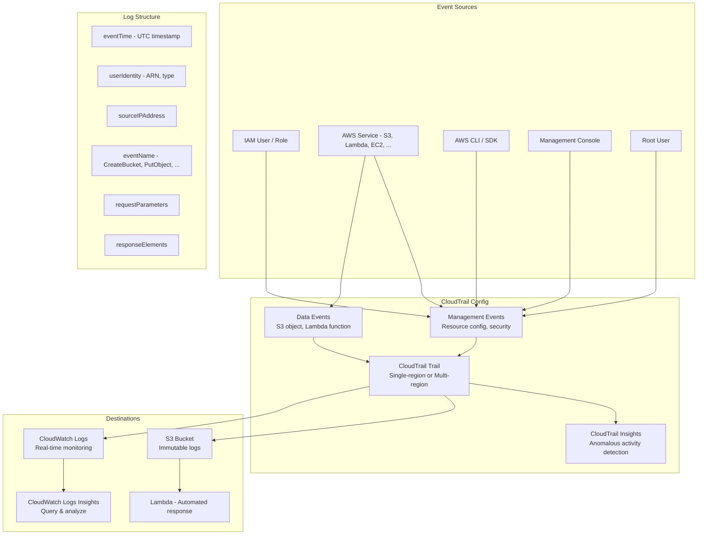

# AWS CloudTrail

## What is it?
AWS CloudTrail is a governance, compliance, operational auditing, and risk auditing service that logs every API call made in your AWS account. It records who made the call, from which IP address, when, and what changes were made.

## Why it was created
In the shared responsibility model, customers need visibility into actions taken in their AWS accounts for security, compliance, and operational troubleshooting. CloudTrail was created to provide a complete, immutable audit trail of all API activity across AWS services, enabling security analysis, resource change tracking, and compliance auditing.

## When should you use it
- **Security auditing**: Track who created, modified, or deleted resources
- **Compliance**: Meet regulatory requirements (SOC, PCI, HIPAA, GDPR) for audit trails
- **Operational troubleshooting**: Investigate unauthorized API calls or configuration changes
- **Security analysis**: Detect anomalous API activity with CloudTrail Insights
- **Resource change tracking**: Determine when and how resources were modified
- **Multi-account aggregation**: Centralized logging across all accounts in an organization

## Architecture



## Hands-on Example

```bash
# Create multi-region trail (logs to S3 + CloudWatch Logs)
aws cloudtrail create-trail \
    --name production-audit-trail \
    --s3-bucket-name my-company-cloudtrail-logs \
    --s3-key-prefix "AWSLogs/123456789012" \
    --cloud-watch-logs-log-group-arn "arn:aws:logs:us-east-1:123456789012:log-group:CloudTrailLogs:*" \
    --cloud-watch-logs-role-arn "arn:aws:iam::123456789012:role/CloudTrail_CloudWatchLogs_Role" \
    --is-multi-region-trail \
    --enable-log-file-validation

# Enable CloudTrail Insights (detect anomalous activity)
aws cloudtrail update-trail \
    --name production-audit-trail \
    --enable-log-file-validation

aws cloudtrail put-insight-selectors \
    --trail-name production-audit-trail \
    --insight-selectors '[{"InsightType": "ApiCallRateInsight"}]'

# Query CloudTrail logs in CloudWatch Logs Insights
aws logs start-query \
    --log-group-name "CloudTrailLogs" \
    --start-time 1705314000 \
    --end-time 1705317600 \
    --query-string \
        'fields @timestamp, sourceIPAddress, eventName, userIdentity.arn, errorCode
        | filter eventSource = "ec2.amazonaws.com" and errorCode = "AccessDenied"
        | stats count() by sourceIPAddress, userIdentity.arn
        | sort @timestamp desc
        | limit 100'

# Search specific events via CloudTrail API
aws cloudtrail lookup-events \
    --lookup-attributes AttributeKey=EventName,AttributeValue=DeleteBucket \
    --start-time 2024-01-01T00:00:00Z \
    --end-time 2024-01-31T23:59:59Z \
    --max-results 50

# Create organization trail (trails all accounts)
aws cloudtrail create-trail \
    --name org-audit-trail \
    --s3-bucket-name my-org-cloudtrail-logs \
    --is-multi-region-trail \
    --is-organization-trail
```

## Pricing Model
- **Management events**: Free for one copy of management events per region per account (logs stored in S3/CloudWatch are charged separately)
- **Data events**: $0.10 per 100,000 data events recorded (S3 object-level, Lambda functions)
- **CloudTrail Insights**: $1.00 per million events analyzed
- **Copying trails**: $2.00 per additional copy per region per account
- **Log file validation**: Free (uses SHA-256 hashing for integrity)
- **S3 storage**: Standard S3 rates ($0.023/GB) for log storage

## Best Practices
- **Enable CloudTrail in all regions**: Capture activity across current and future regions
- **Use organization trails**: A single trail covering all accounts in AWS Organizations
- **Enable log file validation**: Detect tampering with audit log files
- **Send to CloudWatch Logs**: Set up real-time alarms on critical events (root login, SG changes, IAM policy changes)
- **Enable Insights**: Detect anomalous API activity (e.g., unusual write volume, unusual access patterns)
- **Immutable log storage**: Use S3 Object Lock to prevent log deletion or modification
- **Access restriction**: Restrict S3 bucket access to CloudTrail and auditors only

## Interview Questions
1. What's the difference between management events and data events in CloudTrail?
2. How does CloudTrail Insights detect anomalous API activity?
3. How do you make CloudTrail logs immutable for compliance?
4. What is the difference between a single-region and multi-region trail?
5. How does CloudTrail integrate with CloudWatch Logs for real-time alerting?

## Real Company Usage
**Capital One** uses CloudTrail across thousands of accounts with organization trails, sending all logs to a centralized S3 data lake for security analysis. **Salesforce** uses CloudTrail with CloudWatch Logs integration to trigger automated responses when infrastructure changes are detected in their AWS accounts.
