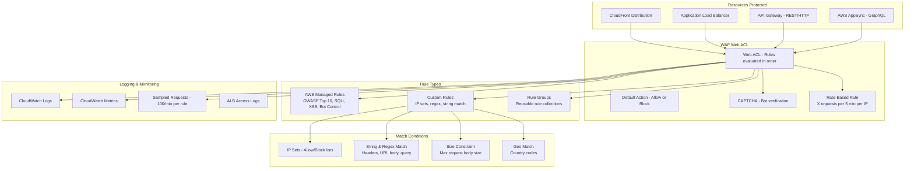

# AWS WAF (Web Application Firewall)

## What is it?
AWS WAF is a web application firewall that protects your web applications from common web exploits like SQL injection, cross-site scripting (XSS), and application-layer DDoS attacks. It integrates with CloudFront, ALB, API Gateway, and AppSync.

## Why it was created
Web applications face constant threats from automated bots, SQL injection, XSS, and application-layer attacks. Traditional network firewalls cannot inspect HTTP/HTTPS traffic. WAF was created to provide a managed, rules-based web application firewall that monitors and filters HTTP/HTTPS traffic without deploying separate security appliances.

## When should you use it
- **Protect web APIs**: Block SQL injection and XSS at the API Gateway level
- **Rate limiting**: Prevent brute-force login attempts and API abuse
- **Bot mitigation**: Block or rate-limit known bad bots and scrapers
- **Geo-blocking**: Restrict access to specific countries
- **DDoS mitigation**: Layer 7 DDoS protection in combination with AWS Shield
- **CAPTCHA challenges**: Challenge suspicious requests with CAPTCHA before allowing through

## Architecture



## Hands-on Example

```bash
# Create IP set (allow trusted IPs)
aws wafv2 create-ip-set \
    --name trusted-corporate-ips \
    --scope CLOUDFRONT \
    --addresses 203.0.113.0/24 198.51.100.0/24 \
    --ip-address-version IPV4

# Create regex pattern set
aws wafv2 create-regex-pattern-set \
    --name bot-user-agents \
    --scope REGIONAL \
    --regular-expression-list '[{"RegexString": "Python-urllib.*"}, {"RegexString": "Java/.*"}, {"RegexString": "curl/.*"}]'

# Create Web ACL with managed rules
aws wafv2 create-web-acl \
    --name production-web-acl \
    --scope CLOUDFRONT \
    --default-action Allow={} \
    --rules '[
        {
            "Name": "AWS-AWSManagedRulesCommonRuleSet",
            "Priority": 0,
            "Statement": {
                "ManagedRuleGroupStatement": {
                    "VendorName": "AWS",
                    "Name": "AWSManagedRulesCommonRuleSet"
                }
            },
            "OverrideAction": {"None": {}},
            "VisibilityConfig": {
                "SampledRequestsEnabled": true,
                "CloudWatchMetricsEnabled": true,
                "MetricName": "AWSManagedRulesCommonRuleSet"
            }
        },
        {
            "Name": "RateLimit",
            "Priority": 1,
            "Statement": {
                "RateBasedStatement": {
                    "Limit": 2000,
                    "AggregateKeyType": "IP"
                }
            },
            "Action": {"Block": {}},
            "VisibilityConfig": {
                "SampledRequestsEnabled": true,
                "CloudWatchMetricsEnabled": true,
                "MetricName": "RateLimit"
            }
        },
        {
            "Name": "Block-Bad-Bots",
            "Priority": 2,
            "Statement": {
                "RegexPatternSetReferenceStatement": {
                    "ARN": "arn:aws:wafv2:us-east-1:123456789012:regional/regexpatternset/bot-user-agents/abc123",
                    "FieldToMatch": {"SingleHeader": {"Name": "user-agent"}}
                }
            },
            "Action": {"Block": {}},
            "VisibilityConfig": {
                "SampledRequestsEnabled": true,
                "CloudWatchMetricsEnabled": true,
                "MetricName": "BlockBadBots"
            }
        }
    ]' \
    --visibility-config SampledRequestsEnabled=true,CloudWatchMetricsEnabled=true,MetricName=ProductionWebACL

# Associate Web ACL with CloudFront
aws wafv2 associate-web-acl \
    --web-acl-arn "arn:aws:wafv2:us-east-1:123456789012:global/webacl/production-web-acl/abc123" \
    --resource-arn "arn:aws:cloudfront::123456789012:distribution/ED12345"
```

## Pricing Model
- **Web ACL**: $5.00 per month per Web ACL
- **Rules**: $1.00 per month per rule (managed rule groups: additional $1.00 per rule group)
- **Requests**: $0.60 per million requests processed
- **Bot Control**: $10.00 per month per ACL (bot control rules + $0.60 per million requests)
- **CAPTCHA**: $1.50 per 1,000 CAPTCHA attempts (over first 10,000 free per month)
- **Intelligent Threat Mitigation**: $0.60 per million requests (ATP, account takeover prevention)

## Best Practices
- **Use AWS Managed Rules for baseline protection**: Start with the Common Rule Set (OWASP Top 10) and SQLi/XSS rule groups
- **Implement rate-based rules**: Protect login endpoints with 5 requests per IP per 5 minutes
- **Use Bot Control managed rule group**: Block or rate-limit known bad bots, crawlers, and scrapers
- **Test with sampled requests**: Use sampled requests to fine-tune rules before enabling blocking
- **Use CAPTCHA for suspicious traffic**: Challenge requests instead of immediately blocking (reduces false positives)
- **Scope-down rules**: Use AND/OR/NOT conditions to narrow rule scope for precision
- **Enable CloudWatch metrics and logging**: Monitor blocked/allowed counts and log full requests for analysis

## Interview Questions
1. How does WAF differ from AWS Shield?
2. What AWS resources can WAF be associated with?
3. How do you implement rate limiting for a login endpoint with WAF?
4. What is the difference between AWS Managed Rules and custom rules?
5. How does WAF CAPTCHA integration work for bot mitigation?

## Real Company Usage
**Zillow** uses WAF with rate-based rules and bot control to protect their property search APIs from scrapers and automated agents. **PagerDuty** uses WAF with CloudFront to protect their web application, using geo-matching to restrict access to supported countries and managed rules for OWASP protection.
