# AWS Shield

## What is it?
AWS Shield is a managed Distributed Denial of Service (DDoS) protection service that safeguards applications running on AWS. It provides always-on detection and automatic inline mitigations that minimize application downtime and latency.

## Why it was created
DDoS attacks are increasing in frequency, complexity, and volume. Without dedicated protection, applications can be taken offline by floods of malicious traffic. Shield was created to provide built-in DDoS protection for all AWS customers (Shield Standard) and enhanced protection for business-critical applications (Shield Advanced).

## When should you use it
- **All AWS workloads**: Shield Standard is automatically enabled at no cost
- **Business-critical applications**: Shield Advanced for enhanced protection, cost protection, and DDoS response team
- **High-profile websites**: Prevent Layer 3/4/7 DDoS attacks from taking down your application
- **Gaming platforms**: Protect real-time gaming from DDoS attacks targeting game servers
- **Financial services**: Shield Advanced + WAF for comprehensive DDoS mitigation

## Architecture

```mermaid
graph TD
    subgraph "Attack Vectors"
        L3[Layer 3 - Network<br/>UDP floods, SYN floods, NTP amplification]
        L4[Layer 4 - Transport<br/>SYN floods, ACK floods, RST floods]
        L7[Layer 7 - Application<br/>HTTP floods, Slowloris, SQLi]
    end

    subgraph "Shield Standard"
        Std_Protection[Infrastructure Layer DDoS<br/>Auto-detection at AWS edge]
        Std_WAF[Basic WAF rules<br/>Rate limiting]
        Std_Coverage[AWS services protected<br/>CloudFront, Route 53, ALB, NLB]
    end

    subgraph "Shield Advanced"
        Adv_Protection[Enhanced detection<br/>Granular visibility via DRT]
        Adv_CostProtection[Cost Protection<br/>Waive scaling fees during attack]
        Adv_DRT[DDoS Response Team<br/>24/7 proactive engagement]
        Adv_Monitoring[Real-time metrics<br/>DDoSDetected, DDoSAttackBitsPerSecond]
        Adv_HealthBased[Health check detection<br/>Application health-based DDoS]
    end

    subgraph "Integration"
        WAF[AWS WAF - Layer 7 rules]
        CW[CloudWatch - DDoS metrics & alarms]
        SRT[AWS SRT - Shield Response Team]
        RT[Route 53 - DNS-based mitigation]
    end

    L3 --> Std_Protection
    L4 --> Std_Protection
    L7 --> Adv_Protection
    Adv_Protection --> WAF
    Adv_Protection --> CW
    Adv_Protection --> SRT
    Adv_Protection --> RT
    Std_Protection --> CloudFront
    Std_Protection --> Route53
    Std_Protection --> ALB
    Std_Protection --> NLB
    Adv_Protection --> Adv_CostProtection
    Adv_Protection --> Adv_DRT
    Adv_Protection --> Adv_Monitoring
    Adv_Protection --> Adv_HealthBased
```



## Hands-on Example

```bash
# Subscribe to Shield Advanced
aws shield create-subscription \
    --subscription-type Enterprise

# Add resource protection (ALB)
aws shield associate-drt-log-bucket \
    --log-bucket my-shield-logs-bucket

# List protections
aws shield list-protections

# Describe DDoS attack detail
aws shield describe-attack \
    --attack-id abc123-def456-7890

# Get DDoS metric trends
aws shield get-subscription-state

# CloudWatch alarm for DDoS detection
aws cloudwatch put-metric-alarm \
    --alarm-name DDoS-Attack-Detected \
    --metric-name DDoSDetected \
    --namespace AWS/DDoSProtection \
    --statistic Sum \
    --period 60 \
    --threshold 1 \
    --comparison-operator GreaterThanOrEqualToThreshold \
    --evaluation-periods 1 \
    --alarm-actions arn:aws:sns:us-east-1:123456789012:security-alerts

# Describe DRTAccess (DDoS Response Team)
aws shield describe-drt-access
```

## Pricing Model
- **Shield Standard**: **Free** — automatically enabled for all AWS customers
- **Shield Advanced**: $3,000 per month per organization (includes 1 year commitment)
  - $1,000 per month per protected resource (CloudFront, Route 53, ALB, NLB, Global Accelerator)
  - Includes cost protection against scaled infrastructure charges during attacks
  - Includes access to DDoS Response Team (DRT)
  - Includes WAF credits ($1,500 per month)
- **Data transfer out**: Shield Advanced protection for data transfer costs during attacks

## Best Practices
- **Enable Shield Advanced for critical workloads**: Web applications, APIs, and real-time services
- **Combine with WAF for Layer 7 protection**: Shield handles network/transport layers, WAF handles application layer
- **Use health checks for faster detection**: Configure application health checks so Shield can quickly differentiate real vs attack traffic
- **Configure CloudWatch alarms on DDoS metrics**: Alert your security team when `DDoSDetected` goes to 1
- **Use Route 53 for DNS-level mitigation**: Route traffic away from attacked endpoints
- **Engage SRT proactively**: Authorize the Shield Response Team to apply mitigations on your behalf
- **Enable cost protection**: Shield Advanced waives scaling charges incurred during an attack (EIP, ALB, NLB)

## Interview Questions
1. What's the difference between Shield Standard and Shield Advanced?
2. How does Shield Advanced integrate with WAF for Layer 7 protection?
3. What is cost protection in Shield Advanced and how does it work?
4. How does the Shield DDoS Response Team (DRT) engage during an attack?
5. How do you monitor DDoS attacks with CloudWatch and Shield?

## Real Company Usage
**Twilio** uses Shield Advanced to protect their communications APIs from DDoS attacks, with the SRT proactively engaging during attack events. **Electronic Arts (EA)** uses Shield Advanced with WAF to protect their gaming platforms from both Layer 3/4 and Layer 7 DDoS attacks during major game launches.
