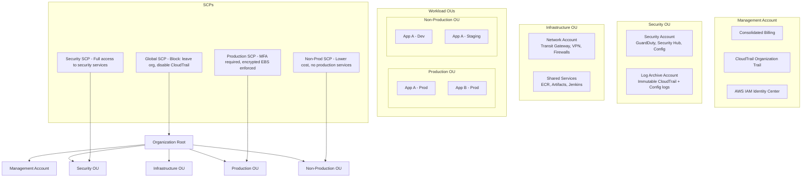

# AWS Organizations

## What is it?
AWS Organizations is a service that enables you to centrally govern and manage multiple AWS accounts. It allows you to create accounts, organize them into organizational units (OUs), apply service control policies (SCPs), and consolidate billing.

## Why it was created
As companies grow their AWS footprint, they need multiple accounts for environment isolation (dev/staging/prod), team boundaries, and billing separation. Without a management service, this creates chaos — no centralized policy enforcement, no consolidated billing, and no account lifecycle management. Organizations was created to provide hierarchical account management with policy guardrails and cost consolidation.

## When should you use it
- **Multi-account strategy**: Implement a well-architected multi-account architecture
- **Environment isolation**: Separate accounts for dev, staging, production, and security
- **Centralized billing**: Consolidated billing across all accounts for volume discounts
- **Policy enforcement**: Apply SCPs to restrict actions at the account/OU level
- **Account lifecycle**: Automate new account creation with baseline policies and budgets

## Architecture



## Hands-on Example

```bash
# Create organization
aws organizations create-organization \
    --feature-set ALL

# Create organizational unit
aws organizations create-organizational-unit \
    --parent-id r-abc123 \
    --name Production

# Create AWS account (programmatic)
aws organizations create-account \
    --email "prod-admin@company.com" \
    --account-name "Production-App-A" \
    --iam-user-access-to-billing ALLOW \
    --role-name OrganizationAccountAccessRole

# Apply Service Control Policy (deny leaving org)
aws organizations create-policy \
    --name "DenyLeaveOrganization" \
    --description "Prevent accounts from leaving the organization" \
    --type SERVICE_CONTROL_POLICY \
    --content '{
        "Version": "2012-10-17",
        "Statement": [
            {
                "Effect": "Deny",
                "Action": [
                    "organizations:LeaveOrganization",
                    "organizations:DeleteOrganization"
                ],
                "Resource": "*"
            }
        ]
    }'

# Attach SCP to OU
aws organizations attach-policy \
    --policy-id p-abc123 \
    --target-id ou-prod-12345678

# List accounts in organization
aws organizations list-accounts

# Enable trusted access for AWS Service
aws organizations enable-aws-service-access \
    --service-principal config.amazonaws.com
```

## Pricing Model
- **AWS Organizations**: **Free** — no charge for the service itself
- **Management account**: No additional fee for being the management/payer account
- **Member accounts**: Standard AWS service pricing applies per account
- **Consolidated billing**: Volume discounts apply across all accounts (no additional charge)
- **Reserved Instance sharing**: RIs purchased in one account can be shared across accounts in the same organization

## Organizations vs Control Tower

| Feature | AWS Organizations | Control Tower |
|---------|------------------|---------------|
| **Setup** | Manual configuration | Automated landing zone setup |
| **Account creation** | Programmatic (CLI/SDK) | Account Factory (Service Catalog) |
| **Guardrails** | SCPs (applied manually) | SCPs + Config rules (predefined) |
| **SSO** | IAM Identity Center (manual) | Built-in SSO integration |
| **Budget** | Manual budgeting | Automated budget templates |
| **Lifecycle** | Manual | Account Factory lifecycle management |
| **Best for** | Organizations needing flexibility | Organizations wanting automated, pre-configured setup |

## Best Practices
- **Use a multi-account strategy**: Separate accounts for security, infrastructure, shared services, and workloads
- **Apply SCPs at the root level**: Guardrails that apply to every account (block leaving org, block shipping logs, enforce regions)
- **Use consolidated billing**: Aggregate usage for volume discounts and Reserved Instance sharing
- **Use OUs for policy boundaries**: Apply different SCPs to Production vs Non-Production OUs
- **Never use root user in member accounts**: Use IAM roles with permission boundaries
- **Enable CloudTrail organization trail**: A single trail captures events from all accounts
- **Use the management account for audit only**: Don't deploy workloads in the management account

## Interview Questions
1. How does AWS Organizations help with multi-account governance?
2. What is the difference between SCPs and IAM policies?
3. How does consolidated billing work with Reserved Instance sharing?
4. What is the difference between the management account and member accounts?
5. How does AWS Organizations compare to AWS Control Tower?

## Real Company Usage
**Capital One** uses AWS Organizations with 1,000+ accounts organized into OUs by environment and business unit. They apply hundreds of SCPs, including region restrictions and mandatory encryption policies. **Lyft** uses organizations to manage multi-account environments per service team, with centralized security and networking accounts.
