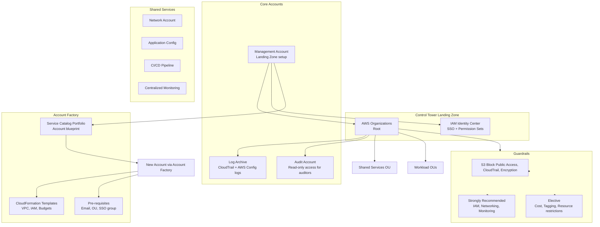

# AWS Control Tower

## What is it?
AWS Control Tower provides a pre-configured, secure, multi-account AWS environment based on best practices. It automates the setup of a landing zone, provides prescriptive guardrails, and enables account provisioning through Account Factory.

## Why it was created
Setting up a well-architected multi-account AWS environment manually requires deep expertise — you need to configure Organizations, SCPs, SSO, CloudTrail, Config, budgets, and networking. Control Tower was created to automate this setup with a proven, opinionated baseline, reducing the time from weeks to hours while ensuring compliance from day one.

## When should you use it
- **Starting a new AWS footprint**: Greenfield environments need a secure, scalable foundation
- **Regulatory compliance**: Requires automated guardrails for PCI-DSS, SOC, HIPAA
- **Multi-account standardization**: Need consistent baselines across dozens or hundreds of accounts
- **Centralized governance**: Enforce policies on resource creation, networking, and encryption
- **Account self-service**: Allow teams to provision new accounts with pre-configured guardrails

## Architecture



## Hands-on Example

```bash
# Control Tower is primarily managed through the AWS Console
# Key CLI interactions:

# List all enrolled accounts
aws control-tower list-managed-accounts

# Get landing zone status
aws control-tower get-landing-zone-status

# Enable a guardrail on an OU
aws control-tower enable-control \
    --control-identifier arn:aws:controltower:us-east-1::control/AWS-GR_S3_BLOCK_PUBLIC_ACCESS \
    --target-identifier ou-prod-12345678

# Disable a guardrail
aws control-tower disable-control \
    --control-identifier arn:aws:controltower:us-east-1::control/AWS-GR_S3_BLOCK_PUBLIC_ACCESS \
    --target-identifier ou-prod-12345678

# List enabled controls
aws control-tower list-enabled-controls \
    --filter "arn:aws:controltower:us-east-1::control/AWS-GR_S3_BLOCK_PUBLIC_ACCESS"

# Get account factory details (via Service Catalog)
aws servicecatalog list-provisioning-artifacts \
    --product-id prod-abc123

# Update landing zone (after configuration change)
aws control-tower update-landing-zone \
    --manifest '{"...": ...}'
```

## Pricing Model
- **Control Tower**: **Free** — no additional charge for the service itself
- **Underlying resources**: You pay for the services Control Tower provisions:
  - AWS Organizations (free)
  - AWS CloudTrail ($2.00/trail per region + S3 storage)
  - AWS Config ($0.003 per configuration item + rules)
  - IAM Identity Center (free)
  - CloudWatch Logs ($0.50/GB ingested)
  - S3 storage for logs ($0.023/GB)
  - Service Catalog (free)
- **Estimated baseline cost**: ~$50–$150 per month for the core landing zone infrastructure

## Control Tower vs AWS Organizations

| Feature | Control Tower | Organizations |
|---------|--------------|---------------|
| **Setup** | Automated landing zone | Manual setup |
| **Guardrails** | Predefined (mandatory/strong/elective) | Custom SCPs only |
| **Account provisioning** | Account Factory (Service Catalog) | Programmatic CLI/SDK |
| **SSO** | Built-in IAM Identity Center | Manual SSO setup |
| **Logging** | Auto-configure CloudTrail + Config | Manual logging setup |
| **Dashboards** | Centralized compliance dashboard | No built-in dashboard |
| **Best for** | Organizations wanting turnkey governance | Organizations needing full flexibility |

## Best Practices
- **Use Account Factory for all new accounts**: Ensures every account starts with the same baseline
- **Understand guardrail categories**: Mandatory (cannot disable), Strong (recommended), Elective (optional)
- **Design OU structure before setup**: Plan workload OUs for dev/staging/prod with different guardrail levels
- **Use SSO permission sets**: Assign least-privilege permissions via IAM Identity Center groups
- **Monitor landing zone health**: Use the Control Tower dashboard to track guardrail compliance
- **Set budgets for new accounts**: Account Factory can create budgets for each new account
- **Plan for lifecycle**: Use Account Factory to close accounts when they're no longer needed

## Interview Questions
1. What is a landing zone and what does Control Tower set up?
2. What are the three categories of guardrails in Control Tower?
3. How does Account Factory provision new accounts?
4. How does Control Tower differ from AWS Organizations?
5. What is the difference between mandatory, strong, and elective guardrails?

## Real Company Usage
**Intuit** uses Control Tower to manage hundreds of accounts across multiple OUs, with Account Factory enabling developer teams to self-service new environments. **Adobe** uses Control Tower as the foundation for their AWS multi-account strategy, with guardrails enforcing encryption and logging across all accounts.
