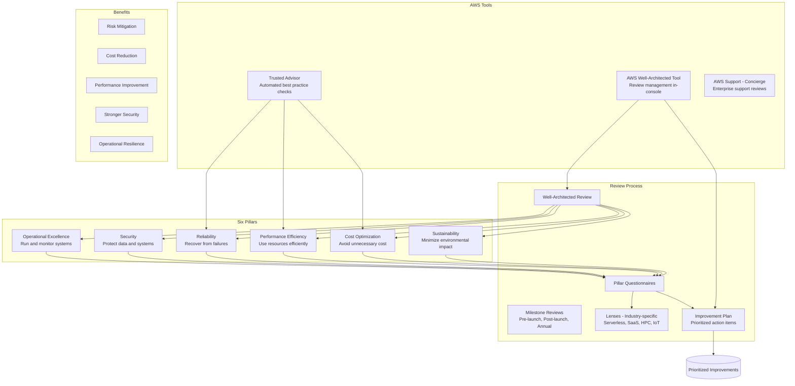

# AWS Well-Architected Framework

## What is it?
The AWS Well-Architected Framework is a set of best practices and guidelines for designing and operating reliable, secure, efficient, cost-effective, and sustainable systems in the cloud. It provides a consistent approach for evaluating architectures and implementing scalable designs.

## Why it was created
Teams often build cloud architectures based on tribal knowledge, resulting in brittle systems that fail under load, have security gaps, waste money, or are hard to operate. The Well-Architected Framework was created to codify AWS's experience building resilient systems, giving teams a structured methodology for evaluating and improving their architectures.

## When should you use it
- **New architecture design**: Use as a checklist during initial design
- **Existing system review**: Conduct Well-Architected Reviews to identify risks and improvement areas
- **Pre-launch validation**: Verify architecture readiness before production launch
- **Periodic audits**: Quarterly or annual reviews to ensure ongoing alignment
- **Migration planning**: Evaluate target architecture before migrating workloads
- **Compliance**: Demonstrate adherence to cloud best practices for auditors

## Architecture



## Pillar Deep Dive

### 1. Operational Excellence
- **Design principles**: Perform operations as code, make frequent small reversible changes, refine operations procedures, anticipate failure, learn from all operational failures
- **Key services**: CloudFormation, CodePipeline, Config, CloudWatch, Systems Manager, Health Dashboard
- **Implementation**: IaC, deployment pipelines, runbooks, game days, post-incident reviews

### 2. Security
- **Design principles**: Strong identity foundation (IAM), enable traceability (CloudTrail), apply security at all layers (WAF, VPC), automate security best practices (Config rules), protect data at rest and in transit
- **Key services**: IAM, KMS, CloudTrail, WAF, Shield, GuardDuty, Security Hub, Inspector, VPC

### 3. Reliability
- **Design principles**: Test recovery procedures, automatically recover from failure, scale horizontally to increase aggregate system availability, stop guessing capacity (auto-scaling), manage change in automation
- **Key services**: Route 53, Auto Scaling, RDS Multi-AZ, DynamoDB, SQS, ELB, CloudFormation, Backup

### 4. Performance Efficiency
- **Design principles**: Democratize advanced technologies (RDS, DynamoDB, S3), go global in minutes (CloudFront), use serverless architectures, experiment more often, consider mechanical sympathy
- **Key services**: Auto Scaling, Lambda, CloudFront, ElastiCache, DynamoDB DAX, RDS Read Replicas

### 5. Cost Optimization
- **Design principles**: Implement Cloud Financial Management, adopt a consumption model, measure overall efficiency, stop spending on undifferentiated heavy lifting, analyze and attribute expenditure
- **Key services**: Cost Explorer, Trusted Advisor, Savings Plans, Compute Optimizer, Budgets, Spot Instances

### 6. Sustainability (Added 2022)
- **Design principles**: Understand your impact, establish sustainability goals, maximize utilization, adopt new efficient hardware and software, use managed services, reduce downstream impact
- **Key services**: EC2 Auto Scaling, Serverless (Lambda, Fargate), S3 Intelligent-Tiering, Graviton processors, Region selection (green regions)

## Hands-on Example

```bash
# Create a Well-Architected Review using the CLI

# Create a workload
aws wellarchitected create-workload \
    --workload-name "Production Order Processing" \
    --description "Well-Architected Review for production order processing system" \
    --environment PRODUCTION \
    --review-owner "platform-team@company.com" \
    --lenses '["arn:aws:wellarchitected:us-east-1::lens/wellarchitected-v2023"]'

# Get workload ID
WORKLOAD_ID=$(aws wellarchitected list-workloads \
    --query 'WorkloadSummaries[0].WorkloadId' \
    --output text)

# Answer a milestone question (Security pillar, IAM question)
aws wellarchitected update-answer \
    --workload-id $WORKLOAD_ID \
    --lens-alias wellarchitected \
    --pillar-id security \
    --question-id iam_1 \
    --selected-choice-titles '["Define access control requirements"]' \
    --notes "We use IAM groups with managed policies"

# List workload improvements
aws wellarchitected list-lenses

# Create milestone
aws wellarchitected create-milestone \
    --workload-id $WORKLOAD_ID \
    --milestone-name "Pre-Production-Review-v1"

# Generate improvement plan
aws wellarchitected get-improvement-plan \
    --workload-id $WORKLOAD_ID \
    --lens-alias wellarchitected
```

## Pricing Model
- **Well-Architected Tool**: **Free** — no charge for using the service
- **AWS Well-Architected Framework**: Free (documentation and best practices)
- **AWS Well-Architected Lenses**: Free (Serverless, SaaS, HPC, IoT, Financial Services, Game Tech)
- **AWS Well-Architected Partner Program**: Free (for APN Partners)
- **Associated costs**: You pay for the AWS resources you review (recommendations may increase or decrease resource costs)

## Best Practices
- **Conduct regular reviews**: Schedule Well-Architected Reviews at least annually or before major milestones
- **Use the right Lens**: Apply industry-specific Lenses (Serverless, SaaS, Financial Services, Healthcare)
- **Leverage the Well-Architected Tool**: Document reviews, track improvements, and generate reports centrally
- **Combine with Trusted Advisor**: Use Trusted Advisor for automated checks, WA Framework for architectural design
- **Prioritize improvements by risk level**: Address high-risk items (R1) before medium (R2) or low (R3)
- **Use milestones for tracking**: Create milestones for pre-launch, post-launch, and periodic reviews
- **Involve multiple teams**: Include security, operations, development, and finance in the review process

## Interview Questions
1. What are the six pillars of the AWS Well-Architected Framework?
2. How does the Well-Architected Review process work?
3. What is a Lens and when would you use a specific Lens?
4. How do you prioritize improvements identified in a Well-Architected Review?
5. What is the difference between a Well-Architected Review and AWS Trusted Advisor?

## Real Company Usage
**Netflix** uses the Well-Architected Framework as the foundation for their cloud architecture, with a dedicated team conducting regular reviews on each microservice. **Capital One** integrates Well-Architected Reviews into their CI/CD pipeline — every new architecture undergoes a review before deployment to production, and existing workloads are reviewed annually.
