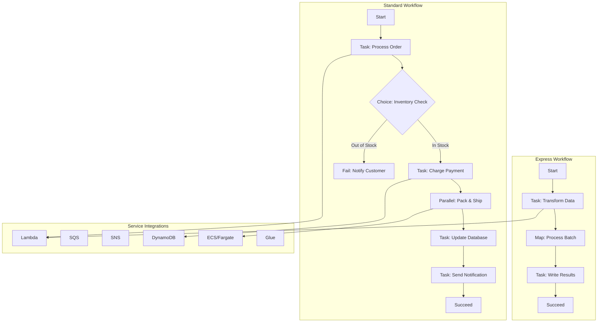

# AWS Step Functions

## What is it?
AWS Step Functions is a serverless orchestration service that lets you coordinate multiple AWS services into flexible, visual workflows. It provides state machines with built-in error handling, retry logic, and parallel execution, enabling you to build distributed applications as a series of steps.

## Why it was created
Building distributed applications requires coordinating multiple services, handling failures, retries, and timeouts. Traditionally, developers had to write custom orchestration code using queues, databases, and polling mechanisms, which was error-prone and hard to maintain. Step Functions was created to provide a fully managed visual workflow engine that handles state management, error handling, and service coordination with minimal code.

## When should you use it
- **Order fulfillment workflows**: Coordinate inventory, payment, shipping, and notification services
- **Data processing pipelines**: Chain multiple compute steps (Lambda, ECS, Glue) with conditional branching
- **Human approval workflows**: Pause execution and wait for manual approval via callback patterns
- **Microservice orchestration**: Coordinate distributed transactions across multiple services
- **ETL and batch processing**: Run parallel transformations with fan-out/fan-in patterns
- **Saga patterns**: Implement distributed transactions with compensating transactions on failure

## Architecture



## Workflow Types

| Feature | Standard Workflow | Express Workflow |
|---------|------------------|------------------|
| **Execution duration** | Up to 1 year | Up to 5 minutes |
| **Execution rate** | 2,000 per second | 100,000 per second |
| **History retention** | Up to 90 days | Up to 90 days (CloudWatch Logs) |
| **Pricing** | Per state transition | Per execution + duration |
| **Use case** | Long-running, durable workflows | High-volume, short-lived events |
| **Execution history** | Full event history available | Logged to CloudWatch Logs |
| **Debugging** | AWS Console, Step Functions UI | CloudWatch Logs |

## State Types

| State | Purpose | Key Fields |
|-------|---------|------------|
| **Task** | Execute a unit of work (Lambda, activity) | Resource, HeartbeatSeconds, TimeoutSeconds |
| **Choice** | Route execution based on conditions | Choices (Variable, StringEquals, NumericGreaterThan) |
| **Wait** | Delay execution for a duration or until a time | Seconds, Timestamp, SecondsPath, TimestampPath |
| **Parallel** | Execute branches concurrently | Branches (array of state machines) |
| **Map** | Iterate over an array of items | Iterator, ItemsPath, MaxConcurrency |
| **Pass** | Pass input to output or inject data | Result, ResultPath, Parameters |
| **Succeed** | Terminate execution successfully | None |
| **Fail** | Terminate execution with failure | Error, Cause |

## Error Handling

### Retry
```json
{
    "Retry": [{
        "ErrorEquals": ["States.ALL"],
        "IntervalSeconds": 2,
        "MaxAttempts": 3,
        "BackoffRate": 2.0,
        "MaxDelaySeconds": 300
    }]
}
```

### Catch
```json
{
    "Catch": [{
        "ErrorEquals": ["States.Timeout"],
        "Next": "SendTimeoutNotification",
        "ResultPath": "$.error-info"
    }, {
        "ErrorEquals": ["States.ALL"],
        "Next": "DefaultErrorHandler",
        "ResultPath": "$.error-info"
    }]
}
```

### Common Error Types
- `States.ALL` - Catches all errors
- `States.Timeout` - Task timed out
- `States.TaskFailed` - Task execution failed
- `States.Permissions` - Insufficient IAM permissions
- `States.DataLimitExceeded` - Output data exceeds 256KB limit
- `Custom errors` - Defined by service integrations (e.g., Lambda errors)

## Callback Pattern (waitForTaskToken)

```json
{
    "Type": "Task",
    "Resource": "arn:aws:states:::lambda:invoke.waitForTaskToken",
    "Parameters": {
        "FunctionName": "arn:aws:lambda:us-east-1:123456789012:function:ApprovalFunction",
        "Payload": {
            "taskToken.$": "$$.Task.Token",
            "orderId.$": "$.orderId"
        }
    },
    "TimeoutSeconds": 86400,
    "HeartbeatSeconds": 3600
}
```

The callback pattern pauses the state machine until an external process sends a SendTaskSuccess or SendTaskFailure. This is critical for:
- Human approval workflows (manager approves purchase order)
- Third-party payment processing with async callbacks
- Long-running activity workers that report progress

## Hands-on Example

```json
// Order Fulfillment State Machine
{
    "Comment": "Process customer order with inventory check, payment, and shipping",
    "StartAt": "ValidateOrder",
    "States": {
        "ValidateOrder": {
            "Type": "Task",
            "Resource": "arn:aws:states:::lambda:invoke",
            "Parameters": {
                "FunctionName": "arn:aws:lambda:us-east-1:123456789012:function:ValidateOrder",
                "Payload": { "orderId.$": "$.orderId" }
            },
            "Next": "CheckInventory"
        },
        "CheckInventory": {
            "Type": "Task",
            "Resource": "arn:aws:states:::dynamodb:getItem",
            "Parameters": {
                "TableName": "Inventory",
                "Key": { "sku": { "S.$": "$.sku" } }
            },
            "Next": "InventoryDecision"
        },
        "InventoryDecision": {
            "Type": "Choice",
            "Choices": [{
                "Variable": "$.Item.quantity.N",
                "NumericGreaterThanEquals": "$.quantity",
                "Next": "ProcessPayment"
            }],
            "Default": "OutOfStock"
        },
        "ProcessPayment": {
            "Type": "Task",
            "Resource": "arn:aws:states:::lambda:invoke.waitForTaskToken",
            "Parameters": {
                "FunctionName": "arn:aws:lambda:us-east-1:123456789012:function:ProcessPayment",
                "Payload": {
                    "taskToken.$": "$$.Task.Token",
                    "orderId.$": "$.orderId",
                    "amount.$": "$.total"
                }
            },
            "TimeoutSeconds": 300,
            "Next": "UpdateOrderStatus"
        },
        "UpdateOrderStatus": {
            "Type": "Task",
            "Resource": "arn:aws:states:::dynamodb:updateItem",
            "Parameters": {
                "TableName": "Orders",
                "Key": { "orderId": { "S.$": "$.orderId" } },
                "UpdateExpression": "SET #status = :status",
                "ExpressionAttributeNames": { "#status": "status" },
                "ExpressionAttributeValues": { ":status": { "S": "CONFIRMED" } }
            },
            "Next": "ShipOrder"
        },
        "ShipOrder": {
            "Type": "Parallel",
            "Branches": [
                {
                    "StartAt": "CreateShippingLabel",
                    "States": {
                        "CreateShippingLabel": {
                            "Type": "Task",
                            "Resource": "arn:aws:states:::lambda:invoke",
                            "Parameters": {
                                "FunctionName": "arn:aws:states:::lambda:invoke",
                                "Payload": { "orderId.$": "$.orderId" }
                            },
                            "End": true
                        }
                    }
                },
                {
                    "StartAt": "SendConfirmationEmail",
                    "States": {
                        "SendConfirmationEmail": {
                            "Type": "Task",
                            "Resource": "arn:aws:states:::sns:publish",
                            "Parameters": {
                                "TopicArn": "arn:aws:sns:us-east-1:123456789012:OrderNotifications",
                                "Message.$": "$.orderId"
                            },
                            "End": true
                        }
                    }
                }
            ],
            "Next": "CompleteOrder"
        },
        "CompleteOrder": {
            "Type": "Succeed"
        },
        "OutOfStock": {
            "Type": "Task",
            "Resource": "arn:aws:states:::sns:publish",
            "Parameters": {
                "TopicArn": "arn:aws:sns:us-east-1:123456789012:OrderNotifications",
                "Message": "Order out of stock"
            },
            "Next": "OrderFailed"
        },
        "OrderFailed": {
            "Type": "Fail",
            "Error": "InventoryError",
            "Cause": "Item out of stock"
        }
    }
}
```

```bash
# Create state machine
aws stepfunctions create-state-machine \
    --name OrderFulfillment \
    --definition file://order-fulfillment.json \
    --role-arn arn:aws:iam::123456789012:role/StepFunctions-OrderRole \
    --type STANDARD

# Start execution
aws stepfunctions start-execution \
    --state-machine-arn arn:aws:states:us-east-1:123456789012:stateMachine:OrderFulfillment \
    --input '{"orderId": "ORD-123", "sku": "SKU-456", "quantity": 2, "total": 49.99}'

# Describe execution history
aws stepfunctions get-execution-history \
    --execution-arn arn:aws:states:us-east-1:123456789012:execution:OrderFulfillment:exec-001

# Send task success for callback
aws stepfunctions send-task-success \
    --task-token "abc123" \
    --task-output '{"status": "APPROVED"}'

# List executions
aws stepfunctions list-executions \
    --state-machine-arn arn:aws:states:us-east-1:123456789012:stateMachine:OrderFulfillment \
    --status-filter RUNNING
```

## Pricing Model

| Pricing Dimension | Standard Workflows | Express Workflows |
|-------------------|-------------------|-------------------|
| **State transitions** | $0.025 per 1,000 state transitions | Not applicable |
| **Executions** | Not applicable | $1.00 per 1 million executions |
| **Duration** | Not applicable | $0.000004 per 100ms (compute), $0.000002 per 100ms (memory) |
| **HTTP requests** | N/A | $0.20 per 1 million requests |

- Free Tier: 4,000 state transitions per month for Standard workflows
- Execution history stored for up to 90 days
- CloudWatch Logs charges apply for Express workflow logs

## Service Integrations

| Service | Integration Type | Common Use Case |
|---------|-----------------|-----------------|
| **AWS Lambda** | Invoke | Serverless compute tasks |
| **SQS** | SendMessage, ReceiveMessage | Queue-based decoupling |
| **SNS** | Publish | Fan-out notifications |
| **DynamoDB** | GetItem, PutItem, UpdateItem, DeleteItem | Database operations |
| **ECS / Fargate** | RunTask | Containerized workloads |
| **Glue** | StartJobRun | ETL operations |
| **SageMaker** | CreateTrainingJob | ML training pipelines |
| **Batch** | SubmitJob | Batch computing |
| **API Gateway** | Invoke | REST API orchestration |
| **EventBridge** | PutEvents | Event-driven workflows |
| **CodeBuild** | StartBuild | CI/CD pipelines |
| **Step Functions** | StartExecution | Nested workflows |

## Execution History

Every state transition in a Standard workflow is recorded:

```json
{
    "events": [{
        "id": 1,
        "type": "ExecutionStarted",
        "timestamp": "2025-01-15T10:00:00.000Z",
        "executionStartedEventDetails": {
            "input": "{\"orderId\": \"ORD-123\"}",
            "roleArn": "arn:aws:iam::123456789012:role/StepFunctionsRole"
        }
    }, {
        "id": 2,
        "type": "TaskScheduled",
        "timestamp": "2025-01-15T10:00:00.100Z",
        "taskScheduledEventDetails": {
            "resourceType": "lambda",
            "resource": "arn:aws:lambda:us-east-1:123456789012:function:ValidateOrder"
        }
    }, {
        "id": 3,
        "type": "TaskStarted",
        "timestamp": "2025-01-15T10:00:00.200Z"
    }, {
        "id": 4,
        "type": "TaskSucceeded",
        "timestamp": "2025-01-15T10:00:01.500Z"
    }]
}
```

### CloudWatch Integration
- **CloudWatch Metrics**: ExecutionTime, ExecutionsStarted, ExecutionsSucceeded, ExecutionsFailed, ExecutionsTimedOut, ExecutionThrottled
- **CloudWatch Logs**: Detailed execution logs for Express workflows
- **CloudWatch Alarms**: Alert on execution failures, throttling, or duration spikes
- **EventBridge**: Capture state machine state changes for event-driven responses

## Best Practices
- **Use Standard for long-running, Express for high-volume**: Match workflow type to workload characteristics
- **Implement idempotency**: Design state machines to handle retried executions gracefully
- **Set appropriate timeouts**: Configure TimeoutSeconds and HeartbeatSeconds to detect stuck executions
- **Use ResultPath**: Pass outputs between states without losing data
- **Limit payload size**: Keep state input/output under 256KB to avoid data limit errors
- **Use nested workflows**: Break complex workflows into reusable child state machines
- **Enable CloudWatch Logs for Express**: Required for debugging since Express has no history UI
- **Use Tags**: Tag state machines for cost allocation and resource management
- **Implement saga patterns**: Use compensating transactions for distributed transaction rollback

## Interview Questions
1. What is the difference between Standard and Express workflows, and when would you choose each?
2. Explain the waitForTaskToken callback pattern and how it supports human approval workflows
3. How does Step Functions implement error handling with Retry and Catch?
4. Design an order fulfillment workflow that handles inventory, payment, shipping, and notifications
5. What are the seven state types and when would you use each?
6. How does Step Functions integrate with DynamoDB directly without Lambda?
7. Explain how to implement a Saga pattern using Step Functions for distributed transactions
8. How does execution history help in debugging and compliance?

## Real Company Usage
**Amazon** uses Step Functions internally for its own fulfillment workflows, coordinating inventory management, payment processing, and shipping across multiple internal services. **Netflix** uses Step Functions to orchestrate their media encoding and content delivery pipelines, processing thousands of video files through parallel validation, encoding, and distribution steps. **Stripe** uses Step Functions for payment processing workflows that require complex retry logic and human approval for fraud detection. **Coca-Cola** orchestrates their supply chain management workflows with Step Functions, coordinating warehouse, logistics, and distribution center operations.
