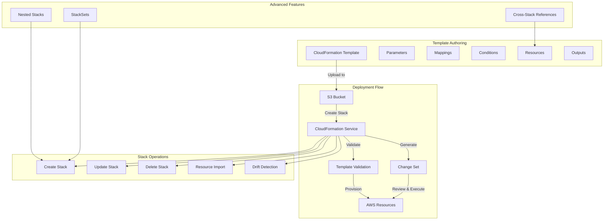

# AWS CloudFormation

## What is it?
AWS CloudFormation is an Infrastructure as Code (IaC) service that allows you to model, provision, and manage AWS resources using declarative templates. It provides a single source of truth for AWS infrastructure, enabling repeatable deployments across environments and accounts.

## Why it was created
Before CloudFormation, infrastructure was provisioned manually through the AWS Console or with scripts using the AWS CLI/SDK. This led to configuration drift, inconsistent environments, and the inability to reproduce infrastructure reliably. CloudFormation was created to bring software engineering practices — version control, code review, and automated deployment — to infrastructure management.

## When should you use it
- **Infrastructure as Code**: Define all AWS resources in version-controlled templates
- **Repeatable environments**: Create identical dev, staging, and production environments
- **Automated deployments**: Integrate with CI/CD pipelines for infrastructure updates
- **Compliance and governance**: Enforce resource configurations through template standards
- **Multi-region deployments**: Deploy identical infrastructure across multiple regions
- **Disaster recovery**: Rebuild entire infrastructure in a recovery region with one template

## Architecture



## Template Anatomy

```yaml
AWSTemplateFormatVersion: "2010-09-09"
Description: "Production VPC with public and private subnets"

Parameters:
  VpcCIDR:
    Type: String
    Description: "CIDR block for VPC"
    Default: "10.0.0.0/16"
    AllowedPattern: "^\\d{1,3}\\.\\d{1,3}\\.\\d{1,3}\\.\\d{1,3}/\\d{1,2}$"
    ConstraintDescription: "Must be a valid CIDR range"

  Environment:
    Type: String
    AllowedValues: [dev, staging, prod]
    Default: dev

Mappings:
  EnvironmentConfig:
    dev:
      InstanceType: t3.small
      MinCapacity: 1
    staging:
      InstanceType: t3.medium
      MinCapacity: 2
    prod:
      InstanceType: t3.large
      MinCapacity: 3

Conditions:
  IsProduction: !Equals [!Ref Environment, prod]

Resources:
  VPC:
    Type: AWS::EC2::VPC
    Properties:
      CidrBlock: !Ref VpcCIDR
      EnableDnsSupport: true
      EnableDnsHostnames: true
      Tags:
        - Key: Name
          Value: !Sub "${AWS::StackName}-vpc"

  PublicSubnet:
    Type: AWS::EC2::Subnet
    Properties:
      VpcId: !Ref VPC
      CidrBlock: !Select [0, !Cidr [!Ref VpcCIDR, 4, 8]]
      MapPublicIpOnLaunch: true
      Tags:
        - Key: Name
          Value: !Sub "${AWS::StackName}-public-subnet"

  InternetGateway:
    Type: AWS::EC2::InternetGateway
    Condition: IsProduction
    Properties:
      Tags:
        - Key: Name
          Value: !Sub "${AWS::StackName}-igw"

  VPCGatewayAttachment:
    Type: AWS::EC2::VPCGatewayAttachment
    Condition: IsProduction
    Properties:
      VpcId: !Ref VPC
      InternetGatewayId: !Ref InternetGateway

Outputs:
  VpcId:
    Description: "VPC ID"
    Value: !Ref VPC
    Export:
      Name: !Sub "${AWS::StackName}-VpcId"

  PublicSubnetIds:
    Description: "Public subnet IDs"
    Value: !Ref PublicSubnet
    Export:
      Name: !Sub "${AWS::StackName}-PublicSubnetIds"
```

## Intrinsic Functions

| Function | Syntax | Purpose |
|----------|--------|---------|
| **Ref** | `!Ref LogicalId` | Returns physical ID of a resource or parameter value |
| **GetAtt** | `!GetAtt Resource.Attribute` | Returns a specific attribute of a resource |
| **Sub** | `!Sub "text ${Var}"` | Substitutes variables in strings |
| **Join** | `!Join [delimiter, [list]]` | Concatenates values with delimiter |
| **Select** | `!Select [index, list]` | Returns element at index from a list |
| **FindInMap** | `!FindInMap [Map, Key, Value]` | Returns value from a mapping |
| **ImportValue** | `!ImportValue ExportName` | Imports output value from another stack |
| **Condition Functions** | `!Equals, !And, !If, !Not, !Or` | Evaluates conditions |
| **Base64** | `!Base64 value` | Returns Base64-encoded value |
| **Cidr** | `!Cidr [ipBlock, count, cidrBits]` | Generates CIDR blocks |
| **GetAZs** | `!GetAZs region` | Returns availability zones |

## Change Sets

Change sets allow you to preview how proposed changes will affect running resources before applying them.

```bash
# Create a change set
aws cloudformation create-change-set \
    --stack-name MyStack \
    --template-body file://updated-template.yaml \
    --change-set-name UpdateVpcConfig

# Describe change set
aws cloudformation describe-change-set \
    --change-set-name UpdateVpcConfig \
    --stack-name MyStack

# Execute change set
aws cloudformation execute-change-set \
    --change-set-name UpdateVpcConfig \
    --stack-name MyStack

# Delete change set (without executing)
aws cloudformation delete-change-set \
    --change-set-name UpdateVpcConfig \
    --stack-name MyStack
```

## StackSets

StackSets enable deploying CloudFormation stacks across multiple accounts and regions from a single template.

```bash
# Create StackSet
aws cloudformation create-stack-set \
    --stack-set-name OrgVPC \
    --template-body file://vpc-template.yaml \
    --capabilities CAPABILITY_IAM

# Add instances (accounts/regions)
aws cloudformation create-stack-instances \
    --stack-set-name OrgVPC \
    --accounts '["111111111111", "222222222222"]' \
    --regions '["us-east-1", "eu-west-1"]'

# Update StackSet
aws cloudformation update-stack-set \
    --stack-set-name OrgVPC \
    --template-body file://updated-vpc-template.yaml

# Delete stack instances
aws cloudformation delete-stack-instances \
    --stack-set-name OrgVPC \
    --accounts '["111111111111"]' \
    --regions '["us-east-1"]' \
    --no-retain-stacks
```

## Drift Detection

CloudFormation can detect whether a stack's actual resources have drifted from the template definition.

```bash
# Detect drift on a stack
aws cloudformation detect-stack-drift \
    --stack-name MyStack

# Detect drift on a specific resource
aws cloudformation detect-stack-resource-drift \
    --stack-name MyStack \
    --logical-resource-id VPC

# Describe drift status
aws cloudformation describe-stack-drift-detection-status \
    --stack-drift-detection-id abc123

# List drifted resources
aws cloudformation describe-stack-resource-drifts \
    --stack-name MyStack \
    --stack-resource-drift-status-filters DELETED MODIFIED
```

## Nested Stacks and Cross-Stack References

### Nested Stacks
```yaml
Resources:
  NetworkStack:
    Type: AWS::CloudFormation::Stack
    Properties:
      TemplateURL: https://s3.amazonaws.com/bucket/network.yaml
      Parameters:
        Environment: !Ref Environment
        VpcCIDR: !Ref VpcCIDR

  ApplicationStack:
    Type: AWS::CloudFormation::Stack
    Properties:
      TemplateURL: https://s3.amazonaws.com/bucket/application.yaml
      Parameters:
        VpcId: !GetAtt NetworkStack.Outputs.VpcId
        SubnetIds: !GetAtt NetworkStack.Outputs.SubnetIds
```

### Cross-Stack References (Export/Import)
```yaml
# Export in network stack
Outputs:
  VpcId:
    Value: !Ref VPC
    Export:
      Name: !Sub "${AWS::StackName}-VpcId"

# Import in application stack
Resources:
  WebServer:
    Type: AWS::EC2::Instance
    Properties:
      VpcId: !ImportValue NetworkStack-VpcId
      SubnetId: !ImportValue NetworkStack-SubnetId
```

## Resource Import

Import existing AWS resources into CloudFormation management.

```bash
# Create a resource import change set
aws cloudformation create-change-set \
    --stack-name MyStack \
    --change-set-name ImportS3Bucket \
    --resources-to-import '[{
        "ResourceType": "AWS::S3::Bucket",
        "LogicalResourceId": "ExistingBucket",
        "ResourceIdentifier": {"BucketName": "my-existing-bucket"}
    }]' \
    --template-body file://template-with-bucket.yaml \
    --change-set-type IMPORT
```

## Hands-on Example

```bash
# Validate a template
aws cloudformation validate-template \
    --template-body file://vpc-template.yaml

# Package and upload nested stack templates
aws cloudformation package \
    --template-file root-template.yaml \
    --s3-bucket my-cfn-artifacts \
    --output-template-file packaged-template.yaml

# Deploy a stack with automatic change set execution
aws cloudformation deploy \
    --template-file packaged-template.yaml \
    --stack-name ProductionVPC \
    --parameter-overrides Environment=prod VpcCIDR=10.0.0.0/16 \
    --capabilities CAPABILITY_IAM \
    --tags Project=MyApp Environment=prod

# Delete a stack
aws cloudformation delete-stack \
    --stack-name ProductionVPC

# List stack resources
aws cloudformation list-stack-resources \
    --stack-name ProductionVPC

# Describe stack events
aws cloudformation describe-stack-events \
    --stack-name ProductionVPC
```

## Pricing Model

CloudFormation itself is **free** — there is no charge for template authoring, stack creation, or stack management. You pay only for the AWS resources provisioned by the templates (EC2, S3, RDS, etc.). StackSets incur no additional cost beyond the resources they create.

## CloudFormation vs Terraform

| Feature | CloudFormation | Terraform |
|---------|---------------|-----------|
| **Language** | JSON, YAML (declarative) | HCL (HashiCorp Configuration Language) |
| **State management** | AWS-managed (no state file) | Local or remote state file (S3, Terraform Cloud) |
| **Multi-cloud** | AWS only | AWS, Azure, GCP, and 1500+ providers |
| **Drift detection** | Built-in | Requires refresh command |
| **Preview changes** | Change Sets | Plan command |
| **Modularization** | Nested stacks, modules (with SAM) | Modules (registry-based) |
| **Rollback** | Automatic on failure | Manual or with custom scripts |
| **Learning curve** | Medium (AWS-specific) | Medium-high (HCL syntax) |
| **Provider support** | AWS-only | Multi-cloud + Kubernetes, Helm, etc. |
| **Policy as Code** | CloudFormation Guard | Sentinel, OPA |
| **Maturity** | 2011 (native AWS) | 2014 (multi-cloud standard) |

## Best Practices
- **Use parameters for configuration**: Avoid hardcoding values — use Parameters with AllowedValues and constraints
- **Leverage conditions**: Create conditional resources for environment-specific configurations
- **Enable termination protection**: Prevent accidental stack deletion on production stacks
- **Use nested stacks**: Break large templates into reusable, composable components
- **Version control templates**: Store all templates in Git with proper commit messages
- **Validate before deploying**: Always run validate-template and create change sets before updates
- **Tag all resources**: Use stack-level tags that propagate to all resources
- **Use Outputs and Exports**: Share information between stacks via cross-stack references
- **Set deletion policy**: Use `DeletionPolicy: Retain` for critical resources (databases, S3 buckets)
- **Use CloudFormation Guard**: Implement policy-as-code to enforce security and compliance rules

## Interview Questions
1. Explain the difference between CloudFormation and Terraform. When would you choose each?
2. How do Change Sets work and why are they important for production deployments?
3. What are StackSets and how do they enable multi-account/region deployments?
4. How does drift detection work and how would you remediate drifted resources?
5. Explain nested stacks vs cross-stack references — when to use each?
6. How do you handle secrets in CloudFormation templates?
7. What is the difference between `Ref` and `GetAtt` intrinsic functions?
8. How does Resource Import work for bringing existing resources into CloudFormation management?
9. Describe the rollback behavior when a stack update fails

## Real Company Usage
**Capital One** uses CloudFormation extensively for infrastructure provisioning across thousands of accounts, with custom tooling built on top of CloudFormation for governance and compliance. **Netflix** leverages CloudFormation as part of their Spinnaker-based deployment pipelines to manage infrastructure for their streaming platform. **Twilio** uses CloudFormation with StackSets to deploy standardized networking and security infrastructure across multiple AWS accounts and regions.
