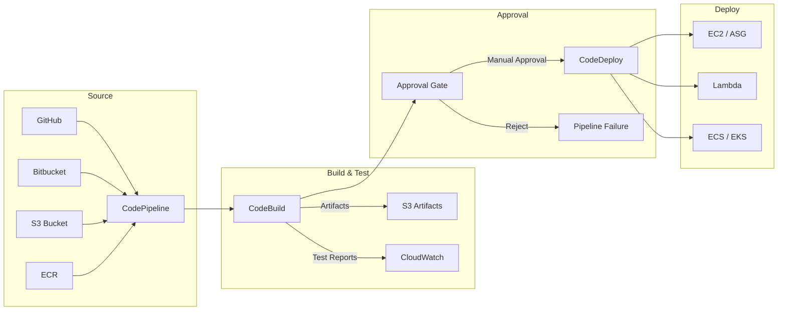

# AWS CodePipeline / CodeBuild / CodeDeploy (CI/CD)

## What is it?
AWS CodePipeline is a fully managed continuous delivery service that automates build, test, and deploy phases. CodeBuild is a fully managed build service that compiles source code, runs tests, and produces artifacts. CodeDeploy automates application deployments to EC2, Lambda, ECS, and on-premises instances.

## Why it was created
Before these services, teams had to manage their own CI/CD infrastructure (Jenkins, TeamCity, etc.), handle scaling build servers, configure artifact storage, and build custom deployment automation. AWS's CI/CD stack provides a fully managed, serverless pipeline that integrates natively with AWS services, eliminating infrastructure management overhead.

## When should you use it
- **Automated release pipelines**: Build, test, and deploy with every code commit
- **Multi-stage deployments**: Dev → Staging → Production with manual approval gates
- **Compliance and audit**: Immutable pipeline history, approval tracking, and rollback
- **Multi-region / multi-environment**: Deploy to multiple regions or accounts from one pipeline
- **Container-based deployments**: Build Docker images, push to ECR, deploy to ECS/EKS

## Architecture



## Pipeline Stages & Actions

| Stage | Actions | Description |
|-------|---------|-------------|
| **Source** | GitHub, CodeCommit, S3, Bitbucket | Fetch source code and trigger pipeline |
| **Build** | CodeBuild, Jenkins, CloudBees | Compile, test, package artifacts |
| **Test** | CodeBuild, 3rd party (BlazeMeter, GhostLab) | Run automated tests (unit, integration, security) |
| **Approve** | Manual Approval | Pause pipeline for human sign-off |
| **Deploy** | CodeDeploy, ECS, CloudFormation, Lambda | Deploy artifacts to target environments |
| **Invoke** | Lambda, Step Functions | Run custom actions (e.g., notify, migrate) |

## CodeBuild — Buildspec

```yaml
version: 0.2
phases:
  install:
    runtime-versions:
      nodejs: 18
    commands:
      - npm install
  pre_build:
    commands:
      - npm run lint
      - npm run test
  build:
    commands:
      - npm run build
  post_build:
    commands:
      - echo "Build completed on `date`"
artifacts:
  files:
    - 'dist/**/*'
    - 'appspec.yml'
  discard-paths: no
cache:
  paths:
    - 'node_modules/**/*'
reports:
  junit_reports:
    files:
      - '**/junit.xml'
    base-directory: 'test-results'
    file-format: JUNITXML
```

## CodeDeploy — AppSpec

### AppSpec for EC2/On-Premises
```yaml
version: 0.0
os: linux
files:
  - source: /
    destination: /var/www/myapp
hooks:
  BeforeInstall:
    - location: scripts/stop_server.sh
      timeout: 300
      runas: root
  AfterInstall:
    - location: scripts/install_deps.sh
      timeout: 300
  ApplicationStart:
    - location: scripts/start_server.sh
      timeout: 300
  ValidateService:
    - location: scripts/health_check.sh
      timeout: 60
```

## Deployment Configs

| Config | Traffic | Speed | Use Case |
|--------|---------|-------|----------|
| **AllAtOnce** | 100% instantly | Fast | Dev/test environments |
| **HalfAtATime** | 50% batches | Medium | Balanced risk |
| **OneAtATime** | Minimum | Slow | Production critical apps |
| **Blue/Green** | Switch all at once | Fast | Zero-downtime deployments |
| **Canary** | Percentage increments | Controlled | Gradual rollouts |

## Hands-on Example

```bash
# Create a pipeline from CLI
aws codepipeline create-pipeline --cli-input-json file://pipeline.json

# Start pipeline execution
aws codepipeline start-pipeline-execution --name MyAppPipeline

# Approve a manual approval action
aws codepipeline put-approval-result \
    --pipeline-name MyAppPipeline \
    --stage-name Approve \
    --action-name Approval \
    --result summary="Approved",status="Approved"

# Retry failed stage
aws codepipeline retry-stage-execution \
    --pipeline-name MyAppPipeline \
    --pipeline-execution-id abc123 \
    --stage-name Deploy \
    --retry-mode FAILED_STATE

# Build project commands
aws codebuild create-project --name MyBuild --source file://source.json
aws codebuild start-build --project-name MyBuild

# Deploy application
aws deploy create-application --application-name MyApp
aws deploy create-deployment-group \
    --application-name MyApp \
    --deployment-group-name MyDG \
    --service-role-arn arn:aws:iam::123456789012:role/CodeDeployRole \
    --ec2-tag-filters Key=Name,Value=MyAppServer,Type=KEY_AND_VALUE
```

## CI/CD with Approval Gates

```json
{
    "pipeline": {
        "name": "Production-Pipeline",
        "stages": [
            { "name": "Source", "actions": [...] },
            { "name": "Build", "actions": [...] },
            { "name": "Staging_Deploy", "actions": [...] },
            { "name": "Integration_Test", "actions": [...] },
            { "name": "Approval", "actions": [{
                "name": "Manager_Approval",
                "actionTypeId": {
                    "category": "Approval",
                    "owner": "AWS",
                    "provider": "Manual",
                    "version": "1"
                },
                "configuration": {
                    "NotificationArn": "arn:aws:sns:us-east-1:123456789012:ApprovalTopic",
                    "CustomData": "Review staging deployment logs"
                },
                "runOrder": 1
            }]},
            { "name": "Production_Deploy", "actions": [...] }
        ]
    }
}
```

## Pricing Model

| Service | Pricing |
|---------|---------|
| **CodePipeline** | $1.00 per active pipeline per month (first 1 free) |
| **CodeBuild** | Pay per build minute: $0.005/min for general compute, $0.009/min for large |
| **CodeDeploy** | No charge for EC2/On-Premises; ECS/Lambda deployments are free |

- CodeBuild free tier: 100 build minutes/month
- No charge for pipeline stages, actions, or approvals
- S3 storage for artifacts billed separately

## Best Practices
- **Use source control triggers**: Automatically start pipeline on code push to main branch
- **Enable pipeline artifact encryption**: Use KMS-managed keys for S3 artifacts
- **Cache dependencies in CodeBuild**: Cache `node_modules`, `.m2`, `vendor` directories
- **Use parallel test actions**: Run unit, integration, and security tests concurrently
- **Implement approval gates**: Require manual approval for production deployments
- **Test rollback procedures**: Validate that CodeDeploy rollback works correctly
- **Use CloudWatch Events**: Monitor pipeline state changes and send notifications
- **Store buildspec in source repo**: Keep pipeline configuration version-controlled

## Interview Questions
1. How do you set up a CI/CD pipeline with CodePipeline, CodeBuild, and CodeDeploy?
2. Explain the difference between AllAtOnce, OneAtATime, and Blue/Green deployment configs
3. How does the approval gate work in CodePipeline and how would you notify approvers?
4. What is a buildspec and what phases does it contain?
5. How does CodeDeploy handle rollbacks?
6. How would you integrate a third-party source like GitHub or Bitbucket?
7. How do you pass artifacts between pipeline stages?
8. What is the difference between CodeDeploy's in-place and blue/green deployments?

## Real Company Usage
**Netflix** uses CodePipeline with Spinnaker integration for their global streaming deployments. **Intuit** runs thousands of pipelines across multiple accounts for their QuickBooks and TurboTax services. **Expedia** uses CodeBuild for their build infrastructure, processing thousands of builds daily for their travel platform.
