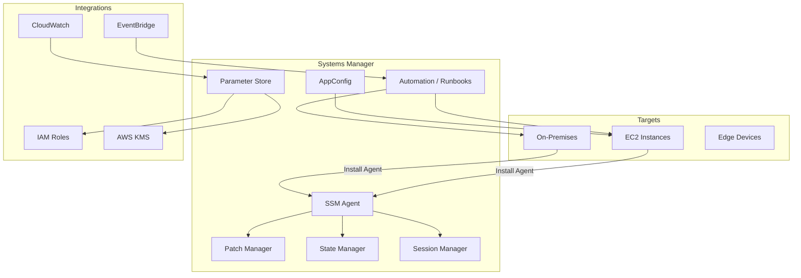

# AWS Systems Manager

## What is it?
AWS Systems Manager is a suite of capabilities for configuring, managing, and patching infrastructure at scale. It provides operational insights, automated remediation, secure access without bastion hosts, and centralized parameter/secret management across EC2, on-premises, and edge devices.

## Why it was created
Managing fleets of servers requires remote access (SSH/RDP), patch management, configuration enforcement, and secret distribution. Traditional approaches involved bastion hosts (security risks), manual patching (inconsistency), and custom scripts (maintenance burden). Systems Manager unifies fleet management with a secure, agent-based approach that requires no open inbound ports.

## When should you use it
- **Bastion-less SSH**: Use Session Manager to access instances without SSH keys or open ports
- **Centralized parameter store**: Store configuration values, database credentials, and license codes
- **Automated patching**: Schedule patching across Windows and Linux instances with Patch Manager
- **State management**: Enforce consistent OS configurations (registry, services, files) across instances
- **Operational automation**: Run predefined or custom runbooks for incident response and remediation
- **Application configuration**: Deploy and manage application configs with AppConfig

## Architecture



## Parameter Store — Tiers

| Feature | Standard | Advanced |
|---------|----------|----------|
| **Max parameters** | 10,000 per account/region | 100,000 per account/region |
| **Parameter size** | 4 KB | 8 KB |
| **Policies** | Not supported | Expiration, notification, auto-deletion |
| **Pricing** | Free | $0.05 per parameter per month |
| **Hierarchy** | /service/env/key supported | Same |

## Hierarchy & Policies

```
/production/webapp/db/url
/production/webapp/db/password
/development/webapp/db/url
/development/webapp/db/password
```

Advanced parameter policies:
```bash
aws ssm put-parameter \
    --name "/production/app/api-key" \
    --value "secret-api-key-123" \
    --type SecureString \
    --tier Advanced \
    --policies '[{
        "Type": "ExpirationNotification",
        "Version": "1.0",
        "Attributes": {"Before": "30", "Unit": "Days"}
    },{
        "Type": "AutoDeleteParameter",
        "Version": "1.0",
        "Attributes": {}
    }]'
```

## Patch Manager

- Supports Windows, Amazon Linux, Ubuntu, RHEL, SUSE, CentOS
- Patch baselines define approved/rejected patches
- Maintenance Windows schedule patch execution
- Patch compliance reporting via SSM Inventory + Config

```bash
# Create patch baseline
aws ssm create-patch-baseline \
    --name "Production-Linux-Baseline" \
    --operating-system AMAZON_LINUX_2 \
    --approval-rules 'PatchRules=[{PatchFilterGroup={PatchFilters=[{Key=PRODUCT,Values=["*"]}]},ApproveAfterDays=7}]'

# Get patch compliance
aws ssm describe-instance-patch-states \
    --instance-ids i-0123456789abcdef0
```

## Session Manager — Bastion-less SSH

```bash
# Start a session
aws ssm start-session --target i-0123456789abcdef0

# Port forwarding (tunnel to private RDS)
aws ssm start-session \
    --target i-0123456789abcdef0 \
    --document-name AWS-StartPortForwardingSessionToRemoteHost \
    --parameters '{"host":["mydb.cluster-xyz.us-east-1.rds.amazonaws.com"],"portNumber":["3306"],"localPortNumber":["3306"]}'
```

## Automation Runbooks

Predefined and custom runbooks for operational tasks:

```yaml
description: "Restore EBS volume from snapshot"
schemaVersion: "0.3"
assumeRole: "arn:aws:iam::123456789012:role/AutomationRole"
parameters:
  VolumeId: { type: "String", description: "Volume ID to restore" }
mainSteps:
  - name: "CreateVolumeFromSnapshot"
    action: "aws:createStack"
    inputs:
      StackName: "RestoreVolume-{{automation:EXECUTION_ID}}"
      TemplateBody: |
        AWSTemplateFormatVersion: "2010-09-09"
        Resources:
          NewVolume:
            Type: AWS::EC2::Volume
            Properties:
              AvailabilityZone: us-east-1a
              Size: 100
```

## Hands-on Example

```bash
# Install SSM Agent (already on Amazon Linux 2/2023)
# On Ubuntu/Debian:
sudo snap install amazon-ssm-agent --classic

# Register on-premises instance
aws ssm create-activation \
    --default-instance-name "onprem-web-01" \
    --iam-role "SSMManagedInstanceRole" \
    --registration-limit 1

# Store a parameter
aws ssm put-parameter \
    --name "/prod/app/db-url" \
    --value "postgresql://prod-db.internal:5432/app" \
    --type String \
    --tags Key=Environment,Value=Production

# Get parameter
aws ssm get-parameter \
    --name "/prod/app/db-url" \
    --with-decryption

# Run a command on multiple instances
aws ssm send-command \
    --document-name "AWS-RunShellScript" \
    --targets Key=tag:Environment,Values=Production \
    --parameters 'commands=["df -h", "systemctl status nginx"]'

# Create maintenance window
aws ssm create-maintenance-window \
    --name "Weekend-Patching" \
    --schedule "cron(0 2 ? * SUN *)" \
    --duration 2 \
    --cutoff 1
```

## Pricing Model

| Component | Pricing |
|-----------|---------|
| **Parameter Store (Standard)** | Free — 10,000 parameters |
| **Parameter Store (Advanced)** | $0.05/parameter/month |
| **Session Manager** | $0.05/connection (no charge for connection time in-region) |
| **Patch Manager** | No additional charge |
| **State Manager** | $0.01 per association per instance per month |
| **Automation** | $0.001 per step per execution (first 10,000 steps free) |
| **Inventory** | No additional charge |
| **AppConfig** | $0.000002 per configuration retrieval + $0.10 per configuration profile per month |

## Best Practices
- **Use Parameter Store for config**: Separate config from code; reference parameters in applications
- **Use SecureString with KMS**: Encrypt sensitive parameters with customer-managed KMS keys
- **Implement least-privilege IAM**: Use fine-grained policies for parameter access by path prefix
- **Use Session Manager over SSH**: No open inbound ports, full CloudTrail audit logging
- **Tag instances for patching**: Use tags to target Patch Manager maintenance windows
- **Use State Manager associations**: Enforce consistent configuration (antivirus, registry, firewall)
- **Create automation runbooks**: Standardize incident response with version-controlled runbooks

## Interview Questions
1. How does Session Manager enable bastion-less SSH access and why is it more secure?
2. What is the difference between Standard and Advanced parameter tiers?
3. How does Patch Manager automate OS patching across a fleet?
4. What are automation runbooks and how do you create custom ones?
5. How does State Manager enforce configuration drift remediation?
6. How does Parameter Store hierarchy work and how can IAM policies restrict access by path?
7. What is AppConfig and how does it differ from Parameter Store?
8. How does Systems Manager integrate with CloudWatch and EventBridge?

## Real Company Usage
**Intuit** uses Session Manager for all EC2 access, eliminating bastion hosts across their multi-account environment. **Dow Jones** uses Patch Manager to patch thousands of Windows and Linux instances across global regions with scheduled maintenance windows. **Siemens** uses Automation runbooks for standardized incident response, reducing mean time to remediation (MTTR) by 60%.
