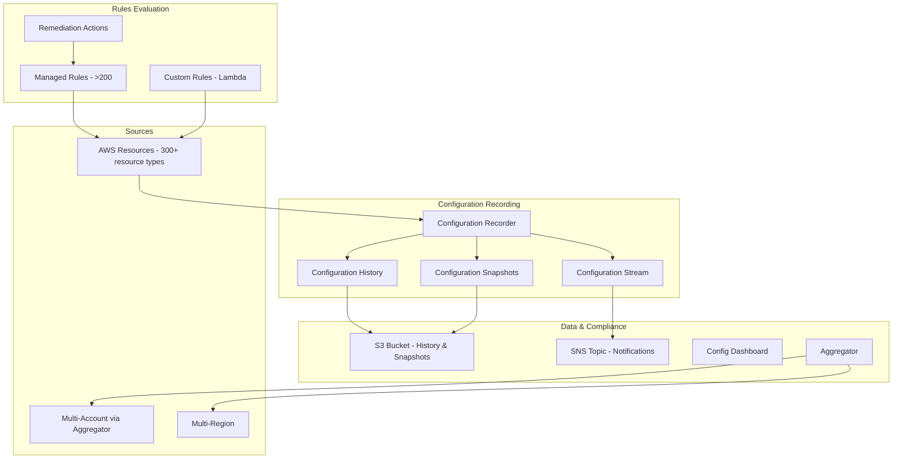
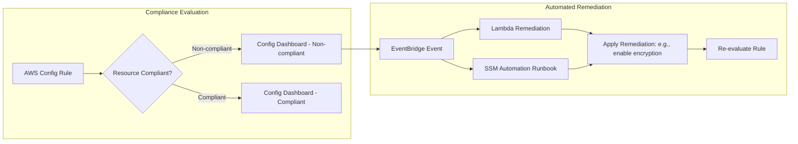

# AWS Config

## What is it?
AWS Config is a service that evaluates, audits, and assesses the configuration of AWS resources against desired policies. It continuously monitors resource configurations, records configuration changes, and evaluates compliance against managed or custom rules.

## Why it was created
Without Config, organizations struggle to track resource configuration changes, detect non-compliant resources, and prove compliance to auditors. Security teams had to build custom scripts to snapshot configurations and manually check for drifts. AWS Config provides a continuous, automated compliance engine with a complete historical view of resource configurations.

## When should you use it
- **Compliance auditing**: Prove resources comply with internal standards (encryption, tagging, region restrictions)
- **Security enforcement**: Detect publicly accessible S3 buckets, unencrypted EBS volumes, overly permissive security groups
- **Configuration change tracking**: Record every configuration change with before-and-after snapshots
- **Operational troubleshooting**: Review resource configuration at the time of an incident
- **Multi-account compliance**: Aggregate compliance data across accounts with an aggregator

## Architecture



## Managed vs Custom Rules

| Type | Example | Evaluation Frequency |
|------|---------|---------------------|
| **Managed** | s3-bucket-public-read-prohibited, encrypted-volumes, restricted-ssh | Configuration changes + periodic (1h/3h/6h/12h/24h) |
| **Custom (Lambda)** | Check specific tagging schema, custom encryption validation | Config triggers Lambda function on configuration changes |

## Conformance Packs

A conformance pack is a collection of AWS Config rules and remediation actions that can be deployed as a single entity across an account or organization.

```yaml
ConformancePack:
  Template: AWS::Config::ConformancePack
  Properties:
    ConformancePackName: "PCI-DSS-Conformance"
    TemplateS3Uri: "s3://config-conformance-templates/pci-dss.yaml"
    TemplateBody: |
      Resources:
        S3BucketLogging:
          Type: AWS::Config::ConfigRule
          Properties:
            Source:
              Owner: AWS
              SourceIdentifier: S3_BUCKET_LOGGING_ENABLED
        SecurityGroupOpenPorts:
          Type: AWS::Config::ConfigRule
          Properties:
            Source:
              Owner: AWS
              SourceIdentifier: INCOMING_SSH_DISABLED
```

## Compliance Dashboard & Remediation



## Hands-on Example

```bash
# Enable Config (one-time per region)
aws configservice subscribe --s3-bucket config-bucket --sns-topic arn:aws:sns:us-east-1:123456789012:ConfigTopic

# Create a managed rule
aws configservice put-config-rule \
    --config-rule '{
        "ConfigRuleName": "s3-bucket-public-read-prohibited",
        "Source": {
            "Owner": "AWS",
            "SourceIdentifier": "S3_BUCKET_PUBLIC_READ_PROHIBITED"
        },
        "Scope": {
            "ComplianceResourceTypes": ["AWS::S3::Bucket"]
        }
    }'

# Create a custom rule with Lambda
aws configservice put-config-rule \
    --config-rule '{
        "ConfigRuleName": "required-tags",
        "Source": {
            "Owner": "CUSTOM_LAMBDA",
            "SourceIdentifier": "arn:aws:lambda:us-east-1:123456789012:function:ConfigTagChecker",
            "SourceDetails": [{
                "EventSource": "aws.config",
                "MessageType": "ConfigurationItemChangeNotification"
            }]
        }
    }'

# Get compliance details
aws configservice get-compliance-details-by-config-rule \
    --config-rule-name s3-bucket-public-read-prohibited

# Start conformance pack deployment
aws configservice put-conformance-pack \
    --conformance-pack-name "Security-Baseline" \
    --template-s3-uri "s3://config-templates/security-baseline.yaml"

# Set up aggregator
aws configservice put-configuration-aggregator \
    --configuration-aggregator-name "OrgAggregator" \
    --organization-aggregation-source '{
        "RoleArn": "arn:aws:iam::management-account:role/config-aggregator-role",
        "AllAwsRegions": true
    }'

# Describe configuration history
aws configservice get-resource-config-history \
    --resource-type AWS::EC2::SecurityGroup \
    --resource-id sg-0123456789abcdef0
```

## Pricing Model

| Component | Pricing |
|-----------|---------|
| **Configuration recording** | $0.003 per configuration item recorded per region |
| **Managed rules** | $0.001 per rule evaluation per region (first 10,000 evaluations free) |
| **Custom rules (Lambda)** | $0.001 per evaluation + Lambda invocation costs |
| **Conformance packs** | $0.0001 per evaluation per rule member |
| **Aggregator** | $0.01 per account per region per month |
| **Remediation actions** | $0.001 per remediation step |

- Estimated typical cost: $2-5 per region per account per month
- S3 storage for configuration history and snapshots is extra

## Best Practices
- **Enable Config in all regions**: Use an aggregator to centralize compliance across regions and accounts
- **Use conformance packs**: Deploy standardized compliance rules across the organization
- **Set up automated remediation**: Use SSM Automation or Lambda to auto-fix non-compliant resources
- **Stream config data to S3**: Store configuration history for auditing and compliance evidence
- **Use tags for resource governance**: Create custom rules that enforce mandatory tagging schema
- **Deploy aggregator in audit account**: Centralize compliance visibility across the organization
- **Monitor Config events in EventBridge**: Trigger notifications for non-compliance events

## Interview Questions
1. How does AWS Config evaluate resource compliance and what triggers evaluation?
2. What is the difference between a managed rule and a custom rule?
3. How does conformance packs help with multi-account compliance at scale?
4. How does the configuration recorder work and what data does it capture?
5. How does Config remediation automate fixing non-compliant resources?
6. What is a configuration aggregator and why would you use one?
7. How does AWS Config help with compliance frameworks like PCI-DSS or SOC 2?
8. How does Config differ from CloudTrail in terms of what each records?

## Real Company Usage
**Capital One** uses AWS Config with custom rules and automated remediation across thousands of accounts to enforce encryption, logging, and network security policies. **NHS Digital** uses Config with conformance packs to maintain compliance with healthcare data protection standards. **Dow Jones** uses Config aggregators to gain centralized visibility across their multi-account media and publishing infrastructure.
