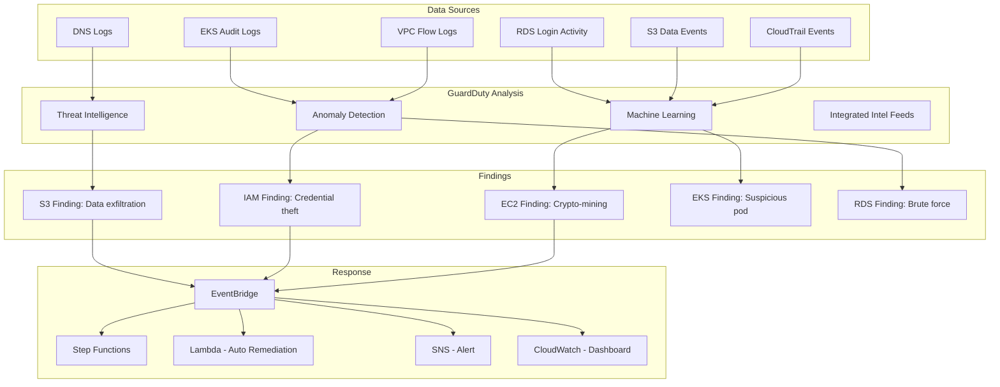

# AWS GuardDuty

## What is it?
Amazon GuardDuty is a threat detection service that continuously monitors AWS accounts and workloads for malicious activity. It uses machine learning, anomaly detection, and integrated threat intelligence to identify threats across CloudTrail, VPC Flow Logs, DNS logs, S3 data events, EKS audit logs, and RDS login activity.

## Why it was created
Security teams needed a way to detect threats across the entire AWS environment without deploying agents or managing security infrastructure. Traditional security monitoring required SIEM deployment, log aggregation, and custom threat detection rules. GuardDuty provides a fully managed, intelligent threat detection service that automatically analyzes AWS data sources for suspicious activity.

## When should you use it
- **Threat detection**: Identify compromised instances, malicious IP communication, and credential theft
- **Anomaly detection**: Detect unusual API activity, data exfiltration, and crypto mining behavior
- **Compliance monitoring**: Meet security monitoring requirements for PCI-DSS, SOC 2, HIPAA
- **Automated incident response**: Trigger Lambda functions or Step Functions for automatic threat remediation
- **Multi-account security**: Centrally manage threat detection across all accounts in the organization

## Architecture



## Finding Types & Severity

| Finding Category | Example | Severity | Data Source |
|-----------------|---------|----------|-------------|
| **Backdoor** | EC2 instance communicating with known C2 server | High (8-10) | VPC Flow + DNS |
| **CryptoCurrency** | EC2 instance mining cryptocurrency | Medium (5-7) | VPC Flow + DNS |
| **Stealth** | IAM user disabled CloudTrail logging | High (8-10) | CloudTrail |
| **UnauthorizedAccess** | SSH brute force on EC2 instance | Low-Medium (2-5) | VPC Flow |
| **Policy** | Root user activity detected | Medium (5-7) | CloudTrail |
| **Recon** | IAM user enumerating permissions (List*) | Low (1-2) | CloudTrail |
| **ResourceConsumption** | S3 bucket data transfer anomaly | Medium (5-7) | S3 Data Events |
| **Discovery** | EKS API calls from unexpected IP | Medium (5-7) | EKS Audit |
| **CredentialAccess** | RDS MySQL brute force login | High (8-10) | RDS Login |

## Threat Lists & Suppression

### Threat Lists
- Custom threat intelligence (your own IP/Domain lists)
- Trusted IP lists (known safe IPs to exclude from findings)
- Up to 6 custom lists per account per region

```bash
# Upload threat list
aws guardduty create-threat-intel-set \
    --detector-id abc123 \
    --name "My-Block-List" \
    --location "s3://guardduty-config/threat-list.txt" \
    --format TXT \
    --activate
```

### Suppression Rules
- Automatically archive findings matching specific criteria
- Based on finding type, resource, severity, or account

```bash
# Create suppression rule
aws guardduty create-filter \
    --detector-id abc123 \
    --filter-name "Supress-Route53-Test" \
    --action ARCHIVE \
    --finding-criteria '{
        "Criterion": {
            "type": {
                "Equals": ["Recon:EC2/PortProbeUnprotected"]
            },
            "severity": {
                "LessThan": 5
            }
        }
    }'
```

## Automated Remediation with EventBridge + Lambda

```json
{
    "detail-type": ["GuardDuty Finding"],
    "source": ["aws.guardduty"],
    "detail": {
        "severity": [8, 9, 10],
        "type": ["*CryptoCurrency*"]
    }
}
```

```python
def lambda_handler(event, context):
    finding = event['detail']
    instance_id = finding['resource']['instanceDetails']['instanceId']
    
    # Isolate instance by revoking security group rules
    ec2 = boto3.client('ec2')
    ec2.modify_instance_attribute(
        InstanceId=instance_id,
        Groups=['sg-isolated-security-group']
    )
    
    # Create snapshot for forensics
    volumes = ec2.describe_volumes(Filters=[{'Name': 'attachment.instance-id', 'Values': [instance_id]}])
    for vol in volumes['Volumes']:
        ec2.create_snapshot(VolumeId=vol['VolumeId'], Description='Forensic snapshot')
    
    # Tag instance
    ec2.create_tags(Resources=[instance_id], Tags=[{'Key': 'GuardDuty-Isolated', 'Value': 'true'}])
```

## Hands-on Example

```bash
# Enable GuardDuty
aws guardduty create-detector --enable

# View findings
aws guardduty list-findings --detector-id abc123

# Get finding details
aws guardduty get-findings \
    --detector-id abc123 \
    --finding-ids "finding-id-1"

# Archive a finding
aws guardduty archive-findings \
    --detector-id abc123 \
    --finding-ids "finding-id-1"

# Pause (disable) GuardDuty
aws guardduty update-detector \
    --detector-id abc123 \
    --no-enable

# Enable organization-wide GuardDuty
aws guardduty create-members \
    --detector-id abc123 \
    --account-details AccountId=222222222222,Email=admin@account2.com

# Get usage statistics
aws guardduty get-usage-statistics \
    --detector-id abc123 \
    --usage-statistic-type SUM_BY_RESOURCE \
    --usage-criteria '{"AccountIds": ["111111111111"]}'
```

## Pricing Model

| Data Source | Pricing per GB |
|-------------|----------------|
| **CloudTrail** | $0.40 per GB (first 50K events free/month) |
| **VPC Flow Logs** | $0.40 per GB |
| **DNS Logs** | $0.40 per GB |
| **S3 Data Events** | $0.40 per GB |
| **EKS Audit Logs** | $0.40 per GB |
| **RDS Login Activity** | $0.40 per GB |

- 30-day free trial for new accounts
- No per-finding or per-alert charges
- Pricing varies by region

## Best Practices
- **Enable GuardDuty in all regions**: Threats can originate from any region; enable organization-wide
- **Integrate with EventBridge**: Automate incident response with Lambda, Step Functions, or SNS
- **Use suppression rules carefully**: Only suppress low-severity, known-baseline findings
- **Create a response runbook**: Define escalation paths for High (8-10) severity findings
- **Review findings weekly**: Even suppressed findings should be regularly reviewed
- **Enable S3 Protection and EKS Audit Logs**: Extend threat coverage to data and container layers
- **Use multi-account setup**: Enable GuardDuty at the organization level via delegated admin
- **Integrate with Security Hub**: Aggregate findings from GuardDuty, Inspector, and other security services

## Interview Questions
1. What data sources does GuardDuty analyze and what types of threats can it detect?
2. How does GuardDuty use machine learning for anomaly detection?
3. How would you automate response to a crypto-mining GuardDuty finding?
4. What is the difference between a threat list and a suppression rule?
5. How does GuardDuty work in a multi-account organization?
6. How do you integrate GuardDuty with EventBridge for automated incident response?
7. What severity levels does GuardDuty use and how would you prioritize high-severity findings?
8. How does GuardDuty compare to third-party SIEM solutions for AWS threat detection?

## Real Company Usage
**Netflix** uses GuardDuty as a primary threat detection layer across their extensive AWS infrastructure. **Twilio** integrates GuardDuty with their incident response automation, using EventBridge to trigger Lambda functions for automatic containment. **Capital One** uses GuardDuty in conjunction with Security Hub for centralized threat management across thousands of AWS accounts.
