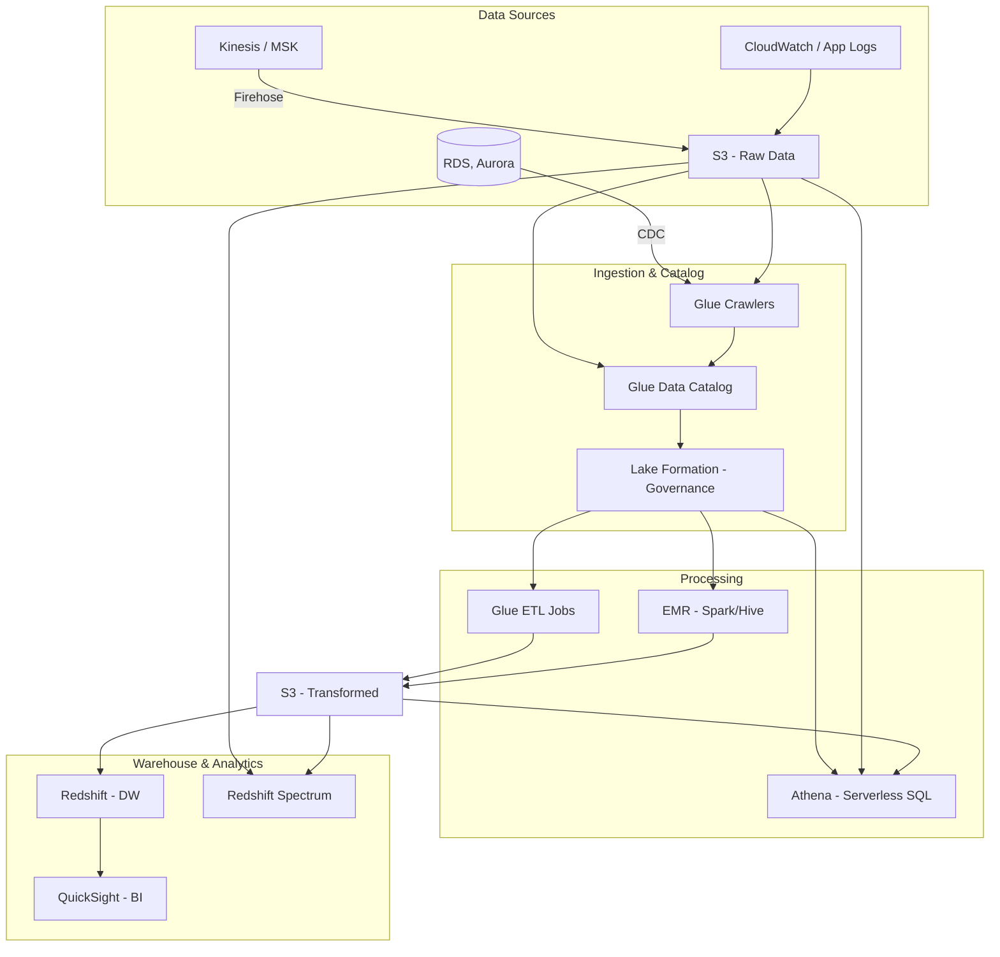

# AWS Analytics Stack (Glue, Athena, Redshift, EMR, Lake Formation)

## What is it?
The AWS analytics stack is a comprehensive set of services for building end-to-end data analytics pipelines. AWS Glue provides serverless ETL (extract, transform, load) with a managed data catalog. Athena enables serverless SQL queries directly on data in S3. Redshift is a fully managed petabyte-scale data warehouse. EMR runs big data frameworks (Spark, Hive, Presto). Lake Formation centralizes data lake governance and security.

## Why it was created
Traditional analytics required separate infrastructure for ETL, data warehousing, and big data processing, with complex integration between components. The AWS analytics stack is designed to work together seamlessly, with a shared data catalog, consistent security model, and serverless options that eliminate infrastructure management. Lake Formation unifies governance so organizations can manage access to data across all analytics services from a single point.

## When should you use it
- **Data lake architecture**: Build a centralized data lake on S3 with governed access
- **Ad-hoc SQL analytics**: Query data directly in S3 with Athena (no ETL required)
- **ETL pipelines**: Transform raw data into analytics-ready formats with Glue
- **BI and reporting**: Run complex analytical queries on structured data with Redshift
- **Big data processing**: Process massive datasets with Spark/Hive on EMR
- **Data cataloging**: Discover, catalog, and search data assets across the organization

## Architecture



## Glue — Crawlers, Catalog, ETL

| Component | Description |
|-----------|-------------|
| **Crawler** | Connects to data store, determines schema, populates Data Catalog |
| **Data Catalog** | Central metadata repository (tables, schemas, partitions, statistics) |
| **ETL Jobs (Python/Scala)** | Serverless Spark-based data transformations |
| **Triggers** | Schedule-based, event-based (S3/Crawler), or on-demand job triggers |
| **Workflows** | Orchestrate multiple crawlers, jobs, and triggers |

```python
# Glue ETL Script (PySpark)
import sys
from awsglue.transforms import *
from awsglue.context import GlueContext
from pyspark.context import SparkContext

sc = SparkContext()
glueContext = GlueContext(sc)

# Read from catalog
datasource = glueContext.create_dynamic_frame.from_catalog(
    database="analytics_db",
    table_name="raw_orders"
)

# Transform
mapped = ApplyMapping.apply(
    frame=datasource,
    transformations=[
        ("order_id", "string", "order_id", "string"),
        ("amount", "double", "amount", "double"),
        ("created_at", "string", "created_date", "date")
    ]
)

# Write to S3 in Parquet
glueContext.write_dynamic_frame.from_options(
    frame=mapped,
    connection_type="s3",
    connection_options={"path": "s3://transformed/orders/"},
    format="parquet"
)
```

## Athena — Serverless SQL

```sql
-- Create external table from Glue Catalog
CREATE EXTERNAL TABLE orders (
  order_id string,
  customer_id string,
  amount double,
  order_date date
)
ROW FORMAT SERDE 'org.apache.hadoop.hive.ql.io.parquet.serde.ParquetHiveSerDe'
STORED AS PARQUET
LOCATION 's3://transformed/orders/';

-- Query directly on S3 (no infrastructure)
SELECT customer_id, SUM(amount) as total_spent
FROM orders
WHERE order_date >= '2025-01-01'
GROUP BY customer_id
ORDER BY total_spent DESC
LIMIT 10;

-- Cross-account query via Lake Formation
SELECT * FROM "lakeformation_db"."shared_sales"
WHERE region = 'NA'; 
```

## Redshift — RA3, Spectrum, Concurrency Scaling

| Feature | Description |
|---------|-------------|
| **RA3 Nodes** | Separated compute and storage — scale compute independently of storage |
| **Redshift Spectrum** | Query exabytes of data in S3 directly (no loading required) |
| **Concurrency Scaling** | Auto-adds capacity for concurrent queries with steady throughput |
| **Materialized Views** | Pre-compute and refresh complex aggregations |
| **AQUA (Advanced Query Accelerator)** | Hardware-accelerated caching for faster queries |
| **Auto-Vacuum & Sort** | Automated table maintenance with no manual tuning |

```sql
-- Create Spectrum external table
CREATE EXTERNAL TABLE spectrum.sales (
  sale_id int,
  product varchar(100),
  amount decimal(10,2),
  sale_date date
)
ROW FORMAT SERDE 'org.apache.hadoop.hive.ql.io.parquet.serde.ParquetHiveSerDe'
LOCATION 's3://data-lake/sales/';

-- Query across Redshift and S3
SELECT p.category, SUM(s.amount) as revenue
FROM spectrum.sales s
JOIN dim_products p ON s.product_id = p.id
GROUP BY p.category;
```

## Hands-on Example

```bash
# Create Glue crawler
aws glue create-crawler \
    --name orders-crawler \
    --role arn:aws:iam::123456789012:role/GlueServiceRole \
    --database-name analytics_db \
    --targets '{"S3Targets": [{"Path": "s3://raw-data/orders/"}]}'

# Start Glue crawler
aws glue start-crawler --name orders-crawler

# Create Glue ETL job
aws glue create-job \
    --name order-transform \
    --role GlueServiceRole \
    --command Name=glueetl,ScriptLocation=s3://scripts/etl.py \
    --default-arguments '{"--job-bookmark-option": "job-bookmark-enable"}'

# Query with Athena from CLI
aws athena start-query-execution \
    --query-string "SELECT COUNT(*) FROM orders WHERE order_date > '2025-01-01'" \
    --result-configuration OutputLocation=s3://athena-results/ \
    --query-execution-context Database=analytics_db

# Create Redshift cluster
aws redshift create-cluster \
    --cluster-identifier analytics-cluster \
    --node-type ra3.xlplus \
    --number-of-nodes 2 \
    --master-username admin \
    --master-user-password StrongP@ss123

# Run EMR Spark job
aws emr create-cluster \
    --name "Spark ETL" \
    --release-label emr-7.1.0 \
    --applications Name=Spark \
    --instance-type r5.xlarge \
    --instance-count 3 \
    --ec2-attributes KeyName=my-key \
    --steps Type=Spark,Name="Process Sales",ActionOnFailure=TERMINATE_CLUSTER,\
StepArgs=["s3://scripts/spark-job.py"]

# Grant Lake Formation permissions
aws lakeformation grant-permissions \
    --principal DataLakePrincipalIdentifier=arn:aws:iam::123456789012:user/analyst \
    --resource '{"Database": {"Name": "analytics_db"}}' \
    --permissions "SELECT" "DESCRIBE"
```

## Pricing Model

| Service | Pricing Model | Approximate Cost |
|---------|--------------|------------------|
| **Glue** | DPU-hour (Data Processing Unit) | $0.44 per DPU-hour |
| **Glue Crawler** | Per DPU-hour | $0.44 per DPU-hour |
| **Athena** | Per TB scanned | $5.00 per TB |
| **Redshift** | Per node-hour (on-demand/RI) | $0.25–$13.04/hr per node |
| **Redshift Spectrum** | Per TB scanned | $5.00 per TB |
| **EMR** | Per EC2 instance-hour + EMR premium | $0.105/hr (m5.xlarge) + EMR surcharge |
| **Lake Formation** | Per object + API calls | $0.01 per 10,000 API calls |

## Best Practices
- **Partition data by date**: Partition S3 data by year/month/day for efficient Athena/Glue query pruning
- **Use columnar formats**: Store transformed data in Parquet/ORC for 10-100x query performance improvement
- **Use Lake Formation RBAC**: Single governance layer for Glue, Athena, Redshift Spectrum, and EMR
- **Enable Glue job bookmarks**: Track processed data for incremental ETL runs
- **Use Redshift Spectrum for warm data**: Query recent data in S3 directly; load only hot data into Redshift
- **Use Glue Workflows**: Orchestrate complex ETL pipelines with dependency management and failure handling
- **Compress data**: Use Snappy/ZSTD compression with Parquet for optimal storage and query performance

## Interview Questions
1. Explain the end-to-end analytics pipeline from raw data ingestion to BI visualization
2. How does Athena query S3 data and how does partitioning improve query performance?
3. What is the difference between Glue ETL and Redshift Spectrum for data transformation?
4. How does Redshift RA3 separate compute and storage and why is this beneficial?
5. How does Lake Formation provide centralized governance across the analytics stack?
6. Compare EMR with Glue for Spark-based ETL workloads
7. What is Redshift concurrency scaling and how does it handle query queuing?
8. How does Glue Data Catalog integrate with Athena, Redshift Spectrum, and EMR?

## Real Company Usage
**Capital One** uses Glue and Athena for their data mesh architecture, enabling self-service analytics across business units. **Intuit** processes terabytes of financial data daily with Glue ETL jobs running Spark transformations. **Netflix** uses Redshift for their A/B testing analytics, processing billions of events per day with Redshift Spectrum querying data directly from S3.
