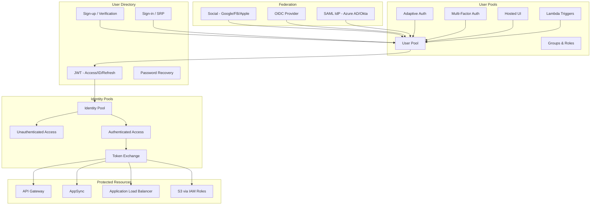

# Amazon Cognito

## What is it?
Amazon Cognito provides authentication, authorization, and user management for web and mobile applications. It consists of User Pools (a fully managed identity provider for sign-up/sign-in) and Identity Pools (for granting temporary AWS credentials to authenticated users). Cognito supports social identity providers, OIDC/SAML federation, MFA, and adaptive authentication.

## Why it was created
Building authentication from scratch is complex and error-prone — developers must handle password hashing, token generation, MFA, session management, user verification, and security best practices. Cognito eliminates this burden by providing a scalable, secure, and customizable user directory with built-in federation support.

## When should you use it
- **Customer identity and access management (CIAM)**: User registration, sign-in, and profile management for apps
- **Social login integration**: Sign-in with Google, Facebook, Apple, Amazon, or any OIDC/SAML provider
- **API authentication**: Authenticate API Gateway, AppSync, or ALB requests with JWT tokens from Cognito
- **Temporary AWS credentials**: Grant mobile/web users access to S3, DynamoDB, or Lambda via Identity Pools
- **Multi-tenancy**: Separate user directories per tenant using Cognito user pool groups with custom attributes

## Architecture



## User Pools — Core Features

| Feature | Description |
|---------|-------------|
| **Sign-up** | Self-registration with email/phone verification (email/SMS) |
| **Hosted UI** | Pre-built, customizable sign-in/sign-up page (Cognito domain or custom domain) |
| **Lambda Triggers** | Custom logic at 16 trigger points (PreSignUp, PostConfirmation, PreTokenGeneration, etc.) |
| **MFA** | SMS, TOTP (Google Authenticator/Authy), or email-based multi-factor authentication |
| **Adaptive Auth** | Risk-based authentication — challenge with MFA based on device, location, IP reputation |
| **Custom attributes** | Add custom fields to user profiles (up to 50 attributes) |

### Lambda Trigger Example

```python
# Pre Sign-up trigger — auto-verify email and add custom claim
def lambda_handler(event, context):
    event['response']['autoVerifyEmail'] = True
    event['response']['autoConfirmUser'] = True
    return event

# Pre Token Generation — add custom claims
def lambda_handler(event, context):
    event['response']['claimsOverrideDetails'] = {
        'claimsToAddOrOverride': {
            'tenant_id': event['request']['userAttributes'].get('custom:tenant_id'),
            'role': 'premium_user'
        }
    }
    return event
```

## Identity Pools — AWS Credentials

```json
{
    "IdentityPoolId": "us-east-1:abc123-def456",
    "Roles": {
        "authenticated": "arn:aws:iam::123456789012:role/AuthenticatedRole",
        "unauthenticated": "arn:aws:iam::123456789012:role/UnauthenticatedRole"
    }
}
```

```python
# Mobile SDK — Get AWS credentials
from boto3 import Session
from warrant import Cognito

u = Cognito('us-east-1_abc123', 'client_id')
u.authenticate(password='mypassword')

# Exchange tokens for AWS credentials
identity = boto3.client('cognito-identity')
response = identity.get_id(
    AccountId='123456789012',
    IdentityPoolId='us-east-1:abc123-def456',
    Logins={
        'cognito-idp.us-east-1.amazonaws.com/us-east-1_abc123': u.id_token
    }
)

credentials = identity.get_credentials_for_identity(
    IdentityId=response['IdentityId'],
    Logins={
        'cognito-idp.us-east-1.amazonaws.com/us-east-1_abc123': u.id_token
    }
)
```

## Federation — OIDC/SAML

```bash
# Create OIDC provider in Cognito
aws cognito-idp create-identity-provider \
    --user-pool-id us-east-1_abc123 \
    --provider-name "AzureAD" \
    --provider-type OIDC \
    --provider-details '{
        "client_id": "azure-client-id",
        "client_secret": "azure-client-secret",
        "authorize_scopes": "openid profile email",
        "authorize_url": "https://login.microsoftonline.com/tenant-id/oauth2/v2.0/authorize",
        "token_url": "https://login.microsoftonline.com/tenant-id/oauth2/v2.0/token",
        "attributes_request_method": "GET",
        "oidc_issuer": "https://login.microsoftonline.com/tenant-id/v2.0"
    }' \
    --attribute-mapping '{"email": "email", "name": "name", "username": "sub"}'
```

## Hands-on Example

```bash
# Create a user pool
aws cognito-idp create-user-pool \
    --pool-name "my-app-users" \
    --policies '{"PasswordPolicy":{"MinimumLength":8,"RequireUppercase":true,"RequireNumbers":true}}' \
    --auto-verified-attributes email \
    --mfa-configuration ON \
    --enabled-mfa-lists SMS TOTP

# Create a user pool client
aws cognito-idp create-user-pool-client \
    --user-pool-id us-east-1_abc123 \
    --client-name "web-app-client" \
    --generate-secret \
    --explicit-auth-flows ALLOW_REFRESH_TOKEN_AUTH ALLOW_USER_SRP_AUTH \
    --supported-identity-providers COGNITO \
    --callback-urls '["https://myapp.com/callback"]'

# Create an identity pool
aws cognito-identity create-identity-pool \
    --identity-pool-name "my-app-identity" \
    --allow-unauthenticated-identities \
    --cognito-identity-providers '{
        "ProviderName": "cognito-idp.us-east-1.amazonaws.com/us-east-1_abc123",
        "ClientId": "client-id",
        "ServerSideTokenCheck": true
    }'

# Sign up a user (CLI)
aws cognito-idp sign-up \
    --client-id client-id \
    --username user@example.com \
    --password "StrongP@ss123!" \
    --user-attributes Name=email,Value=user@example.com

# Admin confirm user
aws cognito-idp admin-confirm-sign-up \
    --user-pool-id us-east-1_abc123 \
    --username user@example.com

# List users
aws cognito-idp list-users \
    --user-pool-id us-east-1_abc123

# Describe user pool
aws cognito-idp describe-user-pool \
    --user-pool-id us-east-1_abc123
```

## Pricing Model

| Component | Pricing |
|-----------|---------|
| **MAU (Monthly Active Users)** | $0.00550 per MAU (first 50,000) |
| **Tier 2 (50K-100K)** | $0.00400 per MAU |
| **Tier 3 (100K-1M)** | $0.00250 per MAU |
| **Tier 4 (1M+)** | $0.00100 per MAU |
| **MFA (SMS)** | $0.065 per SMS message |
| **MFA (TOTP)** | Included in MAU price |
| **Federation** | Included in MAU price |
| **Storage** | Free — up to 50 GB |
| **Advanced Security (Adaptive Auth)** | $0.005 per MAU |

## Best Practices
- **Use SRP (Secure Remote Password) protocol**: Never transmit passwords over the network — use SRP for zero-knowledge proof
- **Configure Lambda triggers**: Customize authentication flow with PreSignUp, PostConfirmation, PreTokenGeneration triggers
- **Use Identity Pools for AWS access**: Grant temporary, scoped AWS credentials based on user pool tokens
- **Enable adaptive authentication**: Challenge suspicious sign-ins with additional MFA based on risk score
- **Use custom domains for Hosted UI**: Use your own domain (auth.myapp.com) instead of Cognito domain
- **Set appropriate token expiration**: Access token (1 hour), ID token (1 hour), Refresh token (30 days by default)
- **Use groups for role-based access**: Assign IAM roles based on user group membership in Identity Pools
- **Integrate with CloudFront**: Use CloudFront with Lambda@Edge for advanced auth flows

## Interview Questions
1. What is the difference between Cognito User Pools and Identity Pools?
2. How does Cognito integrate with API Gateway for REST API authentication?
3. How does SRP (Secure Remote Password) authentication work in Cognito?
4. How do Lambda triggers customize the authentication flow?
5. How does Cognito support federation with external identity providers (OIDC/SAML)?
6. How does adaptive authentication work and what signals does it use for risk assessment?
7. How would you migrate existing users from a legacy auth system to Cognito?
8. How does Cognito work with AppSync for real-time GraphQL subscriptions?

## Real Company Usage
**Netflix** uses Cognito for customer identity management across their streaming platform. **Zillow** uses Cognito User Pools with social login for their real estate platform, handling millions of authenticated users. **T-Mobile** uses Cognito for their customer-facing applications with adaptive authentication and MFA enforcement.
