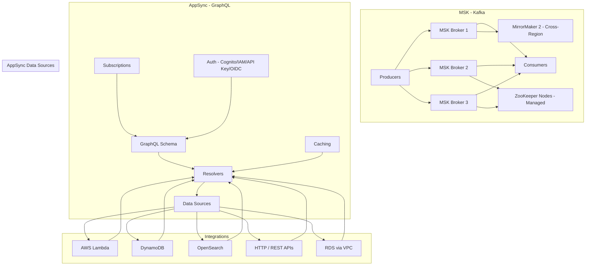

# AWS MSK & AppSync

## What is it?
Amazon MSK (Managed Streaming for Apache Kafka) is a fully managed Apache Kafka service that handles cluster provisioning, configuration, scaling, and maintenance. AWS AppSync is a fully managed GraphQL service that provides real-time data synchronization, offline data access, and secure API access for web and mobile applications.

## Why they were created
**MSK**: Running Apache Kafka requires expertise in cluster management, ZooKeeper maintenance, broker tuning, partition rebalancing, and disaster recovery. MSK eliminates this operational burden while maintaining Kafka API compatibility. **AppSync**: Building real-time applications requires managing WebSocket connections, implementing data synchronization, handling offline mutations, and building GraphQL resolvers that integrate with multiple data sources. AppSync provides all of this as a managed service.

## When should you use them
- **MSK**: Event streaming, log aggregation, data pipeline ingestion, CDC (change data capture), microservice event bus
- **AppSync**: Real-time collaborative apps (chat, dashboards), offline-first mobile apps, GraphQL API with multiple data sources, serverless backends

## Architecture



## MSK — Provisioned vs Serverless

| Feature | Provisioned | Serverless |
|---------|-------------|------------|
| **Capacity** | Manual broker count + instance size | Auto-scales based on throughput |
| **Min cost** | Minimum 2 brokers (HA) | Pay per partition-hour + data written/read |
| **Max throughput** | Up to several GB/s per cluster | Up to 5 MB/s per partition |
| **Partition limit** | 1,000 partitions per broker | 20 partitions per cluster |
| **Scaling** | Manual or auto-scaling (broker count) | Automatic |
| **Best for** | Predictable, high-throughput workloads | Variable throughput, dev/test, bursty workloads |

## MSK Configuration

```bash
# Create MSK cluster (provisioned)
aws kafka create-cluster \
    --cluster-name "production-events" \
    --kafka-version "3.6.0" \
    --number-of-broker-nodes 3 \
    --broker-node-group-info '{
        "InstanceType": "kafka.m5.large",
        "ClientSubnets": ["subnet-abc", "subnet-def", "subnet-ghi"],
        "SecurityGroups": ["sg-123"]
    }' \
    --encryption-info '{
        "EncryptionAtRest": {"DataVolumeKMSKeyId": "arn:aws:kms:..."}
    }'

# Create MSK cluster (serverless)
aws kafka create-cluster-v2 \
    --cluster-name "serverless-events" \
    --serverless '{
        "VpcConfigs": [{
            "SubnetIds": ["subnet-abc", "subnet-def"],
            "SecurityGroups": ["sg-123"]
        }]
    }'

# Describe cluster
aws kafka describe-cluster --cluster-arn arn:aws:kafka:...

# Update broker count (auto-scaling)
aws kafka update-broker-count \
    --cluster-arn arn:aws:kafka:... \
    --target-number-of-broker-nodes 6

# Get bootstrap brokers
aws kafka get-bootstrap-brokers --cluster-arn arn:aws:kafka:...
```

## MSK MirrorMaker 2 — Cross-Region Replication

```bash
# Create MirrorMaker 2 connector on MSK Connect
aws kafkaconnect create-connector \
    --connector-name "mm2-us-east-to-us-west" \
    --connector-configuration '{
        "connector.class": "org.apache.kafka.connect.mirror.MirrorSourceConnector",
        "source.cluster.alias": "us-east",
        "target.cluster.alias": "us-west",
        "source.cluster.bootstrap.servers": "b-1.us-east.mykafka.com:9098",
        "target.cluster.bootstrap.servers": "b-1.us-west.mykafka.com:9098",
        "replication.factor": "3",
        "topics": "orders.*,events.*",
        "sync.topic.configs.enabled": "true"
    }' \
    --kafka-cluster '{"apacheKafkaCluster": {
        "bootstrapServers": "b-1.us-east.mykafka.com:9098",
        "vpc": {"subnets": ["subnet-abc"], "securityGroups": ["sg-123"]}
    }}' \
    --kafka-cluster-client-authentication '{"authenticationType": "IAM"}'
```

## AppSync — GraphQL Schema & Resolvers

```graphql
type Order {
  id: ID!
  customerId: String!
  amount: Float!
  status: OrderStatus!
  items: [OrderItem]
  createdAt: AWSDateTime!
}

type OrderItem {
  productId: String!
  quantity: Int!
  price: Float!
}

enum OrderStatus {
  PENDING
  CONFIRMED
  SHIPPED
  DELIVERED
  CANCELLED
}

type Query {
  getOrder(id: ID!): Order
  listOrders(status: OrderStatus): [Order]
}

type Mutation {
  createOrder(input: CreateOrderInput!): Order
  updateOrderStatus(id: ID!, status: OrderStatus!): Order
}

type Subscription {
  onOrderStatusChanged(id: ID!): Order
    @aws_subscribe(mutations: ["updateOrderStatus"])
}

input CreateOrderInput {
  customerId: String!
  amount: Float!
  items: [OrderItemInput!]!
}
```

### Resolver — AppSync (DynamoDB Unit Resolver)

```json
{
  "version": "2018-05-29",
  "operation": "GetItem",
  "key": {
    "id": $util.dynamodb.toDynamoDBJson($ctx.args.id)
  }
}
```

```json
## Response Mapping
$util.toJson($ctx.result)
```

### Resolver — AppSync (Pipeline Resolver)

```json
{
  "version": "2023-09-01",
  "functions": [
    "validate-order-function",
    "check-inventory-function",
    "create-order-function"
  ],
  "response": "$ctx.result"
}
```

## AppSync — Data Sources & Caching

| Data Source | Use Case | Resolver Type |
|-------------|----------|---------------|
| **DynamoDB** | Key-value lookups, document data | Direct (unit) resolver |
| **Lambda** | Custom business logic, aggregations | Unit or pipeline resolver |
| **OpenSearch** | Full-text search, fuzzy matching | Unit resolver |
| **HTTP** | REST API integration (3rd party) | Unit resolver |
| **RDS (Aurora)** | Relational data with SQL | Pipeline resolver (RDS directive) |

**Caching**: AppSync supports per-resolver and API-level caching with TTL control using Amazon ElastiCache (Redis).

## Hands-on Example

```bash
# AppSync: Create GraphQL API
aws appsync create-graphql-api \
    --name "OrderAPI" \
    --authentication-type AMAZON_COGNITO_USER_POOLS \
    --user-pool-config '{
        "userPoolId": "us-east-1_abc123",
        "awsRegion": "us-east-1",
        "defaultAction": "ALLOW"
    }'

# Create DynamoDB data source
aws appsync create-data-source \
    --api-id abc123 \
    --name OrderTable \
    --type AMAZON_DYNAMODB \
    --dynamodb-config '{
        "tableName": "Orders",
        "awsRegion": "us-east-1"
    }' \
    --service-role-arn "arn:aws:iam::123456789012:role/AppSyncDynamoDBRole"

# Create resolver
aws appsync create-resolver \
    --api-id abc123 \
    --type-name Query \
    --field-name getOrder \
    --data-source-name OrderTable \
    --request-mapping-template '{"version":"2018-05-29","operation":"GetItem","key":{"id":$util.dynamodb.toDynamoDBJson($ctx.args.id)}}' \
    --response-mapping-template '$util.toJson($ctx.result)'

# Test GraphQL query
aws appsync evaluate-mapping-template \
    --template '{"version":"2018-05-29","operation":"GetItem","key":{"id":{"S":"123"}}}' \
    --context '{"arguments":{"id":"123"}}'
```

## Pricing Model

### MSK
| Component | Provisioned | Serverless |
|-----------|-------------|------------|
| **Broker hourly** | $0.15–$5.00/hr per broker | No per-broker charge |
| **Storage** | $0.10/GB-month (EBS) | Included |
| **Data written** | Included | $0.85/GB written |
| **Data read** | Included | $0.03/GB read |

### AppSync
| Component | Pricing |
|-----------|---------|
| **Query & Mutation** | $4.00 per million requests |
| **Subscription** | $2.00 per million connection-minutes |
| **Real-time updates** | $1.25 per million updates |
| **Caching** | $0.10–$2.70/hr for Redis |

## Best Practices
- **MSK**: Use IAM access control for authentication (SCRAM or TLS also available)
- **MSK**: Set appropriate retention and cleanup policies to control storage costs
- **MSK**: Use MSK Connect for stream processing instead of managing Kafka Connect clusters
- **MSK**: Monitor with CloudWatch metrics (BytesInPerSec, BytesOutPerSec, MaxOffsetLag)
- **AppSync**: Use pipeline resolvers for multi-step operations (validation → data fetch → response)
- **AppSync**: Enable caching for frequently accessed data to reduce data source load and latency
- **AppSync**: Use subscriptions for real-time updates (not polling)
- **AppSync**: Use Cognito User Pools for customer-facing APIs and IAM for service-to-service auth

## Interview Questions
1. Compare MSK provisioned vs serverless — when would you choose each?
2. How does MirrorMaker 2 enable cross-region replication for disaster recovery?
3. How does AppSync handle real-time subscriptions under the hood?
4. What is the difference between a unit resolver and a pipeline resolver in AppSync?
5. How does AppSync caching reduce data source load and improve latency?
6. How does AppSync support offline mutations and conflict resolution?
7. How does MSK integrate with Lambda for event-driven processing?
8. Compare MSK vs Kinesis for streaming data use cases.

## Real Company Usage
**Zalando** uses MSK for their event-driven microservices architecture, processing hundreds of thousands of events per second for order fulfillment and inventory management. **Expedia** uses AppSync for their mobile application, enabling real-time booking updates and offline-first travel itinerary management. **Samsung** uses AppSync across their SmartThings platform to provide real-time device state synchronization across millions of connected devices.
