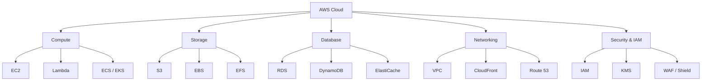

# 07 — Cloud Architecture

> Master cloud infrastructure across AWS, GCP, and Azure.

## Topics

| # | Topic | Description |
|---|-------|-------------|
| 1 | [AWS Overview](01-aws-overview.md) | Core AWS services |
| 2 | [GCP Overview](02-gcp-overview.md) | Core GCP services |
| 3 | [Azure Overview](03-azure-overview.md) | Core Azure services |
| 4 | [EC2 & Compute](04-ec2-compute.md) | Virtual machines and scaling |
| 5 | [Lambda & Serverless](05-lambda-serverless.md) | Serverless computing |
| 6 | [Kubernetes](06-kubernetes.md) | Container orchestration |
| 7 | [Docker](07-docker.md) | Containerization |
| 8 | [VPC & Networking](08-vpc-networking.md) | Cloud networking |
| 9 | [S3 & Storage](09-s3-storage.md) | Object and block storage |
| 10 | [CloudFront & CDN](10-cloudfront-cdn.md) | Content delivery |
| 11 | [RDS & Databases](11-rds-databases.md) | Managed databases |
| 12 | [IAM & Security](12-iam-security.md) | Identity and access management |
| 13 | [EKS, GKE, AKS](13-eks-gke-aks.md) | Managed Kubernetes |

---

Previous: [06 — Distributed Systems](../06-Distributed-Systems/README.md)
Next: [08 — Security](../08-Security/README.md)
