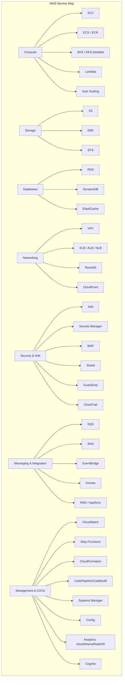

# 10 — AWS Cloud

> Master Amazon Web Services — 42 service deep-dives covering compute, storage, databases, networking, security, serverless, CI/CD, analytics, and more.

## Topics

### Compute
| # | Topic | Description |
|---|-------|-------------|
| 1 | [AWS Overview](01-aws-overview.md) | Global infrastructure, regions, AZs, services overview |
| 2 | [IAM Deep-Dive](02-iam-detailed.md) | Policies, roles, trust relationships, permission boundaries |
| 3 | [ECS & ECR](03-ecs.md) | Container orchestration with AWS native |
| 4 | [EC2 & Compute](04-ec2-compute.md) | Virtual machines, instance types, pricing models |
| 5 | [Lambda & Serverless](05-lambda-serverless.md) | Serverless compute, cold starts, event sources |
| 6 | [API Gateway](06-api-gateway.md) | REST/HTTP/WebSocket APIs, throttling, caching |
| 7 | [EKS Detailed](07-eks-detailed.md) | Managed Kubernetes, node groups, Fargate |
| 8 | [VPC & Networking](08-vpc-networking.md) | Subnets, NAT, VPC peering, endpoints, VPN |
| 9 | [S3 & Storage](09-s3-storage.md) | Object storage, lifecycle policies, versioning |
| 10 | [CloudFront & CDN](10-cloudfront-cdn.md) | Global CDN, Lambda@Edge, origin shield |
| 11 | [RDS & Databases](11-rds-databases.md) | Managed relational DBs, Aurora, read replicas |
| 12 | [IAM & Security Basics](12-iam-security.md) | Users, groups, policies, MFA, best practices |

### Storage & Databases
| # | Topic | Description |
|---|-------|-------------|
| 13 | [EBS](13-ebs.md) | Block storage for EC2, snapshots, encryption |
| 14 | [EFS](14-efs.md) | Managed NFS, lifecycle management, performance modes |
| 15 | [Route53](15-route53.md) | DNS service, routing policies, health checks |
| 16 | [ELB & Load Balancing](16-elb.md) | ALB, NLB, CLB, target groups, stickiness |
| 17 | [Auto Scaling](17-auto-scaling.md) | Launch templates, scaling policies, lifecycle hooks |
| 18 | [DynamoDB Deep-Dive](18-dynamodb-detailed.md) | Partitioning, RCU/WCU, DAX, global tables |
| 19 | [ElastiCache](19-elasticache.md) | Redis & Memcached, cluster mode, replication |

### Messaging & Integration
| # | Topic | Description |
|---|-------|-------------|
| 20 | [SQS Deep-Dive](20-sqs-detailed.md) | Standard vs FIFO, DLQ, long polling, visibility timeout |
| 21 | [SNS](21-sns.md) | Pub/sub messaging, delivery protocols, filtering |
| 22 | [EventBridge](22-eventbridge.md) | Event bus, schema registry, Pipes |
| 23 | [Kinesis](23-kinesis.md) | Streams, Firehose, Analytics, shard scaling |
| 24 | [CloudWatch](24-cloudwatch.md) | Metrics, logs, alarms, dashboards, Contributor Insights |
| 25 | [CloudTrail](25-cloudtrail.md) | Audit logging, event history, Insights |

### Security & Governance
| # | Topic | Description |
|---|-------|-------------|
| 26 | [Secrets Manager](26-secrets-manager.md) | Secret rotation, RDS integration, policies |
| 27 | [WAF](27-waf.md) | Web ACLs, rate limiting, bot control, managed rules |
| 28 | [Shield](28-shield.md) | DDoS protection, Shield Advanced, cost protection |
| 29 | [Organizations](29-organizations.md) | SCPs, OU structure, multi-account management |
| 30 | [Control Tower](30-control-tower.md) | Landing zone, guardrails, account factory |
| 31 | [Well-Architected Framework](31-well-architected.md) | 6 pillars, WAF tool, review process |

### CI/CD, Automation & Analytics
| # | Topic | Description |
|---|-------|-------------|
| 32 | [Certifications](32-certifications.md) | Learning path, exam guides, practice questions |
| 33 | [Step Functions](33-step-functions.md) | Workflows, Express/Standard, error handling |
| 34 | [CloudFormation](34-cloudformation.md) | IaC, stacks, change sets, nested stacks |
| 35 | [CodePipeline & CI/CD](35-codepipeline-cicd.md) | Pipeline stages, CodeBuild, CodeDeploy |
| 36 | [Systems Manager](36-systems-manager.md) | Parameter Store, Run Command, Patch Manager |
| 37 | [Config](37-config.md) | Resource compliance, rules, conformance packs |
| 38 | [GuardDuty](38-guardduty.md) | Threat detection, findings, automation |
| 39 | [Analytics Stack](39-analytics-stack.md) | Glue, Athena, Redshift, EMR, Lake Formation |
| 40 | [Cognito](40-cognito.md) | User pools, identity pools, federation |
| 41 | [MSK & AppSync](41-msk-appsync.md) | Managed Kafka, GraphQL real-time APIs |

---
Previous: [09 — Kubernetes](../09-Kubernetes/README.md)
Next: [11 — Azure](../11-Azure/README.md)
