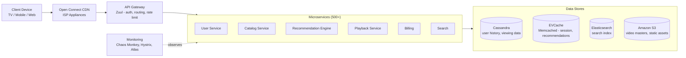

# Netflix Architecture

## Overview
Netflix streams to 260M+ subscribers using a microservices architecture on AWS. It's a pioneer in chaos engineering and CDN technology.

## Key Components

## Engineering Lessons

| Lesson | Detail |
|--------|--------|
| **Chaos Engineering** | Chaos Monkey randomly kills production instances |
| **Circuit Breaker** | Hystrix prevents cascading failures |
| **Immutable Infrastructure** | Every deploy is a new AMI |
| **Redundant CDN** | Open Connect appliances inside ISPs |
| **Microservices** | 500+ services, independent deploy |
| **API Gateway** | Zuul handles auth, routing, rate limiting |

## Interview Questions
1. How does Netflix's chaos engineering improve reliability?
2. How does the Open Connect CDN work?
3. Why did Netflix choose Cassandra for its data store?
4. How does Netflix handle service discovery at scale?
5. Design a simplified Netflix recommendation system
