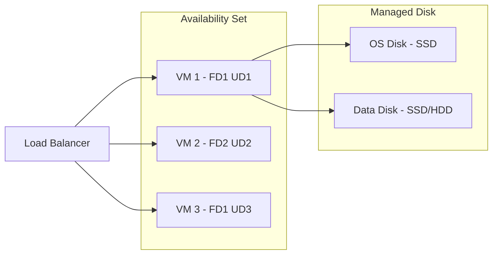

# Azure Virtual Machines

## What is it?
Azure VMs provide IaaS compute capacity with support for Windows, Linux, and custom images. VMs run on hypervisors managed by Microsoft and offer hundreds of VM sizes across multiple series.

## Why it was created
Organizations need lift-and-shift migration of on-premises servers to the cloud with full OS control, custom software installation, and the ability to resize or deallocate resources on demand.

## When should you use it
- Lift-and-shift migrations of existing on-premises workloads
- Custom software requiring full OS access (e.g., legacy apps, custom kernels)
- Applications needing dedicated compute for predictable, steady-state workloads
- Dev/test environments requiring quick provisioning and teardown

## Architecture



## Hands-on Example

### Create VM with Availability Set
```bash
az vm availability-set create \
  --resource-group MyRG \
  --name MyAvSet \
  --platform-fault-domain-count 2 \
  --platform-update-domain-count 3

az vm create \
  --resource-group MyRG \
  --name MyVM \
  --availability-set MyAvSet \
  --image Ubuntu2204 \
  --admin-username azureuser \
  --generate-ssh-keys \
  --size Standard_D2s_v3
```

## Pricing Model
- **Compute**: Per-second billing while VM is running (stopped VMs don't incur compute charges)
- **Storage**: Managed disks billed separately based on size and performance tier (HDD/SSD/Ultra Disk)
- **Licensing**: Additional cost for Windows OS; BYOL via Azure Hybrid Benefit reduces costs
- **Reserved Instances**: 1-year (up to 40%) or 3-year (up to 72%) discount for committed use
- **Spot VMs**: Up to 90% discount for workloads that can tolerate eviction

## Best Practices
- Use availability zones (not availability sets) for region-level resilience
- Attach managed disks with appropriate tier (Premium SSD for production, Standard SSD for dev/test)
- Enable Azure Hybrid Benefit for existing Windows Server licenses
- Use VMSS (Scale Sets) with autoscaling for elastic workloads
- Deploy spot VMs for batch processing, CI/CD runners, and stateless workloads
- Apply Azure Policy to restrict VM sizes and enforce tagging

## Interview Questions
1. What's the difference between availability sets and availability zones?
2. How does Azure Hybrid Benefit reduce cost for Windows Server VMs?
3. What are the different VM series and when would you choose each?
4. How does Spot VM pricing work and what are the eviction policies?
5. Compare managed disks with unmanaged disks (storage accounts) in Azure

## Real Company Usage
- **GE Healthcare**: Runs medical image processing on GPU VMs (NV-series)
- **Siemens**: Uses Azure VMs for IoT gateway workloads
- **Heineken**: Migrated SAP workloads to Azure VMs with reserved instances
