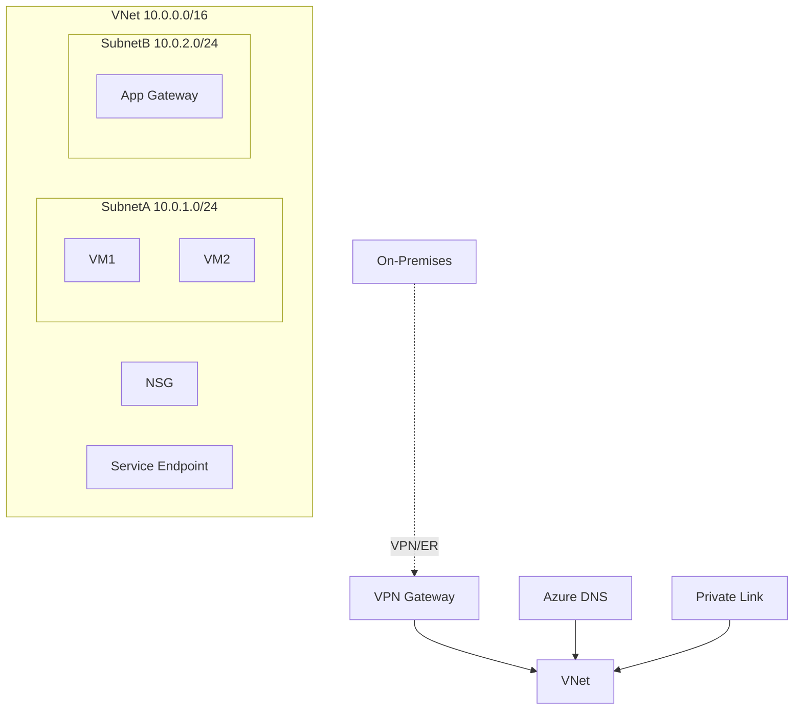

# Azure Virtual Network (VNet)

## What is it?
Azure VNet is a logically isolated network in Azure that enables Azure resources to securely communicate with each other, the internet, and on-premises networks. It is the fundamental building block for Azure networking.

## Why it was created
Cloud workloads require network isolation, traffic filtering, and connectivity options similar to traditional on-premises networks. VNet provides IP address management, segmentation, and secure hybrid connectivity.

## When should you use it
- Every Azure deployment requiring network-level isolation between resources
- Hybrid cloud architectures connecting Azure to on-premises datacenters via VPN or ExpressRoute
- Multi-tier applications needing subnet-level segmentation with NSG rules
- Securing PaaS services (Storage, SQL, etc.) to private network access only

## Architecture



## Hands-on Example

### Create VNet with Subnets
```bash
az network vnet create \
  --resource-group MyRG \
  --name MyVNet \
  --address-prefix 10.0.0.0/16 \
  --subnet-name AppSubnet \
  --subnet-prefix 10.0.1.0/24

az network vnet subnet create \
  --resource-group MyRG \
  --vnet-name MyVNet \
  --name DBSubnet \
  --address-prefix 10.0.2.0/24

# Peer two VNets
az network vnet peering create \
  --resource-group MyRG \
  --name MyVNet-to-OtherVNet \
  --vnet-name MyVNet \
  --remote-vnet OtherVNet \
  --allow-vnet-access
```

## Pricing Model
- **VNet itself**: Free (no charge for creating VNets)
- **VPN Gateway**: Hourly cost + data transfer out; VpnGw1 starts ~$0.10/hr
- **ExpressRoute**: Monthly port fee + data egress; varies by bandwidth (50 Mbps to 10 Gbps)
- **VNet Peering**: Ingress/egress charges between peered VNets ($0.01/GB in each direction)
- **Public IPs**: Static public IPs incur hourly charges (~$0.004/hr)
- **Private Link**: Hourly charge for endpoint + data processing

## Best Practices
- Use /16 or larger address space to accommodate growth and peering
- Segment workloads into subnets with NSGs for east-west traffic control
- Use Application Security Groups (ASGs) for logical grouping over IP-based NSG rules
- Prefer Private Link over service endpoints for secure PaaS access from on-premises
- Use Azure Firewall or NVA for centralized egress traffic inspection
- Enable flow logs on NSGs for network monitoring and compliance

## Interview Questions
1. What is the difference between Azure Service Endpoints and Private Link?
2. How does VNet peering work across regions and what are the limitations?
3. When would you use VPN Gateway vs ExpressRoute?
4. How do NSGs differ from Azure Firewall?
5. What's the maximum address space for a VNet and how do you plan IP ranges?

## Real Company Usage
- **LinkedIn**: Uses VNet peering for data processing pipelines across regions
- **BMW**: Connects manufacturing plants to Azure via ExpressRoute and VNet
- **Maersk**: Implements hub-and-spoke VNet topology for global logistics platform
