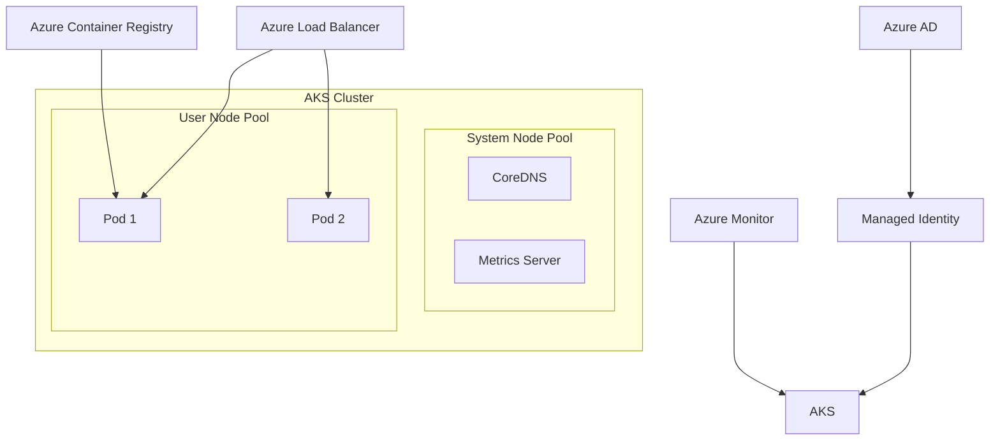

# Azure Kubernetes Service (AKS)

## What is it?
AKS is a managed Kubernetes service that handles master node management, health monitoring, and maintenance. It simplifies Kubernetes deployment by abstracting the control plane and providing automated upgrades, scaling, and security patching.

## Why it was created
Managing Kubernetes control planes is complex and operationally expensive. AKS offloads control plane management to Azure while integrating with Azure AD, Container Registry, and monitoring services.

## When should you use it
- Running containerized microservices at scale without managing the Kubernetes control plane
- Enterprise Kubernetes deployments requiring Azure AD integration for authentication
- CI/CD pipelines with Azure DevOps/GitHub Actions deploying to Kubernetes
- Hybrid deployments using Azure Arc-enabled Kubernetes across on-premises and cloud

## Architecture



## Hands-on Example

### Create AKS Cluster
```bash
az group create --name MyAKSCluster --location eastus

az aks create \
  --resource-group MyAKSCluster \
  --name MyAKS \
  --node-count 3 \
  --enable-cluster-autoscaler \
  --min-count 1 \
  --max-count 10 \
  --enable-managed-identity \
  --network-plugin azure

# Get credentials
az aks get-credentials --resource-group MyAKSCluster --name MyAKS
```

## Pricing Model
- **Control Plane**: Free (no charge for the managed Kubernetes API server)
- **Node VMs**: Pay only for the compute resources (VMs, storage, networking) used by node pools
- **Premium Tier**: $0.0925 per cluster per hour for enhanced SLA (99.95%) and Uptime SLA
- **Azure Container Registry**: Pay per storage and image pull requests
- **Azure Policy add-on**: Included, but Azure Policy itself has per-resource cost

## Best Practices
- Use system node pools for critical system pods (CoreDNS, metrics-server) and user node pools for application workloads
- Enable cluster autoscaler and horizontal pod autoscaler together for elastic scaling
- Prefer Azure CNI over Kubenet for VNet integration and network policies
- Use managed identities (not service principals) for AKS authentication
- Enable Azure AD integration with Kubernetes RBAC for cluster access control
- Implement Azure Policy for AKS to enforce pod security and operational standards (e.g., no privileged containers)
- Configure Container Insights (Azure Monitor) for log and metric collection
- Use Azure Key Vault with CSI driver for secret management

## Interview Questions
1. Compare Azure CNI vs Kubenet network plugins — which would you choose and why?
2. How does AKS handle cluster upgrades and what is the node surge strategy?
3. Explain system vs user node pools and when you'd use multiple node pools
4. How does Azure Policy enforce compliance on AKS workloads?
5. How would you set up a service mesh (e.g., Istio) on AKS?

## Real Company Usage
- **Bose**: Runs its IoT platform on AKS for smart speaker workloads
- **Adobe**: Uses AKS for microservices supporting Adobe Experience Manager
- **Maersk**: Containerizes its logistics applications on AKS with Istio service mesh
