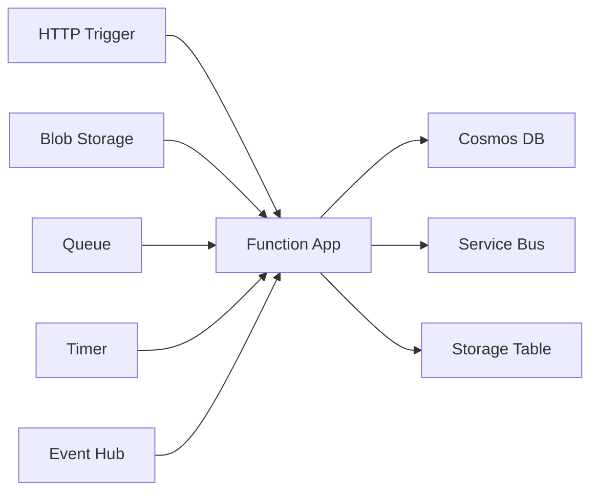

# Azure Functions

## What is it?
Azure Functions is a serverless compute service that runs event-driven code without managing infrastructure. Functions support multiple languages (C#, Java, JavaScript, Python, PowerShell) and integrate with over 200 connectors.

## Why it was created
Developers need to run code in response to events without provisioning or managing servers. Functions enable a pay-per-execution model where idle resources cost nothing.

## When should you use it
- Event-driven workloads (HTTP requests, queue messages, blob uploads, timer-based jobs)
- Microservices and APIs with variable or unpredictable traffic patterns
- Real-time data processing (stream processing with Event Hubs or IoT Hub)
- Scheduled tasks (cron jobs) without maintaining a VM or App Service
- Lightweight web APIs and mobile backends

## Architecture



## Hands-on Example

### Create and Deploy Function App
```bash
az functionapp create \
  --resource-group MyRG \
  --name MyFunctionApp \
  --storageaccount mystorageaccount \
  --consumption-plan-location eastus \
  --runtime python

# Deploy from local folder
func azure functionapp publish MyFunctionApp
```

### Sample Function (HTTP Trigger)
```python
import azure.functions as func

def main(req: func.HttpRequest) -> func.HttpResponse:
    name = req.params.get('name')
    return func.HttpResponse(f"Hello {name}!")
```

## Pricing Model
- **Consumption Plan**: Pay only for execution time (per-second billing) — $0.000016/GBs (first 400,000 GBs free per month)
- **Premium Plan**: Pre-warmed instances, unlimited execution duration, VNet connectivity — fixed hourly + per-second compute
- **Dedicated (App Service) Plan**: Runs on reserved App Service instances — pay for the instance, unlimited function execution
- **Free Grant**: 1 million requests/month free on Consumption Plan

## Best Practices
- Choose Premium Plan if cold start latency is unacceptable (pre-warmed workers)
- Use dependency injection and managed identity instead of connection strings in code
- Implement retry policies with dead-letter queues for event-driven functions
- Enable Application Insights for monitoring, distributed tracing, and failure detection
- Use deployment slots for staging deployments with zero-downtime swaps
- Minimize cold starts by keeping functions lean, using async, and avoiding heavy static constructors
- Batch queue messages and use singleton patterns carefully in consumption plan

## Interview Questions
1. Compare Consumption, Premium, and Dedicated plans — when would you use each?
2. How do triggers and bindings work in Azure Functions?
3. What causes cold starts and how do you mitigate them?
4. Compare Azure Functions vs Logic Apps for workflow orchestration
5. How does Durable Functions handle stateful orchestration in a serverless model?

## Real Company Usage
- **Siemens**: Uses Functions for IoT device telemetry processing
- **GE Healthcare**: Processes medical device data streams with Functions
- **Toshiba**: Runs serverless APIs on Functions for global content distribution
