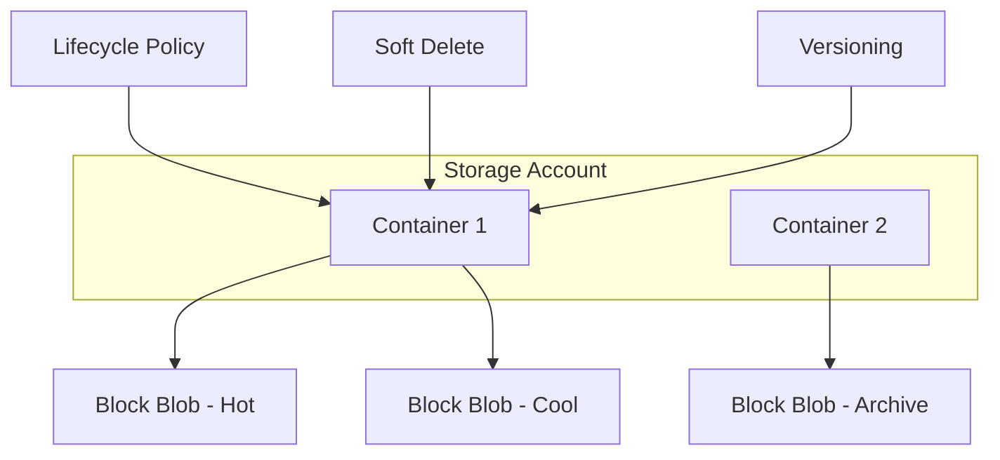

# Azure Blob Storage

## What is it?
Azure Blob Storage is Microsoft's object storage solution for unstructured data (text, binary, images, videos, backups). It supports three resource types: storage accounts, containers, and blobs (block, append, page blobs).

## Why it was created
Applications need scalable, durable, and cost-effective storage for massive amounts of unstructured data. Blob Storage provides tiered storage to optimize cost based on data access frequency.

## When should you use it
- Storing images, videos, documents, and media files for web applications
- Backup and disaster recovery data (Azure Backup stores data as blobs)
- Data lakes for big data analytics (Azure Data Lake Storage Gen2 builds on Blob Storage)
- Log files, application data, and IoT device telemetry archives
- Static website hosting (HTML, CSS, JS without a web server)

## Architecture



## Hands-on Example

### Create Storage Account and Upload Blob
```bash
az storage account create \
  --resource-group MyRG \
  --name mystorageaccount \
  --location eastus \
  --sku Standard_LRS \
  --kind StorageV2

az storage container create \
  --account-name mystorageaccount \
  --name mycontainer

# Upload a file
az storage blob upload \
  --account-name mystorageaccount \
  --container-name mycontainer \
  --name blob.txt \
  --file localfile.txt

# Set access tier
az storage blob set-tier \
  --account-name mystorageaccount \
  --container-name mycontainer \
  --name blob.txt \
  --tier Cool
```

## Pricing Model
- **Storage costs**: Based on data stored per GB per month — varies by tier (Hot ~$0.018/GB, Cool ~$0.01/GB, Archive ~$0.00099/GB)
- **Access costs**: Hot — low read/write costs; Cool/Archive — higher read costs including early deletion fees
- **Operations**: Charged per operation (read/write/list) — more expensive for Cool/Archive
- **Data transfer**: Outbound data transfer (egress) charged at standard bandwidth rates
- **Redundancy**: LRS (lowest cost), GRS, RA-GRS, ZRS — each at progressively higher price

## Best Practices
- Use lifecycle management policies to automatically move blobs between Hot → Cool → Archive tiers
- Enable soft delete for data protection against accidental deletion (retain for 7-365 days)
- Use immutable storage (WORM) for compliance — Legal Hold or Time-Based Retention policies
- Enable versioning to preserve, restore, and recover blob versions
- Use AzCopy or Storage Explorer for large-scale data transfers (parallel operations)
- Block blobs are optimal for most use cases; use append blobs for logging; page blobs for VHD disks
- Use private endpoints or service endpoints to restrict network access

## Interview Questions
1. What are the three blob types and their use cases (block, append, page)?
2. Compare Hot, Cool, and Archive access tiers with cost implications
3. How do lifecycle management policies work in Blob Storage?
4. What's the difference between LRS, ZRS, GRS, and RA-GRS redundancy options?
5. How does Azure Data Lake Storage Gen2 extend Blob Storage for analytics?

## Real Company Usage
- **Spotify**: Uses Blob Storage for music file storage and content delivery
- **Airbus**: Stores satellite imagery data in Geo-Redundant Blob Storage
- **Shell**: Archives geophysical data in Cool and Archive tiers for long-term retention
