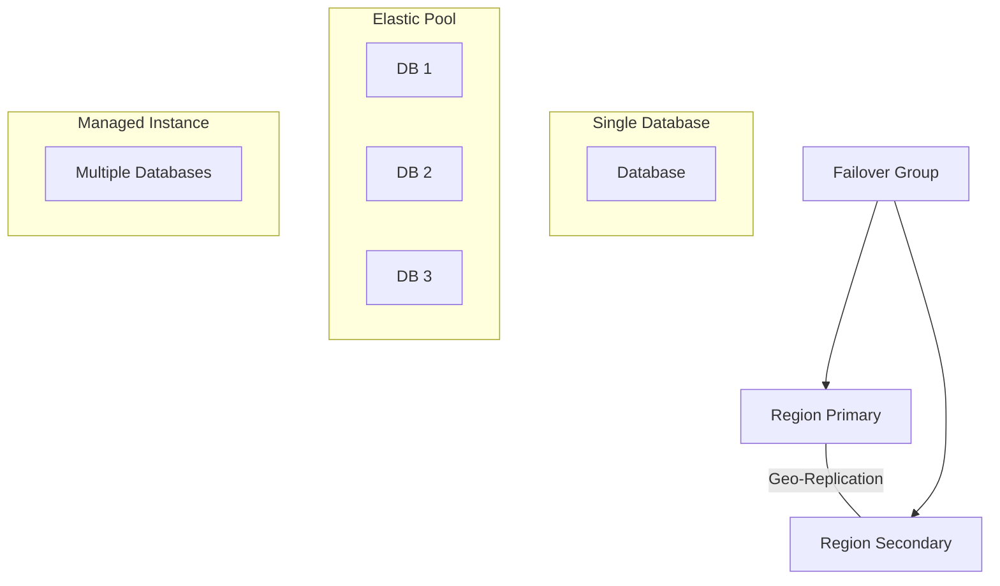

# Azure SQL Database

## What is it?
Azure SQL Database is a fully managed relational database service built on SQL Server engine. It offers PaaS capabilities including automatic patching, backups, high availability, and intelligent performance optimization.

## Why it was created
Organizations need a managed SQL Server experience without the operational overhead of running SQL Server on VMs. It provides built-in high availability, automated backups, and built-in security features.

## When should you use it
- New applications requiring SQL Server compatibility with built-in HA and disaster recovery
- Migrating on-premises SQL Server databases to the cloud with minimal application changes
- SaaS applications needing database isolation per tenant via elastic pools
- Workloads requiring built-in intelligent performance tuning (automatic indexing, query store)

## Architecture



## Hands-on Example

### Create Single Database
```bash
az sql server create \
  --resource-group MyRG \
  --name mysqlserver \
  --location eastus \
  --admin-user adminuser \
  --admin-password Password123!

az sql db create \
  --resource-group MyRG \
  --server mysqlserver \
  --name MyDB \
  --service-objective S2
```

## Pricing Model
- **vCore model**: Provisioned compute (Gen5, serie) — pay per vCore per hour + storage + backup storage
- **DTU model**: Bundled compute + storage — Basic (5 DTU), Standard (10-3000 DTU), Premium (125-4000 DTU)
- **Serverless**: Autoscaling compute — pay for compute used per second + storage
- **Backup storage**: Included 100% of database size; additional at standard rates
- **Geo-replication**: Readable secondaries billed at regular database rates
- **Hyperscale**: Up to 100 TB, instant backup, fast scaling — pay per vCore + data + log storage

## Best Practices
- Use elastic pools for SaaS workloads with multiple databases having variable usage patterns
- Enable geo-replication or failover groups for cross-region disaster recovery
- Use Azure AD authentication (not SQL auth) for centralized identity management
- Enable Advanced Threat Protection and Vulnerability Assessment for security compliance
- Set up auditing and diagnostics logs to Log Analytics for compliance querying
- Use Azure SQL Migration extension for DMA-based assessments before migration
- Enable auto-tuning (FORCE LAST GOOD PLAN, CREATE INDEX, DROP INDEX) for workload optimization

## Interview Questions
1. Compare single database, elastic pool, and managed instance deployment options
2. What's the difference between vCore and DTU pricing models?
3. How do failover groups work for cross-region disaster recovery?
4. What security features does Azure SQL Database provide (auditing, TDE, Advanced Threat Protection)?
5. How does Azure SQL Hyperscale differ from General Purpose and Business Critical tiers?

## Real Company Usage
- **Dell**: Runs its global ERP system on Azure SQL Database
- **JetBlue**: Migrated airline reservation systems from on-premises SQL Server to Azure SQL
- **Walgreens**: Uses Azure SQL for pharmacy management systems
