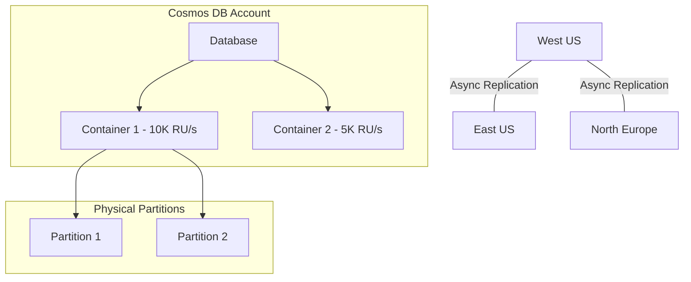

# Azure Cosmos DB

## What is it?
Cosmos DB is a globally distributed, multi-model NoSQL database service with guaranteed single-digit millisecond latency at the 99th percentile. It supports multiple APIs (SQL, MongoDB, Cassandra, Gremlin, Table) and offers five consistency levels.

## Why it was created
Traditional databases struggle with global distribution, multi-region writes, and predictable performance at any scale. Cosmos DB was built to provide SLAs on throughput, latency, consistency, and availability.

## When should you use it
- Globally distributed applications requiring multi-region reads and writes with active-active configurations
- Real-time applications needing single-digit millisecond latency for reads and writes (gaming, IoT, chat)
- Multi-model workloads needing document, graph, key-value, and column-family access from a single database
- Applications requiring multiple consistency levels with tunable trade-offs between performance and data freshness

## Architecture



## Hands-on Example

### Create Cosmos DB Account and Container
```bash
az cosmosdb create \
  --resource-group MyRG \
  --name mycosmosdb \
  --kind GlobalDocumentDB

az cosmosdb sql database create \
  --resource-group MyRG \
  --account-name mycosmosdb \
  --name MyDB

az cosmosdb sql container create \
  --resource-group MyRG \
  --account-name mycosmosdb \
  --database-name MyDB \
  --name MyContainer \
  --partition-key-path "/userId" \
  --throughput 1000
```

## Pricing Model
- **Request Units (RU/s)**: Throughput is provisioned per second — $0.008/hr per 100 RU/s (provisioned) or $0.015/1M RU (autoscale)
- **Storage**: $0.25/GB/month for indexed data
- **Global Distribution**: Additional cost for each write region and data replication bandwidth
- **Multi-region Writes**: 1.5x RU multiplier on write costs across regions
- **Serverless**: Pay per RU consumed for workloads with unpredictable traffic (no idle cost)
- **Free Tier**: 1000 RU/s and 25 GB storage free per account

## Best Practices
- Choose partition key carefully — high cardinality, even distribution, and common query filter
- Use autoscale (RU/s) for variable traffic patterns instead of fixed throughput
- Implement the consistency model matching your app's requirements: Eventual works for most, Strong for critical financial data
- Enable multi-region writes for active-active global deployments with zero downtime failover
- Use the change feed for event-driven architectures and data pipelines (trigger Functions on container changes)
- Monitor normalized RU consumption metric to detect hot partitions
- Set TTL on documents to automatically expire data (e.g., session data, logs)

## Interview Questions
1. What are the five consistency levels and when would you use each?
2. How do you choose a partition key and what makes a good partition key?
3. What are Request Units (RU) and how do you estimate throughput requirements?
4. How does Cosmos DB achieve global distribution with multi-region writes?
5. What is the change feed and how is it used in event-driven architectures?

## Real Company Usage
- **Marriott**: Uses Cosmos DB for global hotel booking and loyalty platform
- **JetBlue**: Manages airline passenger data across regions with Cosmos DB
- **ASOS**: Runs its global e-commerce catalog on Cosmos DB with multi-region writes
