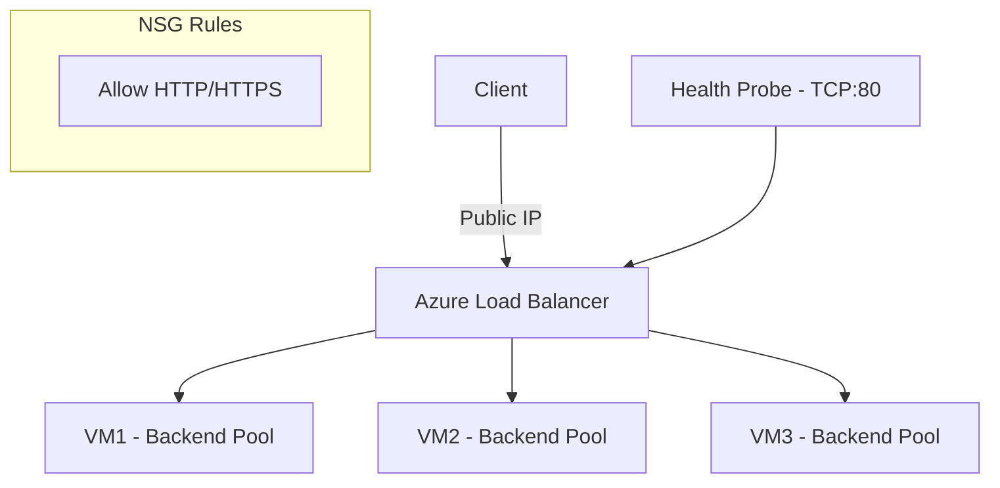

# Azure Load Balancer

## What is it?
Azure Load Balancer is a Layer 4 (TCP/UDP) load balancer that distributes incoming traffic across healthy backend instances. It operates at the transport layer and provides low-latency, high-throughput load balancing.

## Why it was created
Applications need a highly available and scalable entry point that distributes traffic across multiple VMs or instances while detecting and removing unhealthy ones. Load Balancer provides this at Layer 4 with ultra-low latency.

## When should you use it
- Distributing TCP/UDP traffic across VMs in a virtual network
- Building highly available multi-tier applications (web, app, database tiers)
- Internal traffic between application tiers (internal load balancer)
- Scaling out stateless workloads (web servers, API backends)
- Providing outbound connectivity for VMs (SNAT)

## Architecture



## Hands-on Example

### Create Standard Load Balancer
```bash
az network lb create \
  --resource-group MyRG \
  --name MyLB \
  --sku Standard \
  --public-ip-address MyPublicIP \
  --frontend-ip-name MyFrontEnd \
  --backend-pool-name MyBackendPool

az network lb probe create \
  --resource-group MyRG \
  --lb-name MyLB \
  --name HTTPProbe \
  --protocol tcp \
  --port 80

az network lb rule create \
  --resource-group MyRG \
  --lb-name MyLB \
  --name HTTPRule \
  --protocol tcp \
  --frontend-port 80 \
  --backend-port 80 \
  --frontend-ip-name MyFrontEnd \
  --backend-pool-name MyBackendPool \
  --probe-name HTTPProbe
```

## Pricing Model
- **Basic SKU**: Free (no hourly charge)
- **Standard SKU**: $0.0225/hr + $0.006/hr per rule (up to 500 rules) — outbound data transfer at standard rates
- **Gateway Load Balancer**: $0.0125/hr + $0.01/GB data processed
- **Outbound data transfer**: Charged separately at standard egress rates

## Best Practices
- Use Standard SKU for production (supports availability zones, HA ports, outbound rules)
- Configure health probes with appropriate thresholds (interval, unhealthy threshold) — TCP probes for TCP services, HTTP probes for web applications
- Use HA ports for Layer 4 load balancing (all ports) when using NVAs or firewalls
- Place backend VMs behind the load balancer across availability zones for resilience
- Use NSGs on backend subnets to restrict traffic to the load balancer's health probe IP (168.63.129.16)
- Distribute traffic with session persistence only when needed (client IP, client IP + protocol)

## Interview Questions
1. Compare Basic and Standard Load Balancer SKUs
2. How do health probes work and what are the different probe types?
3. What are HA ports and when would you use them?
4. How does Azure Load Balancer compare to Application Gateway and Traffic Manager?
5. What is outbound SNAT and how does Azure Load Balancer handle it?

## Real Company Usage
- **SAP**: Uses Azure Load Balancer for high-availability SAP deployments
- **Adobe**: Load balances traffic across VM scale sets for Adobe Experience Manager
- **Xbox**: Uses Azure Load Balancer for game server traffic distribution
