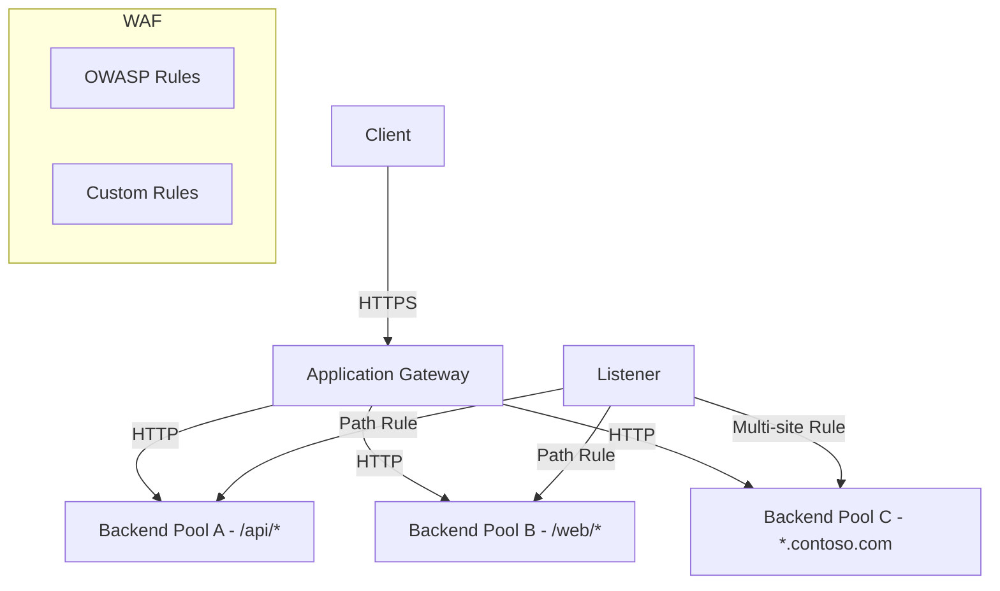

# Azure Application Gateway

## What is it?
Application Gateway is a Layer 7 (HTTP/HTTPS) load balancer and web traffic manager with integrated Web Application Firewall (WAF) capabilities. It provides SSL termination, cookie-based session affinity, and URL-based routing.

## Why it was created
Layer 4 load balancers cannot inspect HTTP/HTTPS traffic. Application Gateway provides application-level routing decisions (path-based, host-based), SSL offloading, and WAF protection in a single managed service.

## When should you use it
- Web applications requiring SSL termination at the gateway to offload from backend servers
- Microservices architectures needing path-based routing (e.g., /api/* → backend A, /web/* → backend B)
- Multi-site hosting (multiple domains on a single gateway with host header routing)
- Applications needing WAF protection against OWASP Top 10 vulnerabilities (SQL injection, XSS)
- Workloads requiring cookie-based session affinity (sticky sessions)

## Architecture



## Hands-on Example

### Create Application Gateway with WAF
```bash
az network application-gateway create \
  --resource-group MyRG \
  --name MyAppGateway \
  --sku WAF_v2 \
  --capacity 2 \
  --vnet-name MyVNet \
  --subnet AppGatewaySubnet \
  --public-ip-address MyPublicIP \
  --http-settings-cookie-based-affinity Enabled \
  --frontend-port 443 \
  --http-settings-protocol Https \
  --servers 10.0.1.4 10.0.1.5
```

## Pricing Model
- **WAF_v1**: $0.25/hr + $0.008/GB data processed
- **WAF_v2**: $0.38/hr + $0.008/GB data processed (autoscaling, zone redundancy included)
- **WAF v2 Fixed Costs**: Autoscaling minimum capacity (1 unit = $0.38/hr)
- **Data Processing**: $0.008/GB of data processed through the gateway
- **WAF Policy**: Included in gateway cost; WAF for App Service separately licensed
- **TLS/SSL Certificates**: Free (bring your own from Key Vault)

## Best Practices
- Use WAF_v2 SKU — it supports autoscaling, zone redundancy, and has better performance
- Place Application Gateway in its own subnet (minimum /27) — named AppGatewaySubnet
- Store SSL certificates in Key Vault and reference via managed identity for automatic renewal
- Use rewrite rules to modify request headers, URLs, and query strings at the gateway
- Enable WAF policy in Prevention mode in production (Detection mode in dev/test)
- Use health probes with custom paths and thresholds matching your application's health check endpoint
- Enable HTTP/2 support for reduced latency on modern browsers

## Interview Questions
1. Compare Application Gateway with Azure Load Balancer — when would you use each?
2. How does path-based routing work in Application Gateway?
3. What is WAF and what OWASP Top 10 categories does it protect against?
4. How does SSL termination and end-to-end TLS work with App Gateway?
5. How does cookie-based session affinity differ from client IP affinity?

## Real Company Usage
- **BMW**: Uses Application Gateway for its customer-facing web portals with WAF protection
- **Lego**: Routes web traffic across microservices with path-based routing
- **Heineken**: Secures its e-commerce platform with Application Gateway WAF
