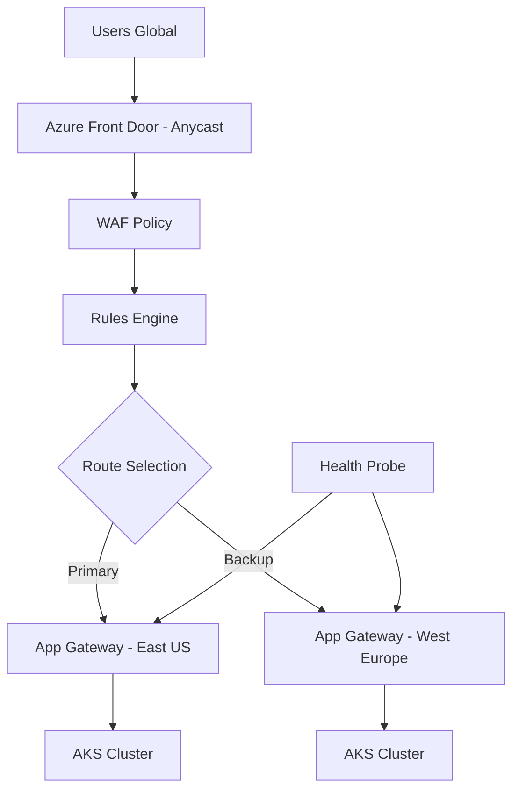

# Azure Front Door

## What is it?
Azure Front Door is a global, scalable entry point that provides HTTP load balancing, SSL offload, path-based routing, WAF, and content acceleration. It operates at Layer 7 and routes traffic to the nearest available origin.

## Why it was created
Applications with global audiences need a single entry point that provides low latency, WAF protection, and intelligent routing across multiple origins. Front Door combines capabilities of a CDN, load balancer, and WAF in a single service.

## When should you use it
- Global web applications requiring low-latency access from anywhere in the world
- Multi-region active-active deployments with intelligent failover across regions
- Applications needing URL rewrite/redirect, path-based routing, or host header manipulation at the edge
- Protection against DDoS and web application attacks via integrated WAF
- Accelerating static and dynamic content delivery with anycast routing

## Architecture



## Hands-on Example

### Create Front Door with WAF Policy
```bash
az network front-door create \
  --resource-group MyRG \
  --name MyFrontDoor \
  --backend-address 40.112.195.100 104.45.9.150 \
  --frontend-port 443 \
  --protocol Https

az network front-door waf-policy create \
  --resource-group MyRG \
  --name MyWAFPolicy \
  --sku Premium_AzureFrontDoor

az network front-door waf-policy managed-rule-set add \
  --resource-group MyRG \
  --policy-name MyWAFPolicy \
  --type Microsoft_DefaultRuleSet \
  --version 2.1
```

## Pricing Model
- **Azure Front Door (classic)**: $0.028/hr + $0.01/GB outbound data transfer from edge to internet
- **Azure Front Door Standard**: $0.037/hr + $0.01/GB (includes WAF, CDN)
- **Azure Front Door Premium**: $0.12/hr + $0.032/GB (adds Private Link, managed WAF, BOT protection)
- **WAF rules**: Included in Premium; $5/month/rule for custom rules in Standard
- **Data transfer from origin**: Additional $0.01-0.05/GB depending on region

## Best Practices
- Use Premium tier if you need Private Link support for private origin access (no public IP needed)
- Configure health probes with appropriate frequency — faster probes improve failover but cost more
- Use the rules engine for URL redirect (HTTP→HTTPS), URL rewrite, and response header modification
- Enable session affinity only when backend requires sticky sessions (it uses ARM Cookie)
- Use origin groups with priority for active-passive failover or weight-based for active-active
- Enable Azure CDN (integrated in AFD) for static content caching at edge locations
- Implement WAF policies with Bot Manager ruleset to block malicious bot traffic

## Interview Questions
1. Compare Azure Front Door, Application Gateway, and Traffic Manager
2. How does Front Door achieve global low-latency routing with anycast?
3. How does Front Door differ from CloudFront?
4. What is Private Link support in Front Door Premium and why is it important?
5. How does the rules engine work for URL redirect/rewrite in Front Door?

## Real Company Usage
- **Microsoft**: Microsoft.com and Bing use Azure Front Door for global traffic management
- **McDonald's**: Uses Front Door for its global ordering platform across regions
- **LinkedIn**: Routes global traffic through Front Door for LinkedIn Learning platform
