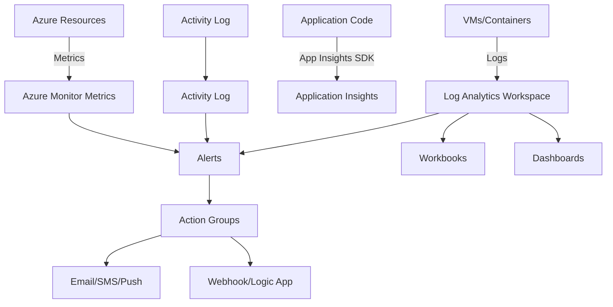

# Azure Monitor

## What is it?
Azure Monitor is a comprehensive monitoring service for collecting, analyzing, and acting on telemetry from cloud and on-premises environments. It includes Application Insights for application performance monitoring, Log Analytics for querying logs, and alerts for proactive notification.

## Why it was created
Modern distributed applications generate massive amounts of telemetry. Organizations need a centralized platform to correlate metrics, logs, traces, and alerts across all their resources.

## When should you use it
- Monitoring Azure resource health, performance, and availability
- Application performance monitoring with distributed tracing and dependency mapping
- Collecting and querying logs from Azure resources, VMs, and Kubernetes clusters
- Setting up proactive alerts (metric, log, activity log) with action groups for automated responses
- Building custom dashboards and workbooks for operational visibility
- Compliance auditing — tracking changes via activity logs

## Architecture



## Hands-on Example

### Create Log Analytics Workspace and Query
```bash
az monitor log-analytics workspace create \
  --resource-group MyRG \
  --workspace-name MyWorkspace \
  --location eastus

# Query AzureActivity logs using KQL
az monitor log-analytics query \
  --workspace MyWorkspace \
  --analytics-query "AzureActivity | where TimeGenerated > ago(1h) | project TimeGenerated, OperationName, Resource"
```

### Application Insights — Enable monitoring
```bash
az monitor app-insights component create \
  --resource-group MyRG \
  --app MyAppInsights \
  --location eastus
```

## Pricing Model
- **Metrics**: 1 month of free metric retention in Azure Monitor Metrics
- **Log Analytics**: Pay-per-GB ingested into Log Analytics workspace (~$2.30/GB first 5 GB free)
- **Application Insights**: Pay-per-GB data ingested ($2.30/GB, 1 GB free/month per resource)
- **Retention**: 31 days free for Log Analytics, longer retention at additional cost ($0.10/GB/month for 90+ days)
- **Alerts**: Metric alerts — free (up to 10 rules); Log alerts — per alert evaluation ($0.10/alert)
- **Action Groups**: Free for email/SMS/push notifications (SMS costs apply per message)

## Best Practices
- Use Log Analytics workspaces as a central repository for all diagnostic logs
- Enable Azure Diagnostics extension on VMs and App Services to send logs to Log Analytics
- Instrument applications with Application Insights SDK (RUM, server-side, dependency tracking)
- Create KQL queries for common scenarios and save them as workbooks for reusability
- Set up metric and log alerts with action groups (Email, SMS, Webhook, ITSM)
- Use availability tests (URL ping, multi-step web test) in Application Insights for proactive monitoring
- Implement log retention policies — basic for debugging, longer for compliance
- Use Azure Workbooks for rich visual reports combining metrics, logs, and custom parameters

## Interview Questions
1. What's the difference between Azure Monitor Metrics and Azure Monitor Logs?
2. How does Application Insights achieve distributed tracing across microservices?
3. What are the three types of alerts in Azure Monitor and when would you use each?
4. How do you write KQL queries and what are some common table schemas?
5. How would you monitor a multi-region AKS deployment with Azure Monitor?

## Real Company Usage
- **Siemens**: Uses Azure Monitor to track IoT device health across global deployments
- **Xbox**: Monitors game server health and player experience metrics with Application Insights
- **Maersk**: Builds operational dashboards with Azure Workbooks for logistics monitoring
