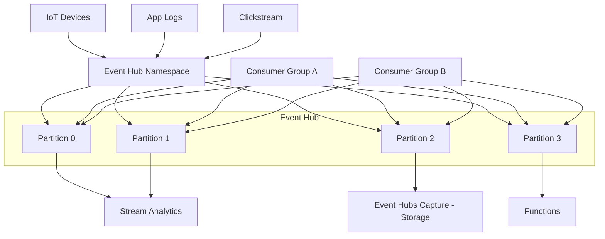

# Azure Event Hubs

## What is it?
Azure Event Hubs is a fully managed, real-time data streaming platform capable of ingesting millions of events per second. It provides low-latency, durable event ingestion for big data pipelines and event-driven architectures.

## Why it was created
Ingesting massive streams of events (IoT telemetry, application logs, clickstreams) at scale requires a highly available, partitioned, and durable buffer between producers and consumers that handles backpressure and replayability.

## When should you use it
- IoT device telemetry ingestion (millions of devices sending data)
- Application activity tracking and clickstream analytics at scale
- Log aggregation from multiple sources into a centralized data pipeline
- Real-time analytics with Azure Stream Analytics, Apache Spark, or custom consumers
- Event buffering and decoupling between microservices in event-driven architectures
- Kafka-compatible workloads — replacing self-managed Kafka clusters

## Architecture



## Hands-on Example

### Create Event Hub and Send Events
```bash
az eventhubs namespace create \
  --resource-group MyRG \
  --name MyEventHubNamespace \
  --location eastus \
  --sku Standard

az eventhubs eventhub create \
  --resource-group MyRG \
  --namespace-name MyEventHubNamespace \
  --name MyEventHub \
  --message-retention 1 \
  --partition-count 4
```

## Pricing Model
- **Basic**: $0.015/hr per throughput unit (TU) — 1 TU = 1 MB/s ingress, 2 MB/s egress
- **Standard**: $0.027/hr per TU — supports Auto-Inflate, Kafka, Capture, schema registry
- **Premium**: $0.43/hr per processing unit (PU) — multi-tenant isolation, better performance
- **Dedicated**: $4,356/month per cluster (single tenant, up to 2000 TUs equivalent)
- **Capture**: Free (writes to Blob Storage — pay only for storage)
- **Data transfer**: Additional outbound bandwidth charges

## Best Practices
- Use Auto-Inflate to automatically scale throughput units based on traffic patterns
- Partition count is determined at creation and cannot be changed — choose based on expected throughput (more partitions = more parallelism)
- Use Consumer Groups for independent read views on the event stream (each consumer gets its own offset)
- Enable Event Hubs Capture to automatically persist events to Blob Storage or Data Lake Storage
- Use checkpoint store (Blob Storage) for reliable consumer offset management
- Prefer AMQP over HTTPS for better performance and lower latency (when SDK supports it)
- Use Kafka-compatible client libraries (librdkafka, Java Kafka clients) for lift-and-shift Kafka workloads

## Interview Questions
1. Compare Event Hubs, Service Bus, and Event Grid — when would you use each?
2. How do partitions work and how should you choose the partition key?
3. What are throughput units and how does Auto-Inflate work?
4. How does Event Hubs support Kafka compatibility?
5. How does Event Hubs Capture work and where does it store data?

## Real Company Usage
- **Bose**: Ingests IoT telemetry from millions of smart speakers into Event Hubs
- **Siemens**: Processes industrial sensor data through Event Hubs to Stream Analytics
- **Toyota**: Collects telemetry data from connected vehicles using Event Hubs
