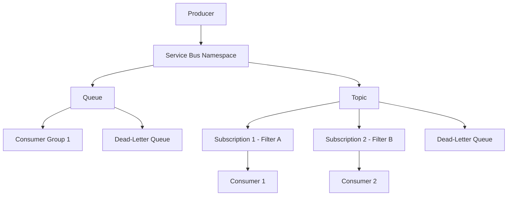

# Azure Service Bus

## What is it?
Azure Service Bus is a fully managed enterprise message broker with support for queues, topics, and subscriptions. It provides reliable message delivery with features like sessions, transactions, deduplication, and dead-lettering.

## Why it was created
Enterprise applications require reliable, ordered, and guaranteed message delivery between decoupled services. Service Bus provides enterprise messaging patterns (competing consumers, publish-subscribe, request-reply) with at-least-once delivery guarantees.

## When should you use it
- Enterprise application integration with guaranteed at-least-once message delivery
- Workloads requiring message ordering, sessions, and transactional processing
- Publish-subscribe patterns where multiple consumers need subsets of messages (topics + subscriptions)
- Decoupling microservices with reliable asynchronous communication
- Applications needing dead-letter queues, scheduled delivery, or duplicate detection
- CQRS patterns with command/event separation

## Architecture



## Hands-on Example

### Create Service Bus Queue
```bash
az servicebus namespace create \
  --resource-group MyRG \
  --name MyServiceBusNamespace \
  --location eastus \
  --sku Standard

az servicebus queue create \
  --resource-group MyRG \
  --namespace-name MyServiceBusNamespace \
  --name MyQueue \
  --max-size 1024 \
  --default-message-time-to-live PT24H \
  --dead-lettering-on-message-expiration
```

## Pricing Model
- **Basic**: $0.0125/hr — queues only (no topics), 10-100 connections, 1 MB max message size
- **Standard**: $0.025/hr — queues + topics, unlimited connections, 256 KB max message (64 MB via large messages support)
- **Premium**: $0.29/hr per messaging unit (MU) — dedicated resources, 1 MB max message, VNet support, geo-disaster recovery
- **Operations**: Charged per operation (send, receive, peek, schedule) at $0.05/M operations for Standard

## Best Practices
- Use Premium tier for production workloads requiring dedicated throughput, VNet integration, or geo-replication
- Use sessions for ordered message processing and stateful message handling
- Enable duplicate detection to prevent processing the same message twice within the deduplication window
- Configure dead-letter queues for messages that exceed max delivery count, time-to-live, or fail processing
- Use auto-forwarding to chain queues/topics for multi-hop routing
- Enable Geo-Disaster Recovery for cross-region failover of the namespace (requires Premium)
- Use topic subscriptions with SQL filters for message routing to specific consumers
- Implement competing consumers pattern with multiple receivers on the same queue

## Interview Questions
1. Compare Service Bus queues vs Storage Queues — when would you use each?
2. How do sessions work in Service Bus and what problem do they solve?
3. Compare Service Bus topics/subscriptions with Event Hubs consumer groups
4. How does duplicate detection and dead-lettering work in Service Bus?
5. How does Geo-Disaster Recovery work for Service Bus Premium?

## Real Company Usage
- **Siemens**: Uses Service Bus for industrial IoT command and control messaging
- **Maersk**: Orchestrates logistics workflows with Service Bus topics and subscriptions
- **Avanade**: Builds enterprise integration solutions with Service Bus for client workloads
