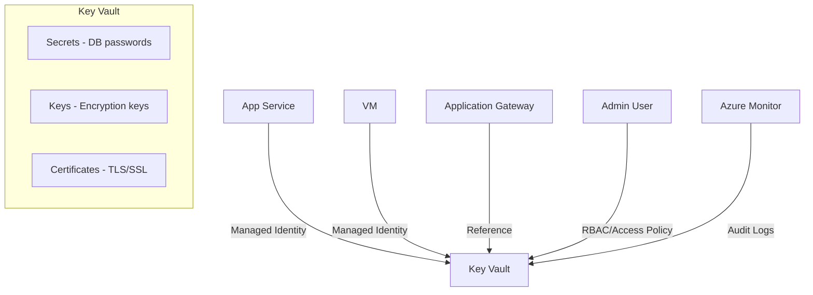

# Azure Key Vault

## What is it?
Azure Key Vault is a cloud service for securely storing and accessing secrets, encryption keys, and certificates. It provides centralized secret management with hardware security module (HSM) support, access policies, and RBAC.

## Why it was created
Applications and services need to securely store credentials, connection strings, API keys, and certificates. Hardcoding secrets in code or configuration files creates security risks. Key Vault provides a secure, auditable, and centralized store.

## When should you use it
- Storing and rotating database connection strings, API keys, and passwords
- Managing TLS/SSL certificates for Azure services (App Service, Application Gateway, CDN)
- Encryption key management (bring your own key — BYOK) with HSM-backed keys
- VM disk encryption via Azure Disk Encryption (integrating with Key Vault)
- Application access to secrets using managed identities (no hardcoded credentials)

## Architecture



## Hands-on Example

### Create Key Vault and Store Secret
```bash
az keyvault create \
  --resource-group MyRG \
  --name MyKeyVault \
  --location eastus \
  --sku Standard \
  --enable-soft-delete true \
  --enable-purge-protection true

az keyvault secret set \
  --vault-name MyKeyVault \
  --name MyDbPassword \
  --value "SuperSecretPassword123!"

# Grant access via RBAC
az role assignment create \
  --role "Key Vault Secrets User" \
  --assignee <user-or-app-id> \
  --scope /subscriptions/.../vaults/MyKeyVault
```

## Pricing Model
- **Standard**: $0.03/10,000 operations for secrets/keys/certificates — $0.06/key version per month (per vault)
- **Premium**: $0.03/10,000 operations + HSM key premium ($0.06/key per month, $1-3/HSM key version per month)
- **Managed HSM**: $0.85/hr per pool, $0.05/10,000 operations (dedicated HSM, FIPS 140-2 Level 3)
- **Vaults**: Free to create — pay only for operations and key versions
- **Backup/restore**: $0.05 per secret/key — one-time fee
- **Soft delete**: No additional cost; restore before retention expires at no charge

## Best Practices
- Enable soft delete and purge protection on all Key Vaults to prevent accidental or malicious deletion
- Use managed identity for application access to Key Vault — never use service principals with secrets
- Prefer RBAC over access policies for Role-based access control (RBAC is consistent with other Azure services)
- Store certificates in Key Vault and reference them from App Service/Application Gateway for auto-renewal
- Restrict network access using Key Vault firewall and virtual network service endpoints
- Enable logging and diagnostics to send Key Vault audit events to Log Analytics workspace
- Rotate secrets regularly and monitor for expiration using Key Vault alerts
- Use Managed HSM for regulated workloads requiring FIPS 140-2 Level 3 validation

## Interview Questions
1. How does Key Vault integrate with Azure managed identities?
2. What's the difference between Key Vault Standard and Premium tiers?
3. How does soft delete and purge protection prevent data loss?
4. How does Key Vault firewall restrict access to trusted networks only?
5. How would you rotate a database password stored in Key Vault without application downtime?

## Real Company Usage
- **Adidas**: Manages e-commerce platform secrets with Key Vault
- **Heineken**: Stores SAP integration credentials in Key Vault with managed identity access
- **AXA**: Manages TLS certificates across global web applications using Key Vault
