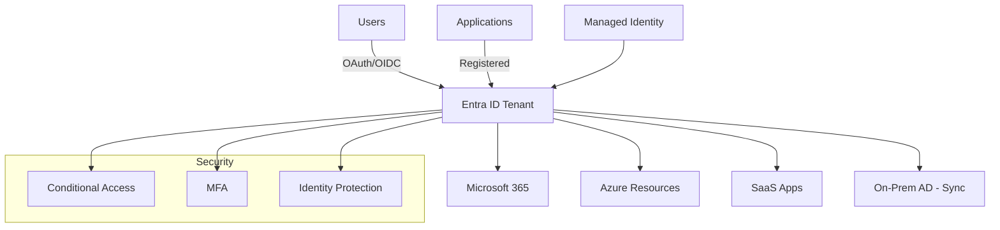

# Microsoft Entra ID (formerly Azure AD)

## What is it?
Microsoft Entra ID is a cloud-based identity and access management service providing single sign-on (SSO), multi-factor authentication (MFA), and conditional access. It is the identity backbone for Azure, Microsoft 365, and third-party SaaS applications.

## Why it was created
Traditional on-premises Active Directory does not scale for cloud applications and modern authentication protocols. Entra ID provides identity-as-a-service for cloud-native authentication with OAuth 2.0, OpenID Connect, and SAML support.

## When should you use it
- Centralized identity management for Azure, Microsoft 365, and third-party SaaS apps (Salesforce, Dropbox, etc.)
- Enforcing security policies — MFA, conditional access, risk-based sign-in protection
- Application authentication — users sign in via OAuth/OIDC (mobile, web, desktop apps)
- B2B collaboration — inviting external partners to access enterprise applications
- B2C customer identity management — user registration, sign-in, and profile management
- Privileged access management — Just-In-Time (JIT) access to admin roles

## Architecture



## Hands-on Example

### Create App Registration and Assign Role
```bash
# Register an application
az ad app create \
  --display-name MyWebApp \
  --homepage https://myapp.contoso.com \
  --identifier-uris https://myapp.contoso.com

# Create a managed identity for an Azure resource
az vm identity assign \
  --resource-group MyRG \
  --name MyVM \
  --identities-read-role true

# Assign Entra ID role
az role assignment create \
  --assignee user@contoso.com \
  --role "Contributor" \
  --scope /subscriptions/...
```

## Pricing Model
- **Free**: Included with Microsoft 365/Azure subscription — directory, SSO, basic MFA
- **P1**: ~$6/user/month — conditional access, dynamic groups, self-service password reset
- **P2**: ~$9/user/month — Identity Protection, Privileged Identity Management (PIM), risk-based conditional access
- **Pay-as-you-go**: B2C — $0.0048/authentication + storage costs
- **External Identities**: B2B — 50,000 free MAUs, then $0.028/user/month
- **Azure AD B2C**: $0.0035 per authentication (first 500/month free)

## Best Practices
- Enable MFA for all users, especially administrators (use Conditional Access policy to enforce MFA)
- Implement Conditional Access policies for location-based, device-based, and risk-based access control
- Use Privileged Identity Management (PIM) for JIT admin access with approval workflows and auditing
- Sync on-premises AD with Entra ID Connect for hybrid identity with password hash sync or pass-through authentication
- Use managed identities for Azure resources (VMs, Functions, App Service) — never use client secrets/app passwords
- Register all applications consuming identity in Entra ID and use OAuth 2.0/OIDC (avoid legacy auth)
- Use B2B for external partner access and B2C for customer-facing identity
- Enable Identity Protection to detect user risk (leaked credentials, anonymous IPs, impossible travel)

## Interview Questions
1. What's the difference between Entra ID and traditional Active Directory?
2. How does Conditional Access work and how would you enforce MFA for all admin logins?
3. Compare managed identity vs service principal — when would you use each?
4. What is Privileged Identity Management (PIM) and how does JIT access work?
5. How does Entra ID B2B differ from B2C?

## Real Company Usage
- **Microsoft**: Uses Entra ID across all services — Azure, Microsoft 365, Xbox, LinkedIn
- **BMW**: Manages partner access through Entra ID B2B for supply chain applications
- **HSBC**: Uses Entra ID PIM for privileged access management across global IT systems
