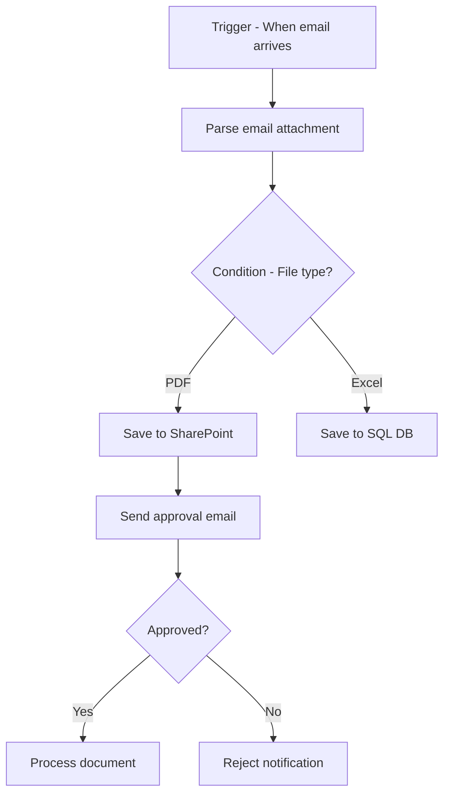

# Azure Logic Apps

## What is it?
Azure Logic Apps is a low-code/no-code workflow automation platform for integrating apps, data, services, and systems. It provides a visual designer to build workflows using 500+ connectors with triggers and actions.

## Why it was created
Enterprise automation requires integrating disparate systems (SaaS, on-premises, Azure services) without writing custom glue code. Logic Apps provides declarative workflows with scheduled, event-driven, and HTTP-triggered execution.

## When should you use it
- Enterprise application integration (EAI) between SaaS apps (Salesforce, SAP, Dynamics 365)
- Process automation — approval workflows, file processing, email routing
- Business-to-business (B2B) message processing with EDI standards (X12, EDIFACT)
- Scheduled data synchronization between systems (e.g., CRM to ERP nightly sync)
- Orchestrating microservices workflows with error handling and compensation
- Hybrid integrations — connecting cloud services to on-premises systems via on-premises data gateway

## Architecture



## Hands-on Example

### Create Logic App via CLI
```bash
az logic workflow create \
  --resource-group MyRG \
  --name MyLogicApp \
  --location eastus \
  --definition "workflow.json"
```

### Sample Workflow Definition (HTTP Trigger)
```json
{
  "definition": {
    "$schema": "https://schema.management.azure.com/providers/Microsoft.Logic/schemas/2016-06-01/workflowdefinition.json#",
    "triggers": {
      "manual": { "type": "Request", "kind": "Http" }
    },
    "actions": {
      "SendEmail": {
        "type": "ApiConnection",
        "inputs": {
          "host": { "connection": { "name": "@parameters('$connections')['office365']['connectionId']" } },
          "method": "post",
          "path": "/Mail"
        }
      }
    }
  }
}
```

## Pricing Model
- **Consumption Plan**: Pay per action execution — $0.000025/action execution (first 4,000 free/month)
  - Standard connector: $0.00125/action execution
  - Enterprise connector (SAP, IBM MQ): $0.05/action execution
- **Standard Plan**: Fixed App Service hosting + per action execution — starts at $0.20/hr + $0.000025/action
- **Integration Account**: $0.30/hr (Developer) or $1.50/hr (Standard) for B2B/EDI processing

## Best Practices
- Use Consumption plan for simple, event-driven workflows with low volume
- Use Standard plan for enterprise workloads requiring VNet integration, private endpoints, and custom code
- Use integration accounts for B2B/EDI scenarios with trading partner agreements
- Implement error handling with retry policies, scopes, and configure alternate paths (try-catch-finally pattern)
- Use managed connectors for SaaS integration; use custom connectors for proprietary APIs
- Move complex logic (data transformation, parsing) to Azure Functions called from Logic Apps
- Use deployment ARM templates with parameterization for CI/CD across environments
- Enable diagnostics logging with Log Analytics for debugging and monitoring workflow execution

## Interview Questions
1. Compare Logic Apps Consumption vs Standard plans
2. How do Logic Apps differ from Power Automate and Azure Functions?
3. How does the on-premises data gateway enable hybrid integration?
4. What are integration accounts and when are they used?
5. How do you implement error handling and retry policies in Logic Apps?

## Real Company Usage
- **DHL**: Automates shipping and tracking workflows with Logic Apps
- **HP**: Integrates SAP ERP with Azure services using Logic Apps and integration accounts
- **Aon**: Automates insurance policy processing workflows with Logic Apps
