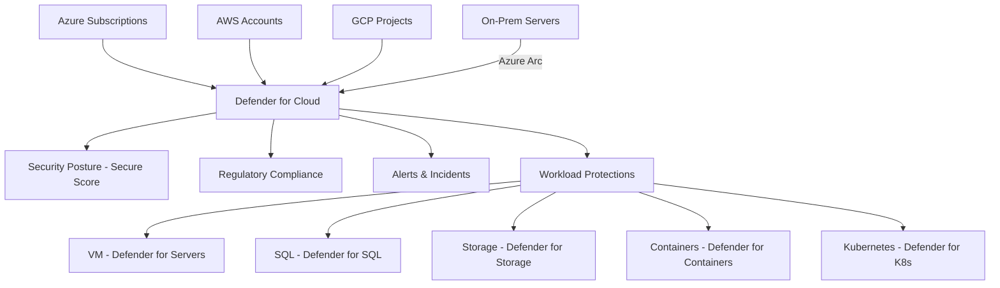

# Microsoft Defender for Cloud

## What is it?
Microsoft Defender for Cloud is a cloud-native application protection platform (CNAPP) providing unified security management and threat protection across Azure, on-premises, and other clouds (AWS, GCP). It combines cloud security posture management and cloud workload protections.

## Why it was created
Organizations struggle to maintain security across multi-cloud and hybrid environments. Defender for Cloud provides a single pane of glass for security posture assessment, threat detection, vulnerability scanning, and regulatory compliance monitoring.

## When should you use it
- Centralized security management across Azure, AWS, GCP, and on-premises workloads
- Regulatory compliance monitoring (CIS, PCI DSS, SOC 2, ISO 27001) with built-in assessments
- Identifying misconfigured resources (open ports, unencrypted data, overly permissive NSGs)
- Protecting workloads against threats — VMs, containers, SQL databases, storage, key vaults
- Just-In-Time (JIT) VM access to reduce exposure to network attacks
- File Integrity Monitoring (FIM) for critical system file changes

## Architecture



## Hands-on Example

### Enable Defender for Cloud
```bash
# Enable Defender for Cloud on a subscription
az security pricing create \
  --name VirtualMachines \
  --pricing-tier Standard

# Enable JIT VM Access policy
az security jit-policy create \
  --resource-group MyRG \
  --location eastus \
  --name MyJITPolicy \
  --vm MyVM \
  --ports 22 3389 \
  --max-request-access-duration PT3H

# View Secure Score
az security secure-score list
```

## Pricing Model
- **Defender CSPM (Foundational)**: Free — includes Secure Score, asset inventory, regulatory compliance (Azure-only), recommendations
- **Defender CSPM (Enhanced)**: $1.15/hr per subscription — adds agentless scanning, data-aware security posture, cloud map, governance rules
- **Defender for Servers**: $15/server/month (P2) — includes file integrity monitoring, JIT, vulnerability scanning
- **Defender for SQL**: $15/server/month or $0.11/database/vCore
- **Defender for Containers**: $0.09/image pull + $1.07/hr per AKS node
- **Defender for Storage**: $5/100M transactions/month ($0.05/1M transactions)
- **Defender for Databases**: $15/server/month
- **Defender for App Service**: $12/App Service node/month

## Best Practices
- Enable Defender for Cloud Standard on all subscriptions for complete threat protection
- Use Secure Score to track and prioritize security improvements (aim for 90%+)
- Enable JIT VM access to replace always-open RDP/SSH ports with time-bound, approved access
- Implement adaptive application controls (allowlisting) to control which apps can run on VMs
- Set up email notifications for high-severity alerts to security operations teams
- Use regulatory compliance dashboard with Azure Policy to track progress against compliance standards
- Integrate Defender alerts with Microsoft Sentinel for SIEM/SOAR capabilities
- Enable vulnerability scanning (built-in Qualys/Defender vulnerability assessment) on all servers
- Use File Integrity Monitoring (FIM) to track changes to sensitive files and registries

## Interview Questions
1. Compare Defender for Cloud CSPM (Foundational) vs CSPM (Enhanced) vs workload protections
2. How does Secure Score work and how would you improve it?
3. How does JIT VM access reduce attack surface?
4. How does Defender for Cloud integrate with Microsoft Sentinel?
5. What compliance standards does Defender for Cloud monitor and how?

## Real Company Usage
- **Avanade**: Uses Defender for Cloud to secure multi-cloud client environments
- **HSBC**: Monitors regulatory compliance across Azure workloads with Defender
- **Siemens**: Protects industrial IoT workloads with Defender for Containers and Defender for IoT
