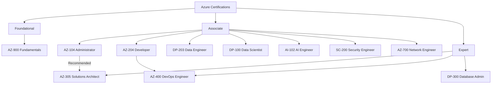

# Azure Certifications

## Learning Paths

### Foundational
| Certification | Code | Duration | Cost | Target |
|--------------|------|----------|------|--------|
| Azure Fundamentals | AZ-900 | 2-3 weeks | $99 | Beginners, non-technical |

### Associate Level
| Certification | Code | Duration | Cost | Target |
|--------------|------|----------|------|--------|
| Administrator Associate | AZ-104 | 8-12 weeks | $165 | Administrators |
| Developer Associate | AZ-204 | 8-12 weeks | $165 | Developers |
| Data Engineer Associate | DP-203 | 8-12 weeks | $165 | Data engineers |
| Data Scientist Associate | DP-100 | 8-12 weeks | $165 | ML engineers |
| AI Engineer Associate | AI-102 | 8-12 weeks | $165 | AI engineers |
| Security Engineer Associate | SC-200 | 8-12 weeks | $165 | Security engineers |
| Network Engineer Associate | AZ-700 | 8-12 weeks | $165 | Network engineers |

### Expert Level
| Certification | Code | Duration | Cost | Target |
|--------------|------|----------|------|--------|
| Solutions Architect Expert | AZ-305 | 12-16 weeks | $165 | Architects |
| DevOps Engineer Expert | AZ-400 | 12-16 weeks | $165 | DevOps engineers |
| Database Administrator | DP-300 | 12-16 weeks | $165 | DBAs |

## Recommended Study Order
1. AZ-900 → AZ-104 → AZ-204
2. AZ-305 (Solutions Architect) → AZ-400 (DevOps)
3. Specialty path based on domain

## Related Topics
- [AWS Certifications](../10-AWS/32-certifications.md)
- [GCP Certifications](../12-GCP/20-certifications.md)
