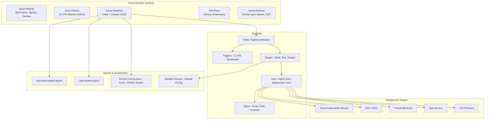

# Azure DevOps

## What is it?
Azure DevOps is a set of developer services for planning, developing, delivering, and monitoring applications. It includes Azure Boards (work tracking), Repos (Git repositories), Pipelines (CI/CD), Test Plans (manual/exploratory testing), and Artifacts (package feeds). Pipelines supports both YAML-based and classic release definitions.

## Why it was created
Teams needed a unified platform covering the entire software development lifecycle — from work item tracking and source control to CI/CD, testing, and package management. Azure DevOps integrates these capabilities into a single platform with built-in support for Azure, AWS, GCP, and on-premises deployments.

## When should you use it
- **End-to-end DevOps**: One platform for boards, repos, pipelines, tests, and artifacts
- **CI/CD for any platform**: Build and deploy to Azure, AWS, GCP, Kubernetes, or on-premises
- **Enterprise compliance**: Enforce branch policies, approval gates, and audit trails
- **Multi-stage pipelines**: Build → Test → Staging → Production with manual approvals
- **Artifact management**: Host NuGet, npm, Maven, and Python packages in private feeds

## Architecture



## YAML Pipeline Example

```yaml
trigger:
  branches:
    include:
      - main
      - release/*
  paths:
    exclude:
      - '*.md'
      - docs/*

pr:
  - main

variables:
  - group: Production-Config
  - name: buildConfiguration
    value: Release

stages:
  - stage: Build
    jobs:
      - job: BuildJob
        pool:
          vmImage: ubuntu-latest
        steps:
          - task: UseDotNet@2
            inputs:
              packageType: sdk
              version: 8.x
          - script: dotnet build --configuration $(buildConfiguration)
          - task: DotNetCoreCLI@2
            inputs:
              command: test
              arguments: '--configuration $(buildConfiguration) --collect:"XPlat Code Coverage"'
          - task: PublishBuildArtifacts@1
            inputs:
              PathtoPublish: '$(Build.ArtifactStagingDirectory)'
              ArtifactName: drop

  - stage: Deploy_Staging
    dependsOn: Build
    condition: succeeded()
    jobs:
      - deployment: DeployApp
        environment: staging
        strategy:
          runOnce:
            deploy:
              steps:
                - download: current
                  artifact: drop
                - task: AzureWebApp@1
                  inputs:
                    azureSubscription: 'Azure-Service-Connection'
                    appName: myapp-staging
                    package: $(Pipeline.Workspace)/drop/**/*.zip

  - stage: Approval
    dependsOn: Deploy_Staging
    jobs:
      - job: WaitForApproval
        pool: server
        steps:
          - task: ManualValidation@0
            inputs:
              notifyUsers: |
                devops-team@company.com
                manager@company.com
              instructions: 'Review staging deployment before production release'

  - stage: Deploy_Production
    dependsOn: Approval
    condition: succeeded()
    jobs:
      - deployment: ProdDeploy
        environment: production
        strategy:
          canary:
            increments: [10, 50]
            deploy:
              steps:
                - task: AzureWebApp@1
                  inputs:
                    azureSubscription: 'Azure-Service-Connection'
                    appName: myapp-prod
                    package: $(Pipeline.Workspace)/drop/**/*.zip
            routeTraffic:
              steps:
                - task: AzureAppServiceManage@0
                  inputs:
                    action: 'Slot Swap with Preview'
                    webAppName: myapp-prod
            on:
              failure:
                steps:
                  - script: echo "Rolling back..."
```

## Classic Releases vs YAML Pipelines

| Feature | YAML Pipelines | Classic Releases |
|---------|---------------|------------------|
| **Definition** | Code (YAML in repo) | UI-based editor |
| **Version control** | Git-tracked, PR reviewable | Stored in Azure DevOps |
| **Reusability** | Templates, extends keyword | Copy/paste between releases |
| **Approvals** | Environments with checks | Pre/post-deployment gates |
| **Multi-stage** | Native stages | Release pipeline per environment |
| **Best for** | Modern, GitOps-style workflows | Legacy, GUI-based teams |

## vs GitHub Actions

| Aspect | Azure Pipelines | GitHub Actions |
|--------|----------------|----------------|
| **CI/CD** | First-class YAML pipelines | Workflow-based YAML |
| **Hosted runners** | Windows, Linux, macOS | Windows, Linux, macOS |
| **Self-hosted** | Yes (agents) | Yes (runners) |
| **Environments** | Built-in with approvals | Built-in with reviewers |
| **Multi-cloud** | Azure-native, with AWS/GCP connectors | GitHub-centric, with cloud connectors |
| **Artifacts** | Azure Artifacts (NuGet, npm, Maven) | GitHub Packages (npm, Docker, Maven) |
| **Boards** | Azure Boards (rich work tracking) | GitHub Issues (lighter weight) |
| **YAML complexity** | Multi-file templates with extends | Single-file with reusable workflows |

## Hands-on Example

```bash
# Create a new project
az devops project create --name MyApp --visibility private

# Configure pipeline
az pipelines create \
    --name "CI-CD Pipeline" \
    --repository https://dev.azure.com/org/MyApp \
    --branch main \
    --repository-type tfsgit \
    --yaml-path azure-pipelines.yml

# Run pipeline
az pipelines run --name "CI-CD Pipeline"

# Create service connection
az devops service-endpoint create \
    --service-endpoint-configuration '{
        "type": "azurerm",
        "authorization": {
            "scheme": "ServicePrincipal",
            "parameters": {
                "tenantid": "tenant-id",
                "serviceprincipalid": "sp-id",
                "authenticationtype": "spKey",
                "serviceprincipalkey": "sp-key"
            }
        },
        "url": "https://management.azure.com/",
        "data": {
            "subscriptionId": "sub-id",
            "subscriptionName": "sub-name"
        }
    }'

# Manage variable group
az pipelines variable-group create \
    --name Production-Config \
    --variables apiUrl="https://api.prod.com" timeout="30" \
    --authorize true

# Queue a build
az pipelines build queue --definition-id 1
```

## Pricing Model

| Component | Basic (Free) | Paid |
|-----------|-------------|------|
| **Pipelines (Microsoft-hosted)** | 1,800 minutes/month (free public) | $40/month for 1,000 minutes (paid) |
| **Pipelines (Self-hosted)** | Unlimited | Unlimited |
| **Azure Boards** | 5 users free | $10/user/month (Basic) |
| **Azure Repos** | 5 users free | Included in Basic |
| **Azure Artifacts** | 2 GB free | $2/GB for first 5 users |
| **Test Plans** | Not included | $52/user/month |
| **Parallel jobs** | 1 free job | $40/month per extra job |

## Best Practices
- **Define pipelines as YAML**: Store pipeline definitions in source control alongside code
- **Use templates**: Create reusable YAML templates for build, test, and deploy patterns
- **Use variable groups**: Centralize configuration like connection strings and API keys
- **Implement branch policies**: Require PR builds, minimum reviewers, and linked work items
- **Use environments with approvals**: Add manual approval gates for production deployments
- **Use deployment strategies**: Implement canary, blue-green, or rolling deployments
- **Cache dependencies**: Cache NuGet/npm/Maven packages to speed up builds
- **Monitor pipeline runs**: Set up alerts for pipeline failures and performance degradation

## Interview Questions
1. What are the five Azure DevOps services and how do they work together?
2. Compare YAML pipelines vs classic releases — when would you use each?
3. How do approval gates work in Azure Pipelines environments?
4. What is the difference between Microsoft-hosted and self-hosted agents?
5. How do variable groups and variable libraries work in Azure Pipelines?
6. Compare Azure Pipelines with GitHub Actions — what are the trade-offs?
7. How do deployment strategies (canary, blue-green, rolling) work in Azure Pipelines?
8. How does Azure DevOps integrate with Azure Boards for work item tracking?

## Real Company Usage
**Microsoft** develops Azure DevOps itself, using the platform for building and shipping Visual Studio, .NET, and Azure services. **Walmart** uses Azure DevOps for their e-commerce platform, running thousands of pipelines across multiple environments. **BP** uses Azure DevOps Boards and Pipelines for their global energy management applications with strict compliance and approval workflows.
