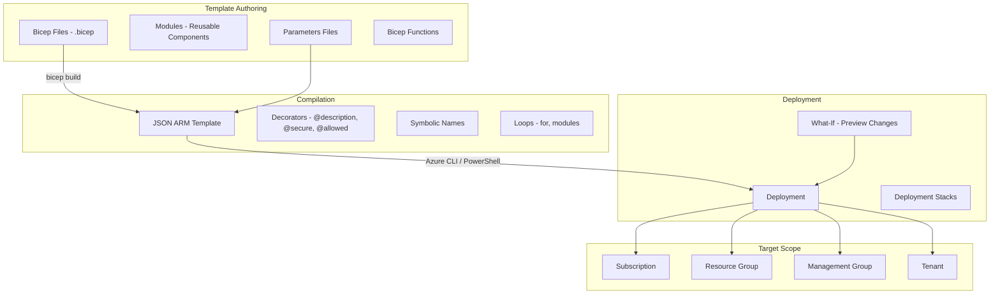

# Azure Bicep & ARM Templates

## What is it?
ARM (Azure Resource Manager) templates are declarative JSON files that define Azure infrastructure. Bicep is a domain-specific language (DSL) that compiles to ARM templates — providing a cleaner, modular, and more maintainable syntax for Infrastructure as Code on Azure.

## Why it was created
ARM templates use verbose JSON syntax that is difficult to read, write, and maintain. Bicep was created as a transparent abstraction — not a new platform — that compiles directly to ARM templates. It provides modularity with modules, expressive syntax with decorators, and type safety, while maintaining full ARM compatibility without any deployment runtime changes.

## When should you use it
- **Infrastructure as Code**: Define all Azure resources in version-controlled templates
- **Modular deployments**: Reuse infrastructure modules across projects and environments
- **CI/CD for infrastructure**: Deploy with Azure Pipelines or GitHub Actions
- **Environment consistency**: Create identical dev, staging, and production environments
- **Deployment stacks**: Manage resources as a single atomic unit

## Architecture



## ARM Template Structure

```json
{
    "$schema": "https://schema.management.azure.com/schemas/2019-04-01/deploymentTemplate.json#",
    "contentVersion": "1.0.0.0",
    "parameters": {
        "environment": {
            "type": "string",
            "allowedValues": ["dev", "staging", "prod"],
            "defaultValue": "dev",
            "metadata": { "description": "Deployment environment" }
        },
        "adminPassword": {
            "type": "securestring",
            "metadata": { "description": "Admin password" }
        }
    },
    "variables": {
        "skuName": "[format('{0}-sku', parameters('environment'))]"
    },
    "functions": [
        {
            "namespace": "contoso",
            "members": {
                "uniqueName": {
                    "parameters": [{"name": "name", "type": "string"}],
                    "output": {
                        "type": "string",
                        "value": "[format('{0}-{1}', parameters('name'), uniqueString(resourceGroup().id))]"
                    }
                }
            }
        }
    ],
    "resources": [
        {
            "type": "Microsoft.Storage/storageAccounts",
            "apiVersion": "2023-01-01",
            "name": "[format('storage{0}', uniqueString(resourceGroup().id))]",
            "location": "[resourceGroup().location]",
            "sku": { "name": "Standard_LRS" },
            "kind": "StorageV2"
        }
    ],
    "outputs": {
        "storageEndpoint": {
            "type": "object",
            "value": "[reference(resourceId('Microsoft.Storage/storageAccounts', format('storage{0}', uniqueString(resourceGroup().id)))).primaryEndpoints]"
        }
    }
}
```

## Bicep — Modules, Decorators, Loops, Conditionals

```bicep
// Parameters with decorators
@description('Environment name')
@allowed(['dev', 'staging', 'prod'])
@secure()
param environment string = 'dev'

param location string = resourceGroup().location

param tags object = {
  environment: environment
  managedBy: 'bicep'
}

// Variables
var uniqueSuffix = uniqueString(resourceGroup().id)
var storageName = 'storage${uniqueSuffix}'
var appServicePlanName = 'asp-${environment}-${uniqueSuffix}'

// Conditional resource
resource storageAccount 'Microsoft.Storage/storageAccounts@2023-01-01' = if (environment != 'dev') {
  name: storageName
  location: location
  kind: 'StorageV2'
  sku: {
    name: 'Standard_GRS'
  }
  tags: tags
}

// Module reference
module appService './modules/app-service.bicep' = {
  name: 'appServiceDeploy'
  params: {
    environment: environment
    location: location
    planName: appServicePlanName
    sku: (environment == 'prod') ? 'P1v3' : 'B1'
    tags: tags
  }
}

// Loop — multiple subnets
param subnetCount int = 3

resource subnets 'Microsoft.Network/virtualNetworks/subnets@2023-01-01' = [for i in range(0, subnetCount): {
  name: 'subnet-${i}'
  parent: virtualNetwork
  properties: {
    addressPrefix: '10.0.${i}.0/24'
  }
}]

// Outputs
output storageEndpoint string = environment != 'dev' ? storageAccount.properties.primaryEndpoints.blob : ''
output appServiceUrl string = appService.outputs.appUrl
```

## Deployments — What-If & Stacks

```bash
# Preview deployment changes (What-If)
az deployment group what-if \
    --resource-group MyRG \
    --template-file main.bicep \
    --parameters environment=prod

# Deploy Bicep file
az deployment group create \
    --resource-group MyRG \
    --template-file main.bicep \
    --parameters environment=prod adminPassword=$password

# Deploy at subscription scope
az deployment sub create \
    --location eastus \
    --template-file subscription.bicep \
    --parameters location=eastus

# Create deployment stack (atomic resource management)
az stack group create \
    --name MyStack \
    --resource-group MyRG \
    --template-file main.bicep \
    --parameters environment=prod \
    --action-on-unmanage detachAll \
    --deny-settings-mode denyWriteAndDelete

# List stacks
az stack group list --resource-group MyRG

# Validate template
az deployment group validate \
    --resource-group MyRG \
    --template-file main.bicep
```

## vs Terraform

| Feature | Bicep | Terraform |
|---------|-------|-----------|
| **Platform** | Azure-only | Multi-cloud (1500+ providers) |
| **Language** | Declarative DSL | HCL (HashiCorp Configuration Language) |
| **State management** | Azure-managed (no state file) | Remote state (S3, Terraform Cloud) |
| **Learning curve** | Low (Azure-native syntax) | Medium (HCL + provider-specific) |
| **Modularity** | Modules (.bicep files) | Modules (registry-based) |
| **What-If** | Built-in | plan command |
| **Idempotency** | Native (idempotent by design) | State-based idempotency |
| **Versioning** | ARM template API versions | Provider version constraints |
| **Community** | Growing (Azure-centric) | Large (multi-cloud community) |
| **Best for** | Azure-only environments | Multi-cloud or multi-provider |

## Hands-on Example

```bash
# Install Bicep CLI
az bicep install

# Build Bicep to ARM JSON
az bicep build --file main.bicep

# Decompile ARM to Bicep
az bicep decompile --file template.json

# Format Bicep file
az bicep format --file main.bicep

# Create resource group
az group create --name MyAppRG --location eastus

# Deploy with parameters file
az deployment group create \
    --resource-group MyAppRG \
    --template-file main.bicep \
    --parameters @parameters.prod.json

# Export resource group as ARM template
az group export --name MyAppRG --include-parameter-default-value

# Convert exported ARM to Bicep
az bicep decompile --file exported-template.json --force
```

## Pricing Model

- **ARM / Bicep**: **Free** — no cost for the deployment service itself
- **Deployment stacks**: No additional charge
- **Resources**: Pay only for the Azure resources provisioned (compute, storage, networking, etc.)
- **Management groups**: No cost
- **What-If previews**: No additional charge

## Best Practices
- **Use Bicep over ARM JSON**: Bicep is easier to read, write, and maintain
- **Use modules for reusable infrastructure**: Network, compute, database modules shared across projects
- **Use parameters files for environments**: Separate `parameters.dev.json`, `parameters.prod.json`
- **Use decorators**: Add @description, @allowed, @secure, @metadata for parameter validation
- **Run What-If before deployment**: Preview changes to catch unintended modifications
- **Use deployment stacks**: Manage resource lifecycle as atomic units with deny settings
- **Version control templates**: Store all Bicep files in Git with PR reviews
- **Use resource tags**: Tag all resources with environment, project, and cost center

## Interview Questions
1. What is the relationship between Bicep and ARM templates?
2. How do Bicep modules enable infrastructure reuse?
3. What are the deployment scopes (resource group, subscription, management group, tenant)?
4. How does the What-If command work and how is it different from Terraform plan?
5. What are deployment stacks and how do they simplify resource lifecycle management?
6. Compare Bicep built-in functions with ARM template functions
7. How do decorators in Bicep improve parameter validation?
8. How would you migrate existing ARM templates to Bicep?

## Real Company Usage
**Microsoft** uses Bicep internally for many Azure service deployments and migration tooling. **Avanade** standardized on Bicep for their Azure delivery practice, building modular libraries for client infrastructure deployments. **Cognizant** uses Bicep with deployment stacks to manage multi-environment Azure foundations for their enterprise clients.
