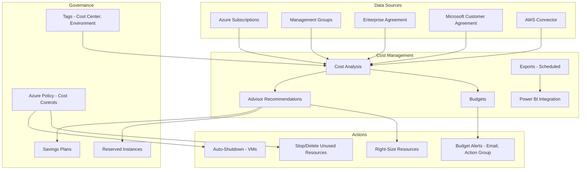

# Azure Cost Management

## What is it?
Azure Cost Management is a suite of tools for monitoring, analyzing, and optimizing Azure cloud spending. It provides budgets, cost analysis, Advisor recommendations, and billing management. It integrates with management groups, tags, and reservations to help organizations govern cloud costs effectively.

## Why it was created
Cloud spending can grow rapidly without proper governance. Organizations need visibility into who is spending what, where costs are going, and how to optimize. Without cost management, teams face billing surprises, inefficient resource usage, and inability to charge back costs to business units. Cost Management provides the data and tools to control and optimize cloud spending.

## When should you use it
- **Cost tracking and analysis**: Understand where money is spent across subscriptions, resource groups, and services
- **Budgeting and alerts**: Set budgets with alerts to prevent overspending
- **Cost optimization**: Use Advisor recommendations to identify idle resources, right-size VMs, and use Reserved Instances
- **Chargeback/showback**: Allocate costs to business units using tags and management groups
- **Multi-cloud cost management**: Manage costs across Azure and AWS (via connectors)

## Architecture



## Budgets & Cost Analysis

```bash
# Create a budget
az consumption budget create \
    --budget-name "Monthly-Production" \
    --amount 5000 \
    --time-grain monthly \
    --start-date 2025-01-01 \
    --end-date 2025-12-31 \
    --category cost \
    --scope /subscriptions/12345 \
    --notifications '{
        "Actual_GreaterThan_80": {
            "enabled": true,
            "operator": "GreaterThan",
            "threshold": 80,
            "contact-emails": ["finops@company.com"],
            "contact-roles": ["Owner"]
        },
        "Actual_GreaterThan_100": {
            "enabled": true,
            "operator": "GreaterThan",
            "threshold": 100,
            "contact-emails": ["finops@company.com"]
        }
    }'

# Query cost data
az consumption usage list \
    --billing-period-name 202501 \
    --top 20

# Create cost export to storage
az costmanagement export create \
    --scope /subscriptions/12345 \
    --name "DailyCostExport" \
    --schedule-frequency Daily \
    --schedule-status Active \
    --recurrence-period-end-date 2025-12-31 \
    --delivery-info '{
        "destination": {
            "resourceId": "/subscriptions/.../storageAccounts/costexports",
            "container": "costdata",
            "rootFolderPath": "/daily"
        }
    }'
```

## Advisor Recommendations

Azure Advisor analyzes resource usage and provides recommendations to optimize costs:

| Recommendation | Potential Savings | Action |
|----------------|-------------------|--------|
| **Right-size VMs** | 15-65% per VM | Reduce VM size to match actual CPU/memory usage |
| **Shut down idle VMs** | 100% of VM cost | Stop VMs not running any workload |
| **Reserved Instances** | Up to 72% vs pay-as-you-go | Purchase 1-year or 3-year RI |
| **Savings Plans** | Up to 65% vs pay-as-you-go | Commit to hourly spend for 1 or 3 years |
| **Delete unattached disks** | 100% of disk cost | Remove orphaned managed disks |
| **Azure Hybrid Benefit** | Up to 40% | Use existing Windows Server/SQL Server licenses |

```bash
# List Advisor cost recommendations
az advisor recommendation list \
    --category Cost \
    --query "[?impactedField=='Microsoft.Compute/virtualMachines']"
```

## Management Groups & Tags for Cost Allocation

```bash
# Create management group hierarchy
az account management-group create --name "Corp-Root"
az account management-group create --name "Engineering" --parent "Corp-Root"
az account management-group create --name "Marketing" --parent "Corp-Root"
az account management-group create --name "Dev-Prod" --parent "Engineering"

# Move subscription
az account management-group subscription add \
    --name "Engineering" \
    --subscription "sub-12345"

# Apply tags for cost tracking
az tag create --resource-id /subscriptions/12345 \
    --tags CostCenter=CC-1000 Environment=Production Project=MyApp

# Query costs by tag
az consumption usage list \
    --billing-period-name 202501 \
    --query "[?tags.CostCenter=='CC-1000']"
```

## Reserved Instances & Savings Plans

| Option | Commitment | Savings | Flexibility |
|--------|-----------|---------|-------------|
| **1-year RI** | 1-year term | Up to 40% | VM size flexibility (with instance size flexibility) |
| **3-year RI** | 3-year term | Up to 72% | Limited flexibility |
| **1-year Savings Plan** | $/hr spend commitment | Up to 35% | Applies to any compute (VM, AKS, App Service) |
| **3-year Savings Plan** | $/hr spend commitment | Up to 65% | Maximum compute flexibility |

```bash
# Purchase Reserved Instance
az reservations reservation purchase \
    --reserved-resource-type VirtualMachines \
    --sku Standard_D2s_v3 \
    --location eastus \
    --quantity 5 \
    --term P1Y \
    --billing-scope Single

# List reservations
az reservations reservation list
```

## Hands-on Example

```bash
# View current month cost
az costmanagement query \
    --scope /subscriptions/12345 \
    --type ActualCost \
    --timeframe MonthToDate

# Set up management group hierarchy with tags
az tag create --resource-id /providers/Microsoft.Management/managementGroups/Corp-Root \
    --tags Environment=Production

# Create budget with action group
az monitor action-group create \
    --name "CostAlerts" \
    --resource-group "CostManagement" \
    --action email finops@company.com

az consumption budget create \
    --budget-name "Monthly-Production" \
    --amount 10000 \
    --time-grain monthly \
    --scope /subscriptions/12345 \
    --notifications '{
        "Forecasted_GreaterThan_100": {
            "enabled": true,
            "operator": "GreaterThan",
            "threshold": 100,
            "contact-groups": ["CostAlerts"]
        }
    }'

# Export cost data daily to storage
az costmanagement export create \
    --scope /subscriptions/12345 \
    --name "MonthlyExport" \
    --type ActualCost \
    --schedule-frequency Monthly \
    --delivery-info '{...}'

# Get pricing calculator estimate API
az billing period list
```

## Pricing Model

| Feature | Pricing |
|---------|---------|
| **Cost Management** | Free (included with Azure subscription) |
| **Budgets** | Free |
| **Advisor recommendations** | Free |
| **Cost exports** | Free (storage charges apply) |
| **Power BI connector** | Free (Power BI license separate) |
| **AWS cost connector** | Free |
| **Reserved Instances** | No fee; discount applied to qualifying resources |
| **Management groups** | Free |

## Best Practices
- **Use management groups for hierarchical governance**: Organize subscriptions by department, environment, and project
- **Apply tags consistently**: Tag all resources with CostCenter, Environment, Project, Owner
- **Set budgets with alerts**: Configure budgets at management group and subscription level with action groups
- **Use export for historical analysis**: Export cost data to storage for long-term trending and Power BI
- **Review Advisor recommendations weekly**: Identify rightsizing, idle resources, and reservation opportunities
- **Use Savings Plans over RIs for flexibility**: Savings Plans cover all compute (VMs, AKS, App Service)
- **Implement auto-shutdown for dev/test**: Use Azure Policy or Automation to stop dev VMs outside business hours
- **Use Azure Hybrid Benefit**: Maximize savings with existing Windows Server and SQL Server licenses

## Interview Questions
1. How does Azure Cost Management help track and optimize cloud spending?
2. How do management groups, subscriptions, and tags work together for cost allocation?
3. What is the difference between Reserved Instances and Savings Plans?
4. How do budgets and alerts prevent cost overruns?
5. What types of cost optimization recommendations does Azure Advisor provide?
6. How would you implement chargeback/showback across business units?
7. How does Cost Management integrate with Power BI for custom reporting?
8. How do you use Azure Policy to enforce cost governance (e.g., restrict VM SKUs)?

## Real Company Usage
**Microsoft** uses Cost Management internally across all Azure subscriptions, with automated budgets and exports feeding FinOps dashboards. **Adobe** uses Azure Cost Management with management groups and tag-based chargeback to allocate costs to product teams. **Siemens** uses Advisor recommendations and Savings Plans to optimize compute costs across their global Azure infrastructure.
