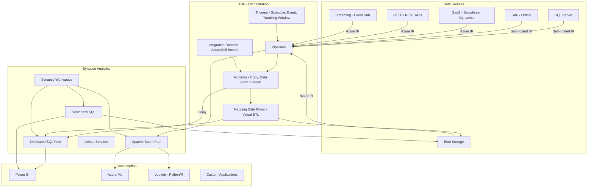

# Azure Data Factory & Synapse Analytics

## What is it?
Azure Data Factory (ADF) is a cloud-based ETL and data integration service that creates orchestrates data pipelines at scale. Azure Synapse Analytics is an unlimited analytics platform that combines big data and data warehousing with dedicated SQL pools, serverless SQL, and Apache Spark under a single workspace.

## Why they were created
Organizations need to ingest data from diverse sources, transform it, and load it into analytics platforms. ADF was created to provide a visual, code-driven ETL service with 100+ connectors and serverless compute. Synapse was created to unify data warehousing (dedicated SQL) with big data processing (Spark) and serverless querying (SQL on-demand) — eliminating the need to stitch separate services together.

## When should you use them
- **ADF**: Data ingestion from SaaS (Salesforce, SAP), databases, files; ETL/ELT pipelines; data migration
- **Synapse**: Petabyte-scale data warehousing, big data analytics with Spark, serverless SQL over data lakes
- **Combined**: ADF orchestrates data movement → Synapse stores and analyzes data at scale

## Architecture



## ADF — Pipelines, Activities, Triggers

```json
{
    "name": "IngestAndTransform",
    "properties": {
        "activities": [
            {
                "name": "CopySalesData",
                "type": "Copy",
                "inputs": [{"referenceName": "SalesforceDataset"}],
                "outputs": [{"referenceName": "RawBlobDataset"}],
                "typeProperties": {
                    "source": {
                        "type": "SalesforceSource",
                        "query": "SELECT Id, Amount, CloseDate FROM Opportunity"
                    },
                    "sink": {
                        "type": "BlobSink",
                        "writeBehavior": "insert"
                    }
                }
            },
            {
                "name": "TransformDataFlow",
                "type": "ExecuteDataFlow",
                "dependsOn": [{"activity": "CopySalesData", "dependencyConditions": ["Succeeded"]}],
                "typeProperties": {
                    "dataflow": {"referenceName": "CleanAndAggregate"},
                    "compute": {"coreCount": 8, "computeType": "General"}
                }
            },
            {
                "name": "LoadToSynapse",
                "type": "Copy",
                "dependsOn": [{"activity": "TransformDataFlow", "dependencyConditions": ["Succeeded"]}],
                "typeProperties": {
                    "source": {"type": "BlobSource"},
                    "sink": {"type": "SqlPoolSink", "preCopyScript": "TRUNCATE TABLE sales.FactOrders"}
                }
            }
        ],
        "triggers": [{
            "name": "DailyTrigger",
            "properties": {
                "type": "ScheduleTrigger",
                "recurrence": {"frequency": "Day", "interval": 1, "schedule": {"hours": [2]}}
            }
        }]
    }
}
```

## Integration Runtime

| Type | Network | Use Case |
|------|---------|----------|
| **Azure IR** | Public internet | Azure-to-Azure data movement |
| **Self-hosted IR** | On-premises or VNet | Connect to on-premises databases, file shares |
| **Azure SSIS IR** | VNet or public | Lift-and-shift SSIS packages to Azure |

## Synapse — Dedicated SQL Pool

```sql
-- Create distribution-friendly table
CREATE TABLE sales.FactOrders (
    OrderID bigint NOT NULL,
    CustomerID int NOT NULL,
    OrderDate datetime NOT NULL,
    Amount decimal(18,2),
    ProductID int
)
WITH (
    DISTRIBUTION = HASH(CustomerID),  -- Even data distribution
    CLUSTERED COLUMNSTORE INDEX,       -- Columnstore for analytics
    PARTITION (OrderDate RANGE RIGHT FOR VALUES (
        '2025-01-01', '2025-04-01', '2025-07-01', '2025-10-01'
    ))
);

-- Create statistics for query optimization
CREATE STATISTICS stat_amount ON sales.FactOrders(Amount);
CREATE STATISTICS stat_date ON sales.FactOrders(OrderDate);

-- Query using result-set caching
SELECT CustomerID, SUM(Amount) as TotalSpend
FROM sales.FactOrders
WHERE OrderDate >= '2025-01-01'
GROUP BY CustomerID
OPTION (LABEL = 'Customer Spend Analysis');
```

## Synapse — Serverless SQL

```sql
-- Query data lake data without loading into SQL pool
SELECT
    YEAR(OrderDate) as Year,
    ProductCategory,
    SUM(Amount) as Revenue
FROM
    OPENROWSET(
        BULK 'https://datalake.dfs.core.windows.net/sales/parquet/**',
        FORMAT = 'PARQUET'
    ) AS [result]
GROUP BY YEAR(OrderDate), ProductCategory
ORDER BY Year, Revenue DESC;

-- Create external table (metadata layer over data lake)
CREATE EXTERNAL TABLE sales.ExtOrders
WITH (
    LOCATION = 'sales/parquet',
    DATA_SOURCE = DataLakeSource,
    FILE_FORMAT = ParquetFormat
) AS
SELECT * FROM OPENROWSET(BULK 'sales/parquet/**', FORMAT = 'PARQUET') as data;
```

## Hands-on Example

```bash
# Create Data Factory
az datafactory create \
    --resource-group MyRG \
    --factory-name MyADF \
    --location eastus

# Create linked service for Blob Storage
az datafactory linked-service create \
    --factory-name MyADF \
    --resource-group MyRG \
    --linked-service-name AzureBlobStorage \
    --properties '{
        "type": "AzureBlobStorage",
        "typeProperties": {
            "connectionString": "DefaultEndpointsProtocol=https;AccountName=mystorage;AccountKey=..."
        }
    }'

# Create pipeline
az datafactory pipeline create \
    --factory-name MyADF \
    --resource-group MyRG \
    --pipeline-name "CopyDataPipeline" \
    --pipeline '{
        "activities": [{
            "name": "CopyFromBlob",
            "type": "Copy",
            "inputs": [{"referenceName": "SourceDataset"}],
            "outputs": [{"referenceName": "SinkDataset"}],
            "typeProperties": {
                "source": {"type": "BlobSource"},
                "sink": {"type": "SqlPoolSink"}
            }
        }]
    }'

# Create Synapse workspace
az synapse workspace create \
    --name MySynapseWS \
    --resource-group MyRG \
    --storage-account mystorageaccount \
    --file-system synapsefs \
    --sql-admin-login-user adminuser \
    --sql-admin-login-password "StrongP@ss123!"

# Create dedicated SQL pool
az synapse sql pool create \
    --workspace-name MySynapseWS \
    --resource-group MyRG \
    --name SalesDW \
    --performance-level DW500c

# Submit Spark job
az synapse spark job submit \
    --workspace-name MySynapseWS \
    --name "SalesETL" \
    --main-definition-file "abfss://fs@storage.dfs.core.windows.net/etl/sales_etl.py" \
    --executors 4 \
    --executor-size Small

# Run Synapse pipeline
az synapse pipeline create-run \
    --workspace-name MySynapseWS \
    --name "IngestPipeline"
```

## Pricing Model

### Data Factory
| Component | Pricing |
|-----------|---------|
| **Orchestration** | $0.50 per 1,000 activity runs (first 50 free/month) |
| **Data movement (Copy)** | $0.25/DIU-hour (Data Integration Unit) |
| **Data flows** | $0.08/DIU-hour per vCore |
| **SSIS** | $0.48/hr (Standard) |

### Synapse
| Component | Pricing |
|-----------|---------|
| **Dedicated SQL Pool** | $0.97/hr for DW100c; scales up to thousands |
| **Serverless SQL** | $5.00 per TB of data processed |
| **Apache Spark** | $0.07/vCore-hour; $0.39/instance-hour |
| **Pipelines (Synapse)** | $0.50 per 1,000 activity runs |
| **Data flows** | $0.08/DIU-hour |

## Best Practices
- **Use Self-hosted IR for on-premises**: Securely connect to databases behind firewalls
- **Use Mapping Data Flows for transformations**: Visual ETL with no coding required
- **Partition Synapse tables by date**: Improves query performance and partition elimination
- **Use CLUSTERED COLUMNSTORE INDEX**: Default index for Synapse — optimal for analytics
- **Use Materialized Views for complex aggregations**: Pre-compute and refresh automatically
- **Create statistics on all columns used in joins/filters**: Critical for query optimizer performance
- **Use PolyBase (External Tables)**: Load data from data lake without separate ETL
- **Scale Synapse SQL pool for large loads**: Scale up before data load, scale down after

## Interview Questions
1. How does ADF's Copy activity work and what integration runtimes does it support?
2. What is the difference between Mapping Data Flows and Copy activity in ADF?
3. How does Synapse Dedicated SQL Pool differ from Serverless SQL?
4. What are table distributions (HASH, ROUND_ROBIN, REPLICATE) and when would you use each?
5. How does Synapse Spark integrate with the SQL pool for unified analytics?
6. How does ADF orchestrate an end-to-end ETL pipeline from source to Synapse?
7. What are tumbling window triggers and how are they different from schedule triggers?
8. How does Synapse handle concurrency and workload management (WLM)?

## Real Company Usage
**Adobe** uses ADF to ingest hundreds of terabytes of marketing and analytics data into Synapse daily. **McDonald's** uses Synapse for global supply chain analytics, processing data from 38,000+ restaurants. **Rolls-Royce** uses ADF and Synapse for their engine telemetry analytics platform, ingesting streaming sensor data and running predictive maintenance models.
