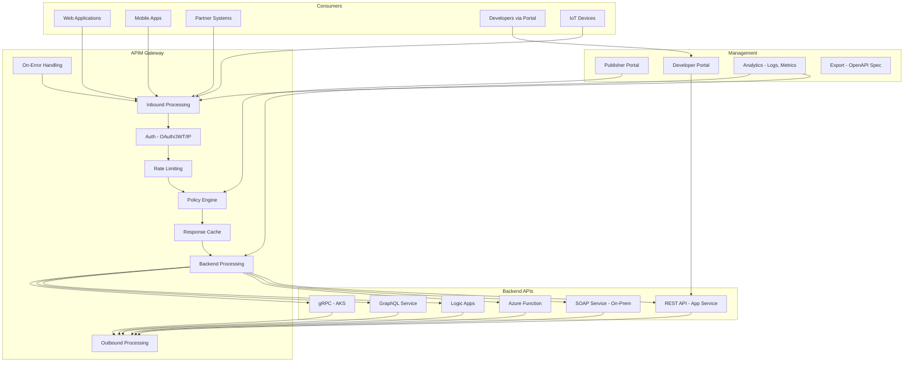

# Azure API Management (APIM)

## What is it?
Azure API Management is a hybrid, multi-cloud API gateway service that provides API publishing, security, transformation, monitoring, and developer portal capabilities. It sits between backend services and API consumers, providing a unified management layer with policies, rate limiting, caching, and analytics.

## Why it was created
Exposing APIs to internal and external consumers requires authentication, rate limiting, transformation, monitoring, and documentation. Building these capabilities for each API leads to code duplication, inconsistent security, and management overhead. APIM provides a centralized, policy-driven gateway that decouples API management from backend implementation.

## When should you use it
- **API gateway**: Single entry point for all backend APIs with consistent security and transformation
- **API monetization**: Package APIs into products with subscriptions and rate limits
- **Developer portal**: Provide interactive API documentation, try-it console, and code samples
- **Security enforcement**: OAuth/OIDC validation, IP filtering, certificate authentication
- **Legacy API transformation**: Transform SOAP to REST, XML to JSON, or modify headers/query parameters
- **Multi-region deployment**: Deploy gateways globally with regional routing and caching

## Architecture



## APIM Tiers

| Feature | Consumption | Developer | Basic | Standard | Premium |
|---------|-------------|-----------|-------|----------|---------|
| **SLA** | 99.9% | None | 99.9% | 99.95% | 99.99% |
| **Scale** | Auto-scale | 1 unit | 1-2 units | 1-4 units | Multi-region |
| **Self-hosted gateway** | No | No | No | No | Yes |
| **VNet support** | No | No | No | Yes | Yes |
| **Developer portal** | Yes | Yes | Yes | Yes | Yes |
| **Caching** | External only | External | Internal | Internal | Internal |
| **Custom domain** | No | Yes | Yes | Yes | Yes |

## Policies — Inbound, Backend, Outbound, On-Error

```xml
<policies>
    <!-- Global policies -->
    <inbound>
        <base />
        <!-- Rate limit by subscription -->
        <rate-limit calls="100" renewal-period="60" />
        <!-- Validate JWT for OAuth -->
        <validate-jwt header-name="Authorization"
            failed-validation-httpcode="401"
            failed-validation-error-message="Unauthorized">
            <openid-config url="https://login.microsoftonline.com/tenant/v2.0/.well-known/openid-configuration" />
            <issuers>
                <issuer>https://login.microsoftonline.com/tenant/v2.0</issuer>
            </issuers>
        </validate-jwt>
        <!-- Set backend URL based on environment -->
        <set-backend-service base-url="https://api-prod.contoso.com" />
    </inbound>
    <backend>
        <base />
        <!-- Retry policy -->
        <retry count="2" interval="10" first-fast-retry="false">
            <forward-request />
        </retry>
    </backend>
    <outbound>
        <base />
        <!-- Transform XML to JSON -->
        <xml-to-json kind="direct" apply="always" />
        <!-- Remove sensitive headers -->
        <set-header name="X-Internal-Info" exists-action="delete" />
    </outbound>
    <on-error>
        <base />
        <!-- Return standardized error -->
        <return-response>
            <set-status code="500" reason="Internal Server Error" />
            <set-body>{"error": "An unexpected error occurred"}</set-body>
        </return-response>
    </on-error>
</policies>
```

## Products, Subscriptions, and Developer Portal

```bash
# Create product
az apim product create \
    --service-name MyAPIM \
    --resource-group MyRG \
    --product-id "premium-api" \
    --product-name "Premium API Product" \
    --description "High-throughput API access" \
    --subscription-required true \
    --approval-required true \
    --subscriptions-limit 5 \
    --state published

# Add API to product
az apim product api add \
    --service-name MyAPIM \
    --resource-group MyRG \
    --product-id "premium-api" \
    --api-id "order-api"

# Create subscription
az apim subscription create \
    --service-name MyAPIM \
    --resource-group MyRG \
    --subscription-id "partner-1" \
    --display-name "Partner Company" \
    --scope /products/premium-api \
    --state active

# List subscriptions
az apim subscription list \
    --service-name MyAPIM \
    --resource-group MyRG
```

## OAuth/OIDC Integration

```xml
<!-- Validate OAuth2 token -->
<inbound>
    <validate-jwt header-name="Authorization"
        failed-validation-httpcode="401"
        require-expiration-time="true"
        require-scheme="Bearer"
        require-signed-tokens="true">
        <issuer-signing-keys>
            <key>base64-encoded-public-key</key>
        </issuer-signing-keys>
        <audiences>
            <audience>api://myapi</audience>
        </audiences>
        <issuers>
            <issuer>https://sts.windows.net/tenant-id/</issuer>
        </issuers>
        <required-claims>
            <claim name="roles" match="any">
                <value>Orders.Read</value>
                <value>Orders.Write</value>
            </claim>
        </required-claims>
    </validate-jwt>
</inbound>
```

## Self-Hosted Gateway

```bash
# Deploy self-hosted gateway to AKS
az apim gateway create \
    --service-name MyAPIM \
    --resource-group MyRG \
    --gateway-id "onprem-gateway" \
    --location-data name="On-Premises" city="New York" district="Manhattan" country-or-region="US"

# Get gateway token
az apim gateway token get \
    --service-name MyAPIM \
    --resource-group MyRG \
    --gateway-id "onprem-gateway" \
    --key-type primary \
    --expiry "2025-12-31T23:59:00Z"

# Deploy to Kubernetes (via Helm)
helm repo add azure-api-management-gateway https://azure.github.io/api-management-self-hosted-gateway/helm-charts/
helm install my-gateway azure-api-management-gateway/azure-api-management-gateway \
    --set gateway.id="onprem-gateway" \
    --set gateway.token="gateway-token" \
    --set service.type=LoadBalancer
```

## Hands-on Example

```bash
# Create APIM instance
az apim create \
    --name MyAPIM \
    --resource-group MyRG \
    --location eastus \
    --publisher-name "MyCompany" \
    --publisher-email "api@mycompany.com" \
    --sku-name Developer \
    --enable-managed-identity true

# Import OpenAPI spec
az apim api import \
    --service-name MyAPIM \
    --resource-group MyRG \
    --api-id "orders-api" \
    --path "/orders" \
    --specification-url "https://api.mycompany.com/openapi.json" \
    --specification-format OpenApi \
    --api-type http

# Set policy for API
az apim api policy set \
    --service-name MyAPIM \
    --resource-group MyRG \
    --api-id "orders-api" \
    --policy-format xml \
    --policy-file policy.xml

# Enable diagnostics
az monitor diagnostic-settings create \
    --name "APIM-Logs" \
    --resource $(az apim show --name MyAPIM --resource-group MyRG --query id -o tsv) \
    --workspace "LogAnalyticsWorkspace" \
    --logs '[
        {"category": "GatewayLogs", "enabled": true},
        {"category": "WebSocketConnectionLogs", "enabled": true}
    ]' \
    --metrics '[{"category": "AllMetrics", "enabled": true}]'

# Generate developer portal
az apim portal upload \
    --service-name MyAPIM \
    --resource-group MyRG \
    --name "default" \
    --source-path ./portal-content
```

## Pricing Model

| Tier | Price (Per Unit/Hour) | Features |
|------|----------------------|----------|
| **Consumption** | Pay-per-call ($0.0012/1K calls) | Serverless, auto-scale |
| **Developer** | $0.07/hr (~$50/month) | Dev/test, no SLA |
| **Basic** | $0.45/hr (~$320/month) | Small production |
| **Standard** | $0.90/hr (~$650/month) | Production with scaling |
| **Premium** | $2.80/hr (~$2,000/month) | Multi-region, SLA |
| **Self-hosted gateway** | $0.40/hr per gateway | Hybrid deployments |

## Best Practices
- **Use products and subscriptions**: Organize APIs into products with different rate limits and pricing tiers
- **Implement OAuth 2.0 / OIDC**: Use Entra ID or external IdP for API authentication
- **Use policy fragments**: Reuse common policies across multiple APIs
- **Enable caching**: Cache response bodies for read-heavy APIs to reduce backend load
- **Use rate limiting and quotas**: Protect backends from overuse with subscription-level and API-level limits
- **Use VNet integration for Premium**: Secure backend connections within your virtual network
- **Use self-hosted gateway for on-premises**: Run APIM gateway locally with same policies
- **Enable diagnostics**: Send gateway logs to Log Analytics for monitoring and troubleshooting

## Interview Questions
1. What are the four policy scopes (inbound, backend, outbound, on-error) and when is each used?
2. How does APIM validate JWT tokens and integrate with OAuth/OIDC providers?
3. What is the difference between products, APIs, and operations in APIM?
4. How do rate limiting and quotas protect backend APIs?
5. What is the self-hosted gateway and when would you deploy it?
6. How does APIM transform SOAP to REST or XML to JSON?
7. How do you enable caching in APIM to reduce backend load?
8. Compare the APIM tiers — when would you choose each?

## Real Company Usage
**Microsoft** uses APIM to expose many Azure service APIs with consistent authentication, rate limiting, and monitoring. **Shell** uses APIM with self-hosted gateways for their on-premises refinery APIs, applying the same policies as their cloud APIs. **Maersk** uses APIM as the central API gateway for their global logistics platform, handling thousands of API calls per second with OAuth authentication and rate limiting.
