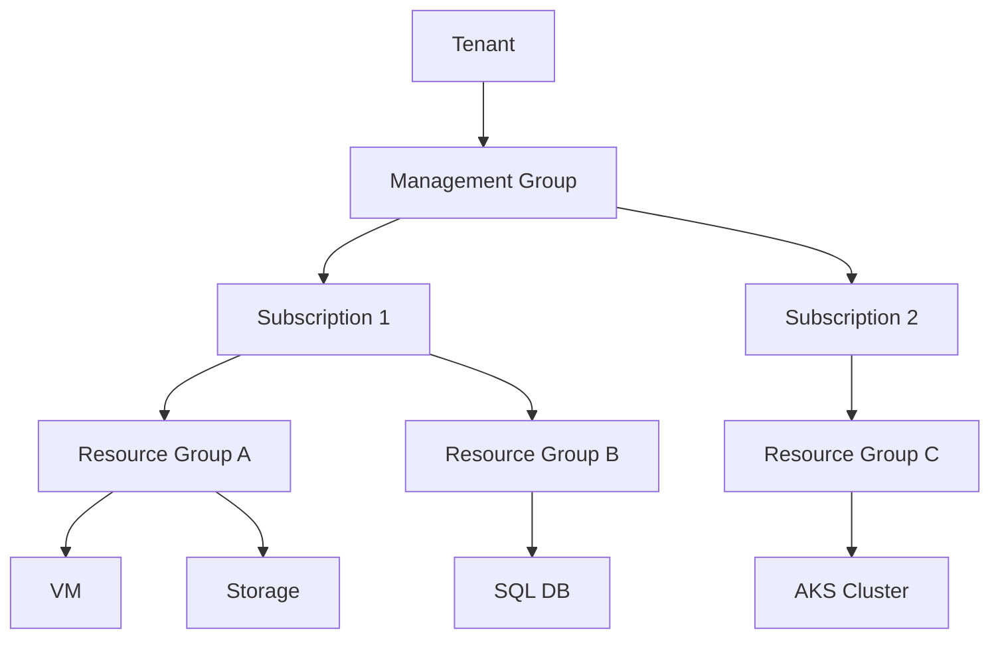

# Azure Module Overview

## What is it?
Microsoft Azure is a cloud computing platform offering IaaS, PaaS, and SaaS solutions across 60+ regions worldwide, with deep integration with Microsoft's enterprise ecosystem (Microsoft 365, Dynamics, Power Platform).

## Why it was created
Azure was built to provide a scalable, enterprise-grade cloud platform that leverages Microsoft's existing datacenter infrastructure and software expertise, offering hybrid cloud capabilities that AWS and GCP initially lacked.

## When should you use it
- Enterprise organizations with existing Microsoft licensing (Windows Server, SQL Server, Active Directory)
- Hybrid cloud architectures requiring on-premises integration via Azure Arc or VPN/ExpressRoute
- .NET ecosystem applications needing seamless Visual Studio/Azure DevOps integration
- Regulated industries requiring extensive compliance certifications (90+ compliance offerings)

## Architecture

### Global Infrastructure
- **Regions**: 60+ regions (largest cloud footprint), each with 3+ availability zones (in supported regions)
- **Availability Zones**: Physically separate datacenters within a region, each with independent power/cooling/network
- **Region Pairs**: Each region paired with another (e.g., East US & West US) for disaster recovery at least 300 miles apart

### Management Hierarchy
- **Management Groups**: Top-level containers for governance policy enforcement across subscriptions
- **Subscriptions**: Billing and policy boundaries; each subscription is a trust boundary
- **Resource Groups**: Logical containers for related resources; all resources must belong to exactly one RG



## Hands-on Example

### Creating a Resource Group via CLI
```bash
az group create --name MyResourceGroup --location eastus
```

### Creating a VM via CLI
```bash
az vm create \
  --resource-group MyResourceGroup \
  --name MyVM \
  --image Ubuntu2204 \
  --admin-username azureuser \
  --generate-ssh-keys
```

## Pricing Model
- **Pay-as-you-go**: No upfront cost, per-second billing for compute
- **Reserved Instances**: 1- or 3-year commitments with up to 72% discount
- **Spot VMs**: Up to 90% discount for interruptible workloads
- **Azure Hybrid Benefit**: Use on-premises Windows Server/SQL Server licenses for free
- **Free Tier**: 12 months of popular services, 200+ services always free

## Best Practices
- Use management groups to apply policy and RBAC at scale across subscriptions
- Implement Azure Policy to enforce compliance (tagging, allowed regions, SKU restrictions)
- Deploy resources across availability zones for production workloads
- Use Blueprints or Bicep/ARM templates for infrastructure-as-code
- Enable Azure Security Center and Azure Defender for all subscriptions

## Interview Questions
1. Explain the difference between management groups, subscriptions, and resource groups
2. How does Azure's global infrastructure differ from AWS's?
3. What is Azure Arc and when would you use it?
4. How do Azure availability zones compare to AWS availability zones?
5. What Azure governance tools would you use for a multi-subscription enterprise deployment?

## Real Company Usage
- **Microsoft**: Uses Azure for its own SaaS products (Microsoft 365, Xbox Live, LinkedIn)
- **Adobe**: Migrated its cloud infrastructure to Azure for enterprise workloads
- **SAP**: Runs SAP applications on Azure for enterprise customers
- **GE Healthcare**: Uses Azure for medical imaging and AI diagnostics
