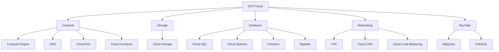

# GCP Overview

## Core Services

| Category | Service | Description |
|----------|---------|-------------|
| Compute | Compute Engine | VMs |
| Compute | GKE | Managed Kubernetes |
| Compute | Cloud Run | Serverless containers |
| Compute | Cloud Functions | FaaS |
| Storage | Cloud Storage | Object storage (buckets) |
| Database | Cloud SQL | Managed MySQL/PostgreSQL |
| Database | Cloud Spanner | Globally distributed SQL |
| Database | Firestore | NoSQL document |
| Database | Bigtable | Wide-column NoSQL |
| Networking | VPC | Virtual networks |
| Networking | Cloud CDN | Content delivery |
| Networking | Cloud Load Balancing | Global LB |
| Big Data | BigQuery | Serverless analytics |
| Big Data | Pub/Sub | Messaging |

## GCP vs AWS

| Feature | GCP | AWS |
|---------|-----|-----|
| Kubernetes | GKE (native) | EKS (add-on) |
| Serverless SQL | Cloud Spanner | Aurora Serverless |
| Object storage | Cloud Storage | S3 |
| CDN | Cloud CDN | CloudFront |
| Pub/sub | Pub/Sub | SNS/SQS |
| Pricing | Per-second (many) | Per-hour (most) |

## Interview Questions
1. What makes Cloud Spanner unique in the database landscape?
2. How does BigQuery achieve serverless analytics at scale?
3. Compare GCP Cloud Run vs AWS Lambda
4. How does GCP's global VPC differ from AWS's VPC model?
5. Design a multi-region architecture on GCP
