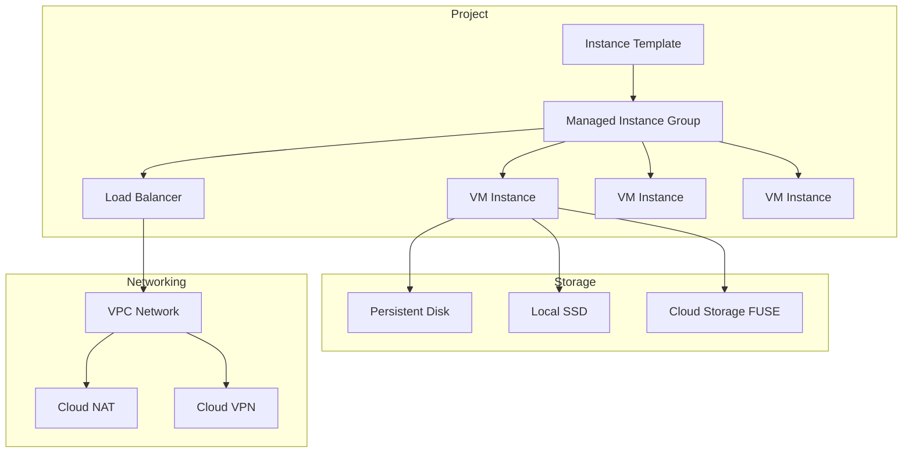

# Compute Engine

## What is it?
Compute Engine provides resizable virtual machines (VMs) running on Google's global infrastructure. It offers full control over OS, networking, and storage with per-second billing and automatic discounts.

## Why it was created
Organizations need scalable, on-demand compute capacity without managing physical servers. Compute Engine provides this with deep integration into GCP's networking, storage, and identity systems.

## When should you use it
- Lift-and-shift migrations of on-premises workloads
- Applications requiring full OS control or custom kernel modules
- Workloads with predictable, steady-state resource usage
- GPU-accelerated training or rendering workloads
- Hybrid cloud setups with on-premises connectivity

## Architecture



## Machine Families

| Family | CPU:RAM | Use Case | Machine Types |
|--------|---------|----------|---------------|
| **General Purpose** | 1:4 | Balanced workloads, web servers, microservices | E2, N2, N2D, N1, T2D |
| **Compute Optimized** | 1:2 | CPU-intensive workloads, batch processing | C2, C2D, C3 |
| **Memory Optimized** | 1:8+ | In-memory databases, large caches, SAP | M1, M2, M3 |
| **GPU** | GPU-attached | ML training, rendering, VDI | A2 (A100), G2 (L4), N1 w/ GPU |

## Machine Types

| Series | Processor | vCPU Range | Key Feature |
|--------|-----------|------------|-------------|
| **E2** | Intel/AMD | 2-32 | Budget, shared-core options |
| **N2** | Intel Ice Lake | 2-128 | Latest gen, great balance |
| **N2D** | AMD Milan | 2-224 | Best price/performance |
| **C2** | Intel Cascade Lake | 4-60 | Compute-optimized |
| **C2D** | AMD Milan | 2-112 | Compute-optimized AMD |
| **C3** | Intel Sapphire Rapids | 4-360 | Hyperdisk, C3D variant |
| **M1** | Intel Skylake | 96-160 | 12TB max memory |
| **M2** | Intel Cascade Lake | 208-416 | 12TB+ memory for SAP |
| **M3** | Intel Sapphire Rapids | 8-96 | Next-gen memory-optimized |
| **A2** | NVIDIA A100 | 12-96 | ML training, HPC |
| **G2** | NVIDIA L4 | 8-96 | ML inference, VDI |

## Sole-Tenant Nodes
Physical servers dedicated to a single project for licensing (BYOL), compliance, or security requirements. VMs can be placed on specific node groups.

## Preemptible / Spot VMs
- **Preemptible**: Max 24-hour runtime, no automatic restart, 60-91% discount
- **Spot**: Same discount as preemptible but no 24-hour limit; newer and recommended
- Use for: batch jobs, CI/CD, stateless workers, data processing
- Avoid for: stateful workloads, databases, critical production services

## Reservations & Committed Use Discounts

| Type | Term | Discount | Flexibility |
|------|------|----------|-------------|
| Committed Use (CUD) | 1 or 3 years | Up to 70% | Resource-specific (vCPU, memory, GPU) |
| Reservations | Flexible | Automatic | Reserve capacity in specific zone |

CUDs are applied automatically to matching usage. Reservations guarantee capacity.

## OS Images
- Public images: Debian, Ubuntu, CentOS, RHEL, SLES, Windows Server, Rocky Linux, Container-Optimized OS
- Custom images: Create from existing instances, import from on-premises
- Image families: Always get the latest version of a given OS family
- Shielded VM: Secure boot, vTPM, integrity monitoring

## Snapshots
- Incremental, point-in-time backups of persistent disks
- Can create new disks from snapshots across zones or regions
- Snapshot schedules automate recurring backups
- Cost: charged for actual stored data (incremental)

## Instance Templates
Reusable VM configuration (machine type, disk, network, metadata, startup script). Used by MIGs to create identical instances.

## Managed Instance Groups (MIGs)
- **Stateless MIG**: Auto-healing, auto-scaling, auto-updating; instances are disposable
- **Stateful MIG**: Preserve instance name, disk, and metadata on restart (databases, legacy apps)
- **Auto-scaling**: CPU utilization, HTTP load balancing, Stackdriver metrics, or scheduled
- **Rolling updates**: Canary or rolling replacements with health check gating

## Hands-on Example

```bash
# Create VM from gcloud
gcloud compute instances create my-vm \
  --zone=us-central1-a \
  --machine-type=e2-medium \
  --image-family=ubuntu-2204-lts \
  --image-project=ubuntu-os-cloud \
  --boot-disk-size=50GB \
  --tags=http-server,https-server

# SSH into VM
gcloud compute ssh my-vm --zone=us-central1-a

# Create managed instance group with autoscaling
gcloud compute instance-templates create my-template \
  --machine-type=e2-small \
  --image-family=ubuntu-2204-lts \
  --image-project=ubuntu-os-cloud

gcloud compute instance-groups managed create my-mig \
  --zone=us-central1-a \
  --template=my-template \
  --size=3 \
  --target-cpu-utilization=0.75 \
  --min-replicas=1 \
  --max-replicas=10

# Create preemptible VM
gcloud compute instances create cheap-vm \
  --zone=us-central1-a \
  --provisioning-model=SPOT \
  --instance-termination-action=DELETE
```

## Pricing Model
- **Per-second billing**: Charged only while VM is running (min 1 minute)
- **Sustained-use discount**: Automatic 20-30% for running VM the full month
- **Committed-use discount**: 1-year (up to 57%) or 3-year (up to 70%) for vCPUs, memory, GPUs
- **Preemptible/Spot**: 60-91% discount for interruptible workloads
- **Premium OS images**: Windows, RHEL, SLES cost extra per hour
- **Disk**: Persistent disk and local SSD billed separately
- **Egress**: Data transfer to internet billed per GB

## Best Practices
- Use MIGs with health checks for auto-healing
- Prefer Spot VMs for batch, preemptible for short-lived jobs
- Right-size with recommendations from Recommender
- Use custom machine types for non-standard CPU/RAM ratios
- Attach GPUs only when needed (stop VMs when idle to save)
- Organize VMs with descriptive names and labels
- Use Shielded VM for security-sensitive workloads
- Schedule snapshots for critical disks

## Interview Questions
1. Compare Compute Engine machine families: when to use E2 vs N2 vs C2 vs M2
2. How do preemptible/Spot VMs work and what are their appropriate use cases?
3. Explain the difference between stateless and stateful MIGs
4. How do committed-use discounts stack with sustained-use discounts?
5. What is the difference between persistent disks, local SSDs, and Cloud Storage for VM storage?

## Real Company Usage
- **Snapchat**: Uses Compute Engine for photo and video processing
- **PayPal**: Runs payment processing workloads on Compute Engine
- **Home Depot**: Migrated retail systems to Compute Engine with MIGs
