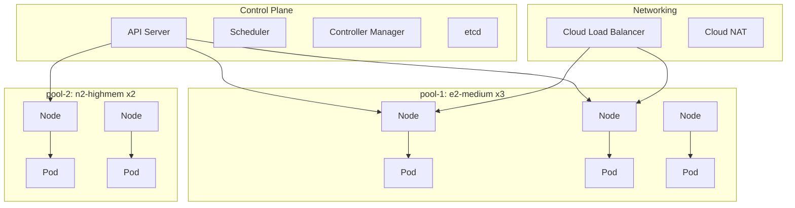

# GKE (Google Kubernetes Engine)

## What is it?
GKE is Google's managed Kubernetes service that provisions, manages, and scales clusters on GCP infrastructure. It was the first managed Kubernetes service (launched 2015) and remains the most mature.

## Why it was created
Kubernetes was created by Google (based on Borg/Omega) and open-sourced in 2014. GKE provides a seamless, managed experience for running Kubernetes workloads without managing control planes or etcd.

## When should you use it
- Containerized microservices needing orchestration
- CI/CD pipelines with container deployment
- Stateful workloads (databases, message queues) via StatefulSets
- Hybrid or multi-cloud deployments (Anthos/GKE Enterprise)
- Batch processing and ML training with GPUs
- Migrating from on-premises Kubernetes

## Architecture



## Cluster Modes

| Feature | Autopilot | Standard |
|---------|-----------|----------|
| **Node management** | Fully managed | User manages node pools |
| **Pricing** | Pay per pod (CPU/memory) | Pay per node + control plane |
| **Scaling** | Automatic | Manual or autoscaling |
| **Customizing nodes** | Limited to machine series | Full control (images, GPUs, etc.) |
| **Best for** | Production without ops overhead | Complex, custom, or cost-optimized workloads |

## Node Pools
- Groups of VM instances within a cluster with identical configuration
- Each pool has its own machine type, disk size, and scaling config
- Use separate pools for different workload types (e.g., general vs GPU vs memory-intensive)
- Node auto-upgrade and auto-repair available per pool

## Workload Types

| Type | Use Case | Example |
|------|----------|---------|
| **Deployment** | Stateless apps, webservers | nginx, API services |
| **StatefulSet** | Stateful apps, databases | Cassandra, MySQL, Redis |
| **DaemonSet** | Run on every node | Logging agents, monitoring, networking |
| **Job/CronJob** | Batch tasks | Data processing, backups |
| **Sidecar** | Helper containers | Envoy proxy, log shippers |

## GKE Sandbox
- Based on gVisor (Google's container sandbox)
- Provides an additional kernel isolation layer between containers and host
- Use for: multi-tenant workloads, untrusted code execution
- Performance overhead: ~10-20% compared to native containers

## Cloud NAT
Managed NAT service that allows private cluster nodes to access the internet while preventing inbound connections. Required for:
- Pulling container images from external registries
- Accessing external APIs from private cluster nodes
- Downloading packages during startup

## Workload Identity
- Recommended way for GKE workloads to access GCP services
- Maps a Kubernetes service account to a GCP IAM service account
- No more service account keys in secrets!
```bash
gcloud iam service-accounts add-iam-policy-binding \
  roles/storage.objectViewer \
  --member "serviceAccount:PROJECT.svc.id.goog[NAMESPACE/KSA]" \
  --role roles/iam.workloadIdentityUser
```

## VPC-Native Clusters
- Pods get native IP addresses from the VPC subnet (not secondary ranges behind NAT)
- Enables direct VPC-based communication, firewall rules for pods, and VPC Service Controls
- Recommended for all new clusters
- Requires alias IP ranges or routes-based (native preferred)

## GKE Enterprise
- Formerly Anthos
- Multi-cluster management across GCP, AWS, Azure, and on-premises
- Config Sync, Policy Controller (OPA/Gatekeeper), Service Mesh (Anthos Service Mesh)
- Serverless with Cloud Run on GKE

## Release Channels

| Channel | Contains | When to use |
|---------|----------|-------------|
| **Rapid** | Latest Kubernetes version | Dev/test, early adopters |
| **Regular** | Recently validated version | General production |
| **Stable** | Older, thoroughly tested version | Conservative, compliance-required |

Clusters are automatically upgraded within their channel but can opt out or set maintenance windows.

## Cluster Upgrade
- Control plane upgrades first (brief API downtime)
- Node upgrades use surge or blue/green strategies
- Node pools can be configured with max surge and max unavailable
- Use PDBs (PodDisruptionBudgets) to protect critical workloads during upgrades

## Hands-on Example

```bash
# Standard cluster
gcloud container clusters create my-cluster \
  --zone=us-central1-a \
  --num-nodes=3 \
  --machine-type=e2-standard-2 \
  --enable-autoscaling \
  --min-nodes=1 \
  --max-nodes=10 \
  --network=my-vpc \
  --subnet=my-subnet

# Autopilot cluster
gcloud container clusters create-auto auto-cluster \
  --region=us-central1

# Deploy workload
kubectl create deployment web --image=nginx:latest
kubectl expose deployment web --port=80 --type=LoadBalancer

# Create node pool with GPUs
gcloud container node-pools create gpu-pool \
  --cluster=my-cluster \
  --zone=us-central1-a \
  --machine-type=a2-highgpu-1g \
  --accelerator=type=nvidia-tesla-a100,count=1 \
  --num-nodes=2

# Get credentials
gcloud container clusters get-credentials my-cluster --zone=us-central1-a
```

## Pricing Model
- **Standard**: Hourly per-node charge + control plane fee ($0.10/hr per cluster) + Compute Engine costs
- **Autopilot**: Pay per pod resource request (CPU/memory/GPU); no node charges
- **GKE Enterprise**: Additional licensing per vCPU per month
- **GKE Sandbox**: Extra cost per sandboxed pod
- **Data egress**: Standard network egress charges apply

## Best Practices
- Use Autopilot for production workloads without ops overhead
- Use Workload Identity instead of service account keys
- Enable VPC-native clusters for native pod networking
- Set resource requests/limits for all containers
- Use HorizontalPodAutoscaler and VerticalPodAutoscaler together
- Implement PodDisruptionBudgets for production workloads
- Use release channels for managed upgrades
- Enable GKE Sandbox for multi-tenant or untrusted workloads
- Monitor with GKE Dashboards and Cloud Monitoring

## Interview Questions
1. Compare GKE Autopilot vs Standard: when would you choose each?
2. How does Workload Identity improve security compared to traditional GCP service account keys?
3. Explain VPC-native clusters and why they are recommended
4. What are the GKE release channels and how do you choose between them?
5. Design a multi-cluster GKE architecture for a global application with regional deployments

## Real Company Usage
- **Spotify**: Runs backend services on GKE for recommendation engine
- **HSBC**: Uses GKE Enterprise (Anthos) for hybrid cloud banking apps
- **Etsy**: Migrated from on-premises Kubernetes to GKE for performance
- **GitHub**: Previously migrated CI/CD pipelines to GKE
