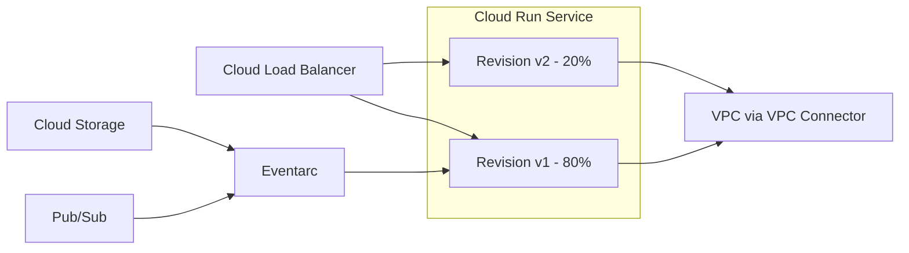

# Cloud Run

## What is it?
Cloud Run is a fully managed serverless container platform that executes stateless containers in a request-driven or event-driven manner. It abstracts away infrastructure and scales to zero when idle.

## Why it was created
Developers want to run containers without managing clusters (GKE) or VMs (Compute Engine). Cloud Run provides the simplicity of Cloud Functions with the flexibility of containers—any language, any runtime, any binary.

## When should you use it
- HTTP APIs and web applications (REST, GraphQL)
- Event-driven workloads (Pub/Sub, Cloud Storage, Eventarc)
- Batch jobs and scheduled tasks (Cloud Run Jobs)
- Microservices that need automatic scaling including zero
- Migrating from Cloud Functions when more control is needed
- Webhooks and integrations

## Architecture



## Revisions
- Immutable snapshot of the container configuration (image, env vars, memory, CPU)
- Each deployment creates a new revision
- Revisions can be pinned (keep-alive) or automatically garbage-collected
- Traffic splitting between revisions for canary deployments

## Traffic Splitting
- Route percentage of traffic to different revisions
- Use for: canary deployments, A/B testing, blue/green
```bash
gcloud run services update-traffic my-service \
  --to-revisions=my-service-00005=80,my-service-00004=20
```
- Tags allow routing to specific revisions without public traffic (for testing)

## Min / Max Instances
- **Min instances**: Keep N instances warm (cold-start mitigation); billed even when idle
- **Max instances**: Limit scale to avoid runaway costs; useful for backend connections
- Default min = 0 (scale to zero), default max = 100

## Concurrency
- Number of simultaneous requests each container instance can handle
- Default: 80 (can be set 1-1000)
- Set to 1 for legacy frameworks (PHP, Rails) that aren't thread-safe
- Higher concurrency improves resource utilization and reduces cold starts

## CPU Acceleration
- **CPU always on**: Container gets CPU even between requests (useful for background threads)
- **CPU throttled (default)**: CPU only allocated during request processing
- CPU always on adds cost but is needed for async processing, background tasks

## VPC Connector
- Serverless VPC access for Cloud Run to reach VPC-based resources (Cloud SQL, Memorystore, private GKE)
- Supports all ports and protocols (not just HTTP)
- Enables private networking without public internet routing
- Must be provisioned in the same region as the service

## Cloud Run Jobs
- Run containers to completion (not HTTP-driven)
- Support parallel tasks, retries, and configurable timeouts up to 24h
- Use for: ETL pipelines, batch processing, database migrations, report generation
```bash
gcloud run jobs create my-job \
  --image=us-docker.pkg.dev/cloudrun/container/job \
  --tasks=10 \
  --parallelism=5 \
  --max-retries=3
```

## Eventarc Triggers
- Delivers events from Google services (Cloud Storage, Pub/Sub, BigQuery, Firestore) directly to Cloud Run
- Supports custom event sources via Audit Logs
- Filtering by event type, service, method, resource name

## Anthos Integration
- Cloud Run for Anthos: Run Cloud Run workloads on GKE clusters (including on-premises)
- Consistent developer experience across cloud and on-premises
- Use when: you need to run serverless containers but must remain on-prem for compliance

## Hands-on Example

```bash
# Build and deploy a container
gcloud builds submit --tag gcr.io/PROJECT-ID/hello-world
gcloud run deploy hello-world \
  --image gcr.io/PROJECT-ID/hello-world \
  --platform managed \
  --region us-central1 \
  --allow-unauthenticated

# Deploy from source (Cloud Build auto-detects language)
gcloud run deploy my-service \
  --source . \
  --region us-central1

# Update environment variables
gcloud run services update my-service \
  --update-env-vars KEY=VALUE

# Deploy with min instances (cold start mitigation)
gcloud run deploy my-api \
  --image gcr.io/PROJECT-ID/api \
  --min-instances=2 \
  --concurrency=80

# Create a scheduled job
gcloud run jobs create hourly-etl \
  --image gcr.io/PROJECT-ID/etl-job
gcloud scheduler jobs create http hourly-trigger \
  --schedule="0 * * * *" \
  --uri="https://REGION-run.googleapis.com/apis/run.googleapis.com/v1/..." \
  --http-method=POST
```

## Pricing Model
- **Compute time**: Pay per vCPU-second and memory-second while processing requests (billable time)
- **CPU always on**: Additional cost if CPU is allocated between requests
- **Requests**: Free tier: 2M requests/month
- **Min instances**: Always-on instances are billed continuously
- **VPC Connector**: Billed per hour + data processing per GB
- **No charge**: When scaled to zero (no requests, no cost)

## Best Practices
- Set memory at least 256 MB for most services
- Use environment variables for config (not files)
- Implement health checks (Cloud Run waits for HTTP 200 on port on startup)
- Mount Cloud Storage via FUSE for large file I/O (not local disk)
- Use Cloud Run Jobs for batch workloads instead of services with request timeouts
- Use traffic splitting for canary deployments
- Set max instances to prevent cost spikes from traffic surges
- Prefer multi-region when deploying globally (use GLB in front)

## Interview Questions
1. How does Cloud Run scale to zero and what are the cold start implications?
2. Compare Cloud Run vs Cloud Functions vs GKE for deploying containerized applications
3. How does traffic splitting work and when should you use it?
4. What is the difference between a Cloud Run service and a Cloud Run job?
5. How do you connect Cloud Run to a private Cloud SQL instance?

## Real Company Usage
- **Spotify**: Uses Cloud Run for backend microservices and event-driven workflows
- **Niantic**: Runs Pokémon GO real-time event processing on Cloud Run
- **Pluralsight**: Migrated .NET microservices to Cloud Run for reduced ops cost
- **PicCollage**: Uses Cloud Run for photo editing API endpoints
