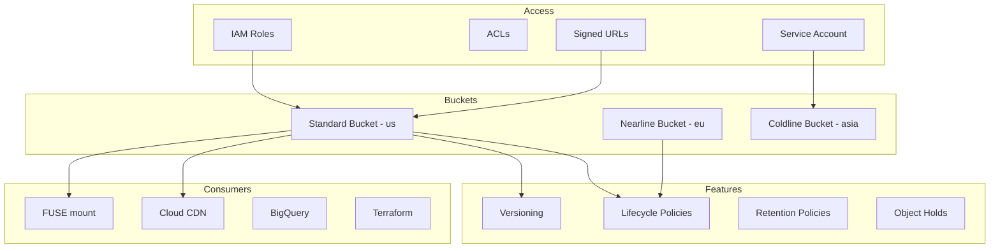

# Cloud Storage

## What is it?
Cloud Storage is GCP's unified object storage service for unstructured data. It offers infinitely scalable storage with strong consistency, configurable lifecycle management, and multiple storage classes optimized for access frequency.

## Why it was created
Applications need durable, highly available, and scalable storage for files, backups, media, and data lakes. Cloud Storage provides Google-scale object storage with a single API across all storage classes.

## When should you use it
- Storing and serving static assets (images, videos, HTML, CSS, JS)
- Backup and disaster recovery data
- Data lake for analytics (BigQuery, Dataflow, Dataproc)
- Media content (streaming video, audio files, game assets)
- Terraform state files and artifacts
- Multi-region storage for globally distributed applications

## Architecture



## Storage Classes

| Class | Min Storage | Retrieval Fee | Access Frequency | Best For |
|-------|-------------|---------------|------------------|----------|
| **Standard** | None | None | Frequent (hot) | Active data, websites, analytics |
| **Nearline** | 30 days | Yes | < 1x per month | Backups, older media |
| **Coldline** | 90 days | Yes | < 1x per quarter | Disaster recovery, archives |
| **Archive** | 365 days | Yes | < 1x per year | Compliance archives, long-term retention |

- **Standard**: $0.020/GB/month (multi-region), $0.020/GB/month (regional)
- **Nearline**: $0.010/GB/month
- **Coldline**: $0.004/GB/month
- **Archive**: $0.0012/GB/month
- Retrieval fees apply to Nearline, Coldline, and Archive: $0.01/GB to $0.05/GB

## Buckets
- Fundamental container for objects; globally unique name
- Location types: Regional (single zone), Dual-region (two zones), Multi-region (largest geographic area)
- Storage class is set at bucket level; objects inherit it by default
- Bucket names must be globally unique across all GCP projects

## Object Versioning
- Preserves noncurrent object versions when objects are overwritten or deleted
- Combined with lifecycle policies to manage noncurrent versions
- Adds cost (each version counts as separate storage)
- Cannot be disabled without losing archived versions

## Lifecycle Policies
- Set of rules to automatically transition objects to colder classes or delete them
- Conditions: age, created before, storage class, number of newer versions
```json
{
  "lifecycle": {
    "rule": [
      { "action": {"storageClass": "NEARLINE"}, "condition": {"age": 30} },
      { "action": {"storageClass": "COLDline"}, "condition": {"age": 90} },
      { "action": {"type": "Delete"}, "condition": {"age": 365} }
    ]
  }
}
```

## Retention Policies & Object Holds
- **Retention policy**: Minimum time an object must be kept (bucket-level); prevents deletion/overwrite
- **Object Hold**: Temporary hold on individual object (event-based); prevents deletion
- Can be combined for compliance
- Before removal, the policy must be removed from the bucket

## Signed URLs
- Time-limited URLs that grant access to a specific object without IAM
- Use for: temporary downloads/uploads, sharing private content
```bash
# Generate signed URL for download (10 min expiry)
gcloud storage sign-url \
  gs://my-bucket/secret-file.pdf \
  --duration=10m

# Generate signed URL for upload
gcloud storage sign-url \
  gs://my-bucket/upload-folder/ \
  --duration=1h \
  --http-verb=PUT
```

## Cloud Storage FUSE
- Mounts a Cloud Storage bucket as a local file system on Linux or macOS
- Useful for VMs and GKE pods needing large-scale file access
- Limitations: no file locking, POSIX semantics are partial
```bash
gcsfuse my-bucket /mnt/data
```

## Transfer Service
- Online: Transfer data from HTTP(S), S3, or another GCP bucket
- Appliances: Physical Transfer Appliance for up to PB-scale offline transfer
- Schedule one-time or recurring transfers

## Requester Pays
- By default, the bucket owner pays for egress and operations
- With Requester Pays enabled, the requester pays for read/operations
- Useful for sharing large datasets publicly (e.g., genomic data, satellite imagery)
- Requests must include `?userProject=REQUESTER_PROJECT_ID`

## Hands-on Example

```bash
# Create a bucket
gcloud storage buckets create gs://my-bucket \
  --location=us \
  --storage-class=STANDARD \
  --uniform-bucket-level-access

# Upload and download
gcloud storage cp local-file.txt gs://my-bucket/
gcloud storage cp gs://my-bucket/remote-file.txt ./

# Set lifecycle policy
gcloud storage buckets update gs://my-bucket \
  --lifecycle-file=lifecycle.json

# Enable versioning
gcloud storage buckets update gs://my-bucket --versioning

# Object hold
gcloud storage objects update gs://my-bucket/compliance.doc \
  --temporary-hold

# Make object public
gcloud storage objects add-iam-policy-binding \
  gs://my-bucket/public-file.html \
  --member=allUsers \
  --role=roles/storage.objectViewer
```

## Pricing Model
- **Storage**: Per GB per month based on storage class
- **Operations**: Per operation (Class A: list, create; Class B: get, read)
- **Data retrieval**: Per GB for Nearline, Coldline, Archive
- **Network egress**: Per GB to internet; free for ingress and inter-service (same region)
- **Early deletion**: Charge if deleted before minimum storage duration (Nearline 30d, Coldline 90d, Archive 365d)

## Best Practices
- Use uniform bucket-level access (disable ACLs) for simpler permissions with IAM
- Set lifecycle policies from day one to automatically manage data costs
- Use Signed URLs for temporary access instead of making objects public
- Use Requester Pays for public datasets to avoid egress costs
- Enable object versioning for critical data, but set lifecycle to expire old versions
- Use FUSE for file-system access patterns; use gcloud CLI for batch operations
- Store Terraform state in a separate bucket with versioning enabled
- Use multi-region for high availability; regional for cost-sensitive + zone affinity

## Interview Questions
1. Compare the four Cloud Storage classes and explain when you'd use each
2. How do signed URLs work and when should you use them?
3. How does Cloud Storage lifecycle management help optimize storage costs?
4. What is the difference between object versioning, retention policies, and object holds?
5. Compare Cloud Storage vs AWS S3 vs Azure Blob Storage in terms of consistency, classes, and features

## Real Company Usage
- **Twitter**: Stores media (images, videos) in Cloud Storage for CDN serving
- **PayPal**: Uses Cloud Storage for data lake ingestion
- **Niantic**: Pokémon GO uses Cloud Storage for game assets and player data
- **Genentech**: Stores genomic research data using Cloud Storage Archive class
