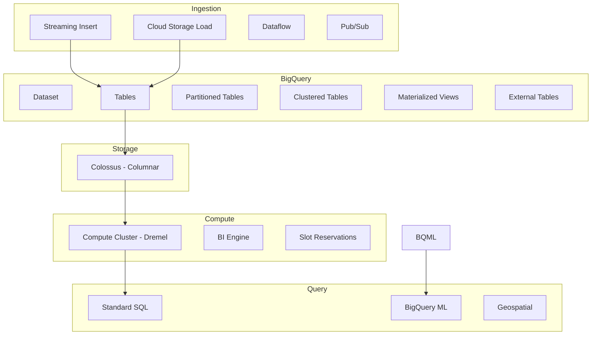

# BigQuery

## What is it?
BigQuery is a fully managed, serverless data warehouse that enables analytics on petabyte-scale datasets using SQL. It separates compute from storage, allowing virtually unlimited scale without infrastructure management.

## Why it was created
Traditional data warehouses (Teradata, Vertica) required provisioning hardware, managing clusters, and complex tuning. BigQuery eliminates all operational overhead while providing Google-scale performance via Dremel and Colossus.

## When should you use it
- Interactive analytics on terabytes to petabytes of data
- Business intelligence dashboards and reporting
- Log and event analysis (with columnar storage)
- Machine learning on warehouse data (BigQuery ML)
- Geospatial analytics and GIS workloads
- Data lakehouse architecture with BigLake

## Architecture



## Partitioning
Divides a table into segments based on a column (date, timestamp, or integer range).

| Partition Type | Column Type | Example |
|----------------|-------------|---------|
| **Ingestion time** | `_PARTITIONTIME` | Log events by day |
| **Date/Timestamp** | DATE, TIMESTAMP column | `order_date` |
| **Integer range** | INT64 column | `customer_id` range |

- Reduces query cost by scanning only relevant partitions
- Max 4000 partitions per table
- Daily, hourly, monthly, yearly grain

## Clustering
Sorts data within partitions based on column values. Useful after partitioning for further pruning.

- Up to 4 clustering columns
- Order matters: most selective column first
- Best for: high-cardinality columns (user_id, SKU), columns used in filters

## Slot Reservations
- **Slot**: Unit of computational capacity in BigQuery (1 slot = 1 virtual CPU)
- **On-demand (default)**: Up to 2000 slots shared across project; pay per query (per TB scanned)
- **Flat-rate**: Purchase dedicated slots (100, 400, or more); pay hourly/monthly
- **Reservations**: Assign slots to specific projects, folders, or orgs
- **Flex slots**: Short-term slot commitments (60 seconds minimum)

## BI Engine
- In-memory analysis engine that accelerates SQL queries on BigQuery
- Sub-second response for dashboards
- Caches data from specified tables in memory
- Integrated with Looker, Data Studio, Tableau

## Materialized Views
- Pre-computed views that are automatically refreshed
- Improves query performance for aggregations, joins, and filters
- Queries on base tables will automatically use materialized views when possible
- Limited to a subset of SQL (aggregations, joins)

## External Tables (BigLake)
- Query data stored in Cloud Storage, AWS S3, or Azure Blob without loading
- **BigLake**: Unified lakehouse; provides fine-grained security (row/column) on external tables
- **Federated queries**: Query Cloud SQL, Spanner, or external databases directly

## Query Optimization

| Technique | Description |
|-----------|-------------|
| **Partition pruning** | Filter on partition column to scan fewer partitions |
| **Clustering** | Order data by frequently filtered columns |
| **Limit + sort** | Use ORDER BY with LIMIT to short-circuit |
| **Avoid SELECT *** | Select only needed columns (less data scanned) |
| **Use APPROX functions** | APPROX_COUNT_DISTINCT for large cardinality (much faster) |
| **Denormalize** | BigQuery is optimized for wide tables, not star schemas |
| **Materialize intermediate results** | Use temp tables for multi-step pipelines |

## Streaming Inserts
- Real-time data ingestion at thousands of rows per second
- 1-second latency to query availability
- Use Dataflow, Pub/Sub, or direct tabledata.insertAll
- Streaming buffer allows immediate querying (no partition pruning during buffer time)
- At-least-once delivery (de-duplication required for exactly-once)

## BigQuery ML (BQML)
- Create, train, and deploy ML models using SQL only
- Supports: linear regression, logistic regression, k-means, time series (ARIMA), matrix factorization (collaborative filtering), deep neural networks, XGBoost, import TensorFlow models
- No data movement required (model trains on warehouse data)
```sql
CREATE MODEL project.dataset.my_model
OPTIONS(model_type='linear_reg') AS
SELECT features, label FROM my_table;
```

## Pricing Models

| Model | Billing | Best For |
|-------|---------|----------|
| **On-demand** | $5/TB scanned (first 1TB free/month) | Variable, exploratory workloads |
| **Flat-rate** | Hourly/monthly slot commitment | Predictable, steady workloads |
| **Mixed** | On-demand + reservations | Combine for peak and baseline |

- Storage: $0.02/GB/month for active data; $0.01/GB/month for long-term (>90 days)
- Streaming inserts: $0.05 per GB (rows)
- Queries against cached results are free (24-hour cache)

## Hands-on Example

```bash
# Query dataset
bq query --use_legacy_sql=false \
  'SELECT name, SUM(salary) FROM `project.dataset.employees` GROUP BY name'

# Load CSV from Cloud Storage
bq load --source_format=CSV \
  mydataset.mytable \
  gs://my-bucket/data.csv \
  schema.json

# Create partitioned table
bq mk --table \
  --schema "id:INT64,name:STRING,created_at:DATE" \
  --time_partitioning_field created_at \
  --clustering_fields id,name \
  mydataset.partitioned_table

# Estimate query cost (dry run)
bq query --dry_run \
  'SELECT COUNT(*) FROM `project.dataset.large_table`'

# Create BQML model
bq query \
  'CREATE MODEL mydataset.my_model
   OPTIONS(model_type="linear_reg") AS
   SELECT
     duration,
     start_station_id,
     num_bikes
   FROM `bigquery-public-data.london_bicycles.cycle_hire`'
```

```sql
-- Query with partition pruning
SELECT *
FROM project.dataset.orders
WHERE order_date >= '2024-01-01'
  AND order_date < '2024-02-01'
```

## Best Practices
- Partition and cluster all large tables (partition first, then cluster)
- Avoid SELECT * in production queries (only select needed columns)
- Use materialized views for repeated aggregation queries
- Use slot reservations for predictable performance
- Monitor slot utilization with INFORMATION_SCHEMA
- Use ON-DEMAND for dev, FLAT-RATE for prod
- Set cost controls (custom quotas for slot usage, per-project limits)
- Load data using AVRO (fastest, compressible) or Parquet (columnar)

## Interview Questions
1. How does BigQuery achieve petabyte-scale query performance (explain Dremel and Colossus)?
2. What is the difference between partitioning and clustering, and when do you use each?
3. Compare BigQuery on-demand vs flat-rate pricing models
4. How does BigQuery ML work and what are its limitations compared to Vertex AI?
5. Design a real-time analytics pipeline using BigQuery, Pub/Sub, and Dataflow
6. What is BigLake and how does it extend BigQuery to data lakes?

## Real Company Usage
- **Twitter**: Uses BigQuery for analytics and ML on user engagement data
- **Spotify**: Analyzes podcast and music streaming data in BigQuery
- **eBay**: Migrated from Teradata to BigQuery for data warehousing
- **The Home Depot**: Uses BigQuery for inventory and supply chain analytics
- **Uber**: Runs fraud detection and revenue analytics on BigQuery
