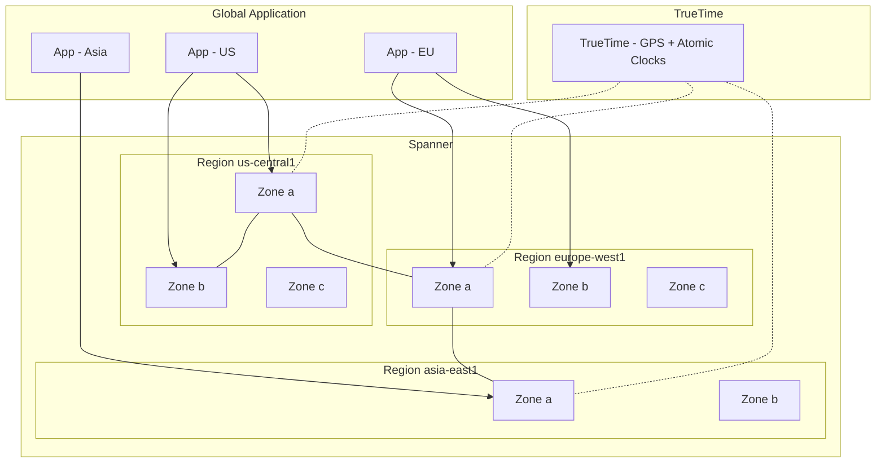

# Cloud Spanner

## What is it?
Cloud Spanner is a globally distributed, strongly consistent relational database that combines the benefits of relational SQL with horizontal scalability. It offers 99.999% availability across regions using Google's TrueTime technology.

## Why it was created
Traditional databases (MySQL, PostgreSQL) could scale up (vertical) but not out (horizontal) while maintaining strong consistency. NoSQL databases (Bigtable, DynamoDB) scaled horizontally but sacrificed relational semantics and strong consistency. Spanner solves both.

## When should you use it
- Globally distributed applications requiring strong consistency across regions
- Financial systems (trading, payments, ledgers) needing ACID transactions and high availability
- Gaming leaderboards and player state at global scale
- Inventory and supply chain systems spanning multiple regions
- Applications that outgrew Cloud SQL or traditional relational databases
- Multi-region disaster recovery with automatic failover

## Architecture



## Strong Consistency & TrueTime
- TrueTime uses GPS clocks and atomic clocks to provide global wall-clock time with bounded uncertainty
- Enables external consistency: transactions appear in timestamp order globally
- No eventual consistency window (unlike DynamoDB, Cassandra)
- Latency of distributed transactions: typically 5-50ms cross-region

## Horizontal Scaling
- **Nodes**: Each node provides 2TB storage and up to 2,000 read operations/sec or 1,000 write operations/sec
- **Splits**: Data automatically partitioned into splits (~2-4GB each)
- **Split points**: Choose to optimize for specific query patterns
- **Automatic**: No shard management or rebalancing needed (unlike MySQL sharding)

## Interleaved Tables
- Store parent-child rows physically co-located for fast joins
- Example: Customer → Orders → OrderItems
- Eliminates cross-table lookups for hierarchical data
- Significantly faster than JOINs for parent-child queries
```sql
CREATE TABLE Orders (
  CustomerID INT64 NOT NULL,
  OrderID INT64 NOT NULL,
  OrderDate DATE NOT NULL,
) PRIMARY KEY (CustomerID, OrderID),
  INTERLEAVE IN PARENT Customers ON DELETE CASCADE;
```

## Secondary Indexes
- Non-interleaved indexes are globally distributed (like DynamoDB GSI)
- Interleaved indexes are local to the parent table
- Indexes can be created after data exists (online index building)
- Stored and versioned like tables

## Query Optimization

| Technique | Description |
|-----------|-------------|
| **Use PRIMARY KEY** | Most efficient access path |
| **Use interleaved tables** | Faster than JOINs for hierarchical data |
| **Stale reads** | Allow 10-60s staleness for read-only queries (reduces latency) |
| **Batch mutations** | Use mutation API for bulk writes (not DML) |
| **Limit SELECT columns** | Reduce data transfer |
| **Avoid SELECT *** | Especially on tables with large columns |

## Multi-Region Configurations

| Config | Regions | Use Case |
|--------|---------|----------|
| **nam3** | US (3 zones, 1 region) | Single-region, high availability |
| **eur3** | EU (3 zones) | GDPR compliance |
| **nam-eur-asia3** | US + EU + Asia | Global leaderboard, global inventory |
| **nam6** | US (6 zones, 2 regions) | US-wide disaster recovery |
| **asia1** | Asia (2 regions) | Asia-focused apps |

## Hands-on Example

```bash
# Create a Spanner instance
gcloud spanner instances create my-instance \
  --config=nam3 \
  --description="Production instance" \
  --nodes=2

# Create a database
gcloud spanner databases create my-db \
  --instance=my-instance

# Create tables via DDL
gcloud spanner databases ddl update my-db \
  --instance=my-instance \
  --ddl="CREATE TABLE Singers (
    SingerId INT64 NOT NULL,
    FirstName STRING(1024),
    LastName STRING(1024),
    SingerInfo BYTES(MAX),
  ) PRIMARY KEY (SingerId)"

# Write data (DML)
gcloud spanner databases execute-sql my-db \
  --instance=my-instance \
  --sql="INSERT Singers (SingerId, FirstName, LastName)
         VALUES (1, 'Marc', 'Richards')"

# Query with stale read
gcloud spanner databases execute-sql my-db \
  --instance=my-instance \
  --sql="SELECT SingerId, FirstName FROM Singers" \
  --timestamp-bound-max-staleness=10s
```

## Cloud Spanner vs Cosmos DB vs DynamoDB

| Feature | Spanner | DynamoDB | Cosmos DB |
|---------|---------|----------|-----------|
| **Data model** | Relational (SQL) | Key-value / Document | Multi-model (document, graph, column, key-value) |
| **Consistency** | Strong (external) | Eventual (default), strong (optional) | Multiple levels (strong, bounded staleness, session, eventual) |
| **Transactions** | Full ACID across rows + regions | Limited (TransactGet, TransactWrite) | Single-partition (multi-document); distributed limited |
| **Secondary indexes** | Global + interleaved | Global + local (LSI) | Automatic indexing (all properties) |
| **Schema** | Strict (DDL) | Schemaless | Schemaless (flexible) |
| **Global replication** | Multi-region, strong consistency | Global tables (eventual) | Multi-region, multi-master |
| **SQL support** | Standard SQL | PartiQL | SQL-like (when using document API) |

## Hands-on Example (Node.js)

```javascript
const {Spanner} = require('@google-cloud/spanner');

const spanner = new Spanner();
const instance = spanner.instance('my-instance');
const database = instance.database('my-db');

// Insert
await database.run({
  sql: 'INSERT Singers (SingerId, FirstName, LastName) VALUES (@id, @first, @last)',
  params: { id: 2, first: 'Taylor', last: 'Swift' }
});

// Strong read
const [rows] = await database.run('SELECT * FROM Singers');
rows.forEach(row => console.log(row.toJSON()));

// Stale read (allow 15 second staleness)
const [staleRows] = await database.run({
  sql: 'SELECT * FROM Singers',
  requestOptions: { maxStaleness: { seconds: 15 } }
});
```

## Pricing Model
- **Instance nodes**: $0.90/node/hour (processing + 2TB storage included)
- **Processing units**: Smaller unit than nodes (1000 PU = 1 node); $0.0015/PU/hour
- **Storage**: $0.30/GB/month (included up to 2TB per node)
- **Egress**: Standard network egress charges
- **Backups**: $0.15/GB/month for incremental backups
- Minimum 1 node or 1000 processing units per instance

## Best Practices
- Design primary keys to avoid hotspots (use bit-reversed or hash-prefixed keys for sequential inserts)
- Use interleaved tables for hierarchical data to avoid JOIN overhead
- Prefer stale reads for dashboards and reporting (lower latency)
- Use mutations (not DML) for bulk operations (more efficient)
- Monitor splits with `spanner.googleapis.com/instance/splits` metric
- Use processing units (PUs) for small instances instead of full nodes
- Enable point-in-time recovery (PITR) for time-based backups
- Use Cloud Armor and VPC Service Controls for network security

## Interview Questions
1. How does Spanner achieve strong consistency at global scale using TrueTime?
2. Compare Spanner vs DynamoDB vs Cosmos DB for a global multi-region application
3. What are interleaved tables and when should you use them?
4. How does Spanner handle auto-scaling and split management?
5. Design a global financial ledger using Spanner that must support ACID across continents

## Real Company Usage
- **YouTube**: Uses Spanner for video metadata and recommendations
- **Google Play**: Runs on Spanner for app distribution and billing
- **Coinbase**: Uses Spanner for cryptocurrency transaction records
- **UPS**: Global logistics tracking on Spanner
- **Niantic**: Pokémon GO uses Spanner for player state across regions
