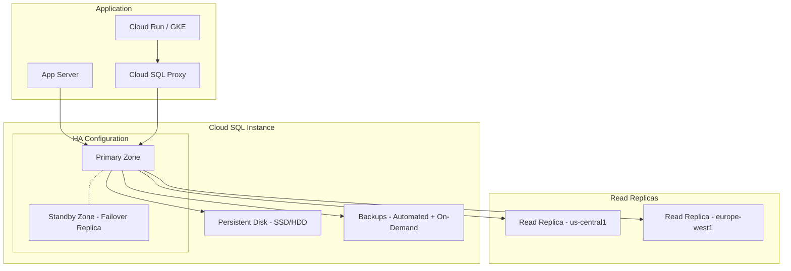

# Cloud SQL

## What is it?
Cloud SQL is a fully managed relational database service for MySQL, PostgreSQL, and SQL Server. It handles backups, replication, patching, and failover automatically.

## Why it was created
Running relational databases in production requires significant operational effort (backups, replication, patching, failover). Cloud SQL automates these tasks while providing high availability and compatibility with standard SQL databases.

## When should you use it
- Web applications needing MySQL or PostgreSQL
- Content management systems (WordPress, Drupal, Magento)
- Business applications (ERP, CRM) requiring SQL Server
- Lift-and-shift migrations from on-premises databases
- Applications that need standard SQL without learning Spanner
- Development/staging environments requiring database isolation
- NOT suitable for: >50TB databases, global replication, NoSQL workloads

## Architecture



## MySQL, PostgreSQL, SQL Server

| Feature | MySQL | PostgreSQL | SQL Server |
|---------|-------|------------|------------|
| **Version** | 5.6, 5.7, 8.0 | 13, 14, 15, 16 | 2017, 2019, 2022 |
| **Max storage** | 30TB | 30TB | 30TB |
| **Max connections** | 4000 | Depend on tier | 100 (Express) - 1000+ |
| **Extensions** | InnoDB | 70+ (PostGIS, pgvector) | SQL Server Agent |
| **License cost** | Free | Free | Additional cost |
| **Best for** | Web apps, CMS | Analytics, GIS, advanced features | Windows ecosystem, SSIS |

## High Availability (Regional vs Zonal)

| Feature | Zonal | Regional (HA) |
|---------|-------|---------------|
| **SLA** | 99.95% | 99.99% |
| **Failover** | Manual restart (different zone) | Automatic sync replication |
| **VMs** | 1 primary | 1 primary + 1 standby (different zone) |
| **Failover time** | Minutes | ~60 seconds |
| **Data loss** | Possible (async) | None (sync replication) |
| **Cost** | 1x | 2x compute + same storage |

## Read Replicas
- Up to 10 read replicas per instance (cross-region supported)
- Async replication; replica may lag
- Use for: read offloading, reporting, analytics
- Can be promoted to standalone instance (disaster recovery)
- Cross-region replicas help with global read scaling

## Backups
- **Automated**: Daily backup; configurable window; retained up to 365 days
- **On-demand**: Manual backup at any time
- **Point-in-time recovery (PITR)**: Restore to any point within the backup retention window
- PITR uses write-ahead logs (WAL) stored in Cloud Storage separately
- Restores create a new instance (does not overwrite)

## Private IP & Cloud SQL Proxy
- **Private IP**: Cloud SQL instance gets an IP in your VPC; no public internet access
- **Cloud SQL Proxy**: Client-side proxy for secure connections without a public IP
  - Handles IAM-based authentication automatically
  - Encrypts connections (TLS)
  - Works from Cloud Shell, Cloud Run, GKE, on-premises
```bash
cloud_sql_proxy -instances=PROJECT:REGION:INSTANCE=tcp:3306
```

## Maintenance Windows
- Configure weekly maintenance window (any 2-hour slot)
- Maintenance includes: OS patches, minor version updates, security fixes
- Can receive notifications before scheduled maintenance
- Maintenance typically causes a brief failover for HA instances (< 60s)

## Connection Pooling
- Use PgBouncer (PostgreSQL) or ProxySQL (MySQL) for connection pooling
- Cloud SQL max connections limit can be reached without pooling
- Applications should use connection pool libraries (HikariCP, DBCP, etc.)
- Connection limits per tier:
  - db-f1-micro: 25
  - db-n1-standard-1: 250
  - db-n1-standard-8: 4000

## Hands-on Example

```bash
# Create MySQL instance (HA)
gcloud sql instances create my-mysql \
  --database-version=MYSQL_8_0 \
  --region=us-central1 \
  --availability-type=REGIONAL \
  --tier=db-n1-standard-2 \
  --storage-type=SSD \
  --storage-auto-increase

# Create database and user
gcloud sql databases create mydb --instance=my-mysql
gcloud sql users create myuser \
  --instance=my-mysql \
  --password=mypassword

# Connect via proxy
cloud_sql_proxy -instances=my-project:us-central1:my-mysql=tcp:3306 &
mysql -u myuser -p -h 127.0.0.1 mydb

# Create read replica
gcloud sql instances create my-mysql-replica \
  --master-instance-name=my-mysql \
  --region=europe-west1 \
  --tier=db-n1-standard-2

# Create PostgreSQL instance
gcloud sql instances create my-postgres \
  --database-version=POSTGRES_16 \
  --region=us-central1 \
  --tier=db-f1-micro

# Export database
gcloud sql export sql my-mysql \
  gs://my-bucket/backup.sql \
  --database=mydb
```

## Pricing Model
- **Compute**: Per hour based on machine tier (shared-core db-f1, db-g1-small; standard db-n1/db-n2 series)
- **Storage**: $0.17/GB/month for SSD; $0.09/GB/month for HDD
- **Backups**: Automated backups included up to storage size; excess charged at $0.08/GB/month
- **Read replicas**: Same compute + storage costs as primary
- **Data egress**: Standard network egress for cross-region replicas and external access
- **HA**: 2x compute cost (primary + standby)
- **License**: MySQL and PostgreSQL free; SQL Server charged per core/hour

## Best Practices
- Always use Regional HA for production workloads
- Use Private IP (not public) with Cloud SQL Proxy for security
- Set up automated backups and enable point-in-time recovery
- Use read replicas to offload read traffic from primary
- Implement connection pooling to avoid hitting max connections
- Monitor database flags and slow query logs
- Use Cloud SQL Insights (query performance, wait stats) for optimization
- Enable deletion protection to prevent accidental database deletion
- Pre-allocate enough storage to avoid auto-increase latency

## Interview Questions
1. Compare Cloud SQL (MySQL/PostgreSQL) vs Cloud Spanner: when to use each
2. How does Cloud SQL High Availability work and what is the failover process?
3. What are the different connection options (Private IP, Public IP, Cloud SQL Proxy)?
4. How do you migrate an on-premises MySQL database to Cloud SQL with minimal downtime?
5. Explain how read replicas, backup retention, and PITR work together for disaster recovery

## Real Company Usage
- **Snapchat**: Stores user data in Cloud SQL (PostgreSQL)
- **PayPal**: Migrated MySQL workloads to Cloud SQL
- **Electronic Arts**: Uses Cloud SQL for game backend databases
- **GoDaddy**: Hosting services use Cloud SQL for customer sites
